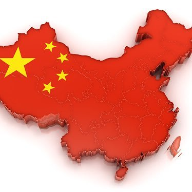

当サイト 「中国を読み解く」 は中国の政治、文化を理解するための情報発信ブログサイトです。

日本にとって、中国は一番大きな隣国であり、世界一のマーケットに成長しています。中国の未来は日本の未来と粘り強く関わっています。  
中国の本質まで、成るべく理解する事は、TOPの政客、企業の経営層だけではなく、普通の日本国民にとっても非常に重要であるかと思います。  
残念ですが、日本マスコミだけでは、本当の中国を理解するには物足りません。これを気付いている方も多いと思い、当サイトの情報はご参考になれば幸いと存じます。

通常のニュースサイトと異なる点としては、その情報の背景まで、そして、国家戦略まで分析したいと思います。

一点を強調したいですが、我々の情報も、マスコミの情報も、誰かを信じるのではなく、異なる観点の情報を吸収し、貴方自身の考えが一番重要です。  
読者の皆さんに何を信じてもらうのではなく、中国を理解するために、一つの情報発信元として、存在し、中国について、日本人として相応しい言動を適切な判断できるために、「中国を読み解く」 我々の存在する意義であります。

**政治的な立場について**

我々は日本の文化を尊重し、天皇、現政権を支持する前提で、情報発信を行っています。  
原則、反日、人種差別、紛争を興す行為を反対し、政治の紛争に関わりません。

常に高いところで各国の政権を鳥瞰するように、政治や、時事を論じたいと思います。

* * *
