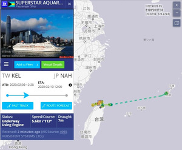
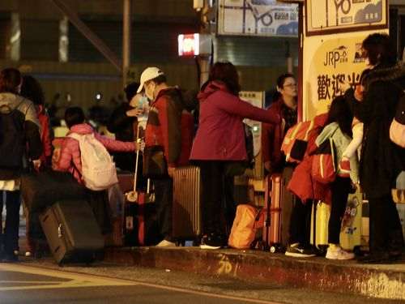

新型肺炎について、中国の続き、日本も国内感染ができて、危なくなっていますが、[政府は素早く動き始めて、最悪な状況を想定して備えているようで](https://www.kantei.go.jp/jp/98_abe/actions/202002/16corona_sen.html)、日本の皆さんは一丸にして必ず困難を乗り越えます。  
単に、集計数字から、中国より日本は2番目に危ないと見えるかもしれませんが、こちらは、日本より、台湾も危ないではないかと見受けています。

その理由はクルーズ船の対応です。  
日本に寄港したクルーズ船、ダイヤモンドプリンセス号から、密閉空間の中では、新型コロナウイルスが非常に移りやすいと分かります。  
台湾発のクルーズ船、スーパースター・アクエリアス号は、 基隆港(キールンこう) から出発して、沖縄入港拒否されたため、一旦戻るようにした。  
関連記事：「[クルーズ船検疫、対象者は全員陰性 台湾人乗客ら、帰宅の途へ](http://japan.cna.com.tw/news/asoc/202002090004.aspx)」  
一旦騒ぎ立てて、戻れた所、皆さんは一旦安心したが、台湾政府の対応はいまいちで、批判もありました。  
乗客 1738 の内、発熱、中国本土の渡航履歴ある人、外国人の128人に対して**検疫**したとありますが、**検査**ではありませんので、この人達の中に新型肺炎を持つ人がいるなら、残念ですが、検疫だけでは検出できません。

勿論、基隆港(キールンこう)から出て、戻りだけですから、問題ないだろうが、この時期って、「だろう運転」にして本当によい？のでしょうか。

<figure>

<figcaption>

クルーズ船から降りて帰途につく乗客たち

</figcaption>

</figure>

マスクの供給状況の行政院長からのウソによって、興した混乱、トイレットペーパーの混乱、更に「だろう運転」的なクルーズ船対応で、もはや、台湾式の情報隠蔽はできています。  
これで何もないことを祈りますが、下手にすると、武漢よりえらい程、新型コロナが爆発する可能性がゼロではない。しかも、時期が過ぎた所ですから、数世代変異後のもので、本土での治療法、薬などは効かないかもしれません。
