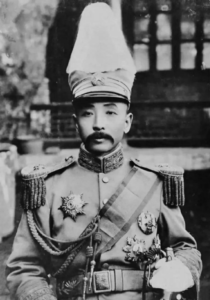
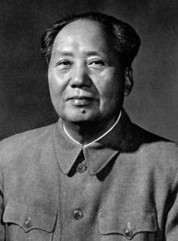

地政学理解できる人材が少ないから、琉球独立は夢話です。分断のリスクを予想する観点で、実現するには、少なくとも何が必要か？考えてみました。

長文になるので、まず、目次からとなります。

**目次：**

1. 学ぶべき中国事例
2. 地政学の現状を理解すべき
3. 琉球独立の根拠
4. 根本的な問題点
5. 「革命」の遣り甲斐あるか
6. 夢話をやめ、日本は頑張ってほしい処

**学ぶべき中国事例**

日本は成功した革命がなくて、事例がないので、1911年(清)以降、中国で政権を握った、代表的な人物を見れば分かりやすいかと思います。

中華民国時代の軍閥、[張作霖](https://ja.wikipedia.org/wiki/%E5%BC%B5%E4%BD%9C%E9%9C%96)は中国の東北地方、日本軍に暗殺されるまで、実際に政権を握っていた人。

同氏は日本とソ連をうまく利用して、自らの勢力を強くした。当時の中国はかなり弱くて、地方政権は、日本にもソ連にも、対立できないが、中間地帯に挟まれてた紛争地の特徴を利用して、危⇒機会にさせた優秀な政治家である。

琉球独立を図ってるならば、少なくとも、同氏並みの知恵で、日本、米国と中国の勢力の中、どう利用するか、考えなくてはならない。

政権を立ち上げた[毛沢東](https://ja.wikipedia.org/wiki/%E6%AF%9B%E6%B2%A2%E6%9D%B1)。 毛沢東について、独裁者だ、暴君だとしか分からなかったら、こちらで1つ認識していただきたいことは、今、中国の発展、中国経済の構図は、全て、毛沢東時代から、構想して、鄧小平(裏側)、江沢民、胡錦濤、習近平まで、毛沢東思想に従って、辿ってきたわけです。 [一帯一路](https://blog.loveapple.cn/tag/%e4%b8%80%e5%b8%af%e4%b8%80%e8%b7%af)も、毛沢東思想を欠かせない存在である。

強権の間に挟んで、自らの勢力を立ち上げるには、張作霖を見習うべき。 国まで独立したければ、毛沢東を見習うべき。

本気で政権を立ち上げたいのであれば、中国語を覚えて、同氏の「論持久戦」、中国の共産党歴史を学んでおく方が近道でしょう。日本であまり情報少ないが、インド共産党毛沢東主義派の独立運動、アフガニスタンのタリバン、全て、毛沢東思想の学生と言ってもよいかな？

中国大学生向けの政治教育の本は、欧米で禁止するものが多いらしい。理由として、中国共産党の歴史の内容は、政権を倒す方法を紹介する内容が多いからっだ。

**地政学の現状を理解すべき**

一方的に自らの政治主張を謳っても意味がありません。地政学の現状の理解が前提である。 上記、成功した政治家の共通点は、地政学の現状を踏まえ、利害関係をうまく利用できる人であることを、ご認識して頂ければと思います。

今の現状を簡単にまとめておきます。

1. 日本は経済強国ですが、米国の半植民地であること。 日本政府の政治、外交の言動は、多い場合、日本の国家利益ではなく、米国利益前提であること、理解しなくてはならない。
2. 日本は米国にとって、米国本土防衛に、重要な緩衝地帯である。 太平洋は広いが、島が少ないので、原潜は潜みやすく、結局、日本からの島鏈は、米国の最初でも、最後の防衛ラインになります。日本を失ってしまうと、行き成り本土防衛になるので、不利です。
3. 防衛の観点から、中露は米国の逆、原潜をスムーズに太平洋での進出である。 日本周辺、原潜にとって重要な通路は以下となります。 ロシア：北方四島 中国：バシ海峡(台湾)
4. [経済上、日本の輸出も、輸入も、最大の相手は、中国である](https://www.jftc.or.jp/kids/kids_news/japan/country.html)。 中国は、日本にとって、重要な顧客でもありながら、生活必需品を含めて、生活に欠かせないあらゆる製品を中国から輸入しなくてはならない。
5. [日本は、ロシアのエネルギーに頼ってる](https://www.enecho.meti.go.jp/about/special/johoteikyo/russia.html)。 中国ほど、存在感がないかもしれないが、日本は、ロシアに依存している。
