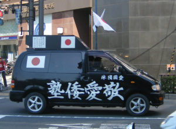
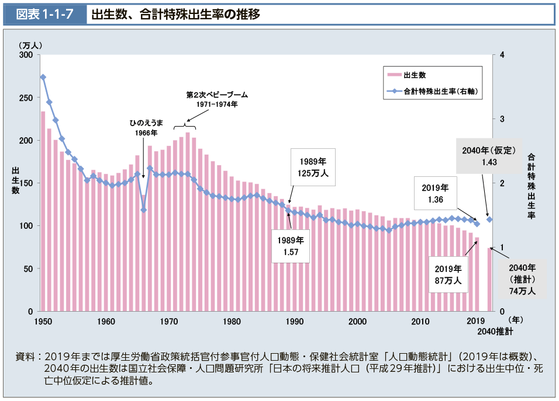

日本では「右翼」がほぼいないと、何を言ってるか？ 小泉純一郎、安倍晋三、麻生太郎等々、日本は右傾では？と思われるかもしれません。

日本人は米国(アングロサクソン、ユダヤ)の奴隷であるべきと思うならば、論外ですから、飛ばしてください。 ヤマトは世界中に、尊敬すべき民族たるものだと思うのであれば、最後まで、みて下さい。

[右翼](https://ja.wikipedia.org/wiki/%E5%8F%B3%E7%BF%BC#:~:text=%E5%8F%B3%E7%BF%BC%EF%BC%88%E3%81%86%E3%82%88%E3%81%8F%E3%80%81%E8%8B%B1%EF%BC%9A,%E5%8B%A2%E5%8A%9B%E3%82%84%E4%BA%BA%E7%89%A9%E3%82%92%E6%8C%87%E3%81%99%E3%80%82)とは「反動主義」「保守主義」「排外主義」です。 愛国心、国粋を主軸したポピュリズムである。 日本文化の柔軟性がすくなく、基本排他的であり、極右は他民族を排除、ジェノサイドして、自らの民族の利益を最大限を図ること。 排他的ですから、周りの他民族と共存できなく、日本右翼の基本的な理論は、中国崩壊して、再び大東亜共栄圏を実現することです。見た目上、日本を強くする1つの道らしく見えるが、本当かな？

**ヤマトは自然に消えてゆく**

ヤマトは滅んでいくこと、ご存じですか？ [厚生労働省の統計](https://www.mhlw.go.jp/stf/wp/hakusyo/kousei/19/backdata/01-01-01-07.html)によると、日本の出生率は、1.4以下、下がっている。以下は例年の推移です。 この数字は世界中、どのぐらいでしょうか？

[2021年の統計数字](https://eleminist.com/article/1714)、208国の内、191位にあります。去年、中国は出生率低いと、大騒ぎほどのニュースだったが、実には1.7、先進国の中での平均値である。

厚生労働省の統計数字でも、日本人の出生数が減っていくことを認めてます。このままでいくと、ヤマトは、自然に消えています。

**カレルギーの人類改造計画**

[カレルギー計画](https://ameblo.jp/damedamewanko2/entry-12450105659.html)、簡単に言うと、日本、中国、ロシア等、民族国家を撲滅して、ユダヤ人が裏側にコントロールしやすい状態にすることです。表は、文化のないアングロサクソンの国(英米)、宗教である。

戦後、何が起こったか、ざっくりとおさらい。

日本軍の主体、ヤマト民族は失敗と分かっても、自殺攻撃までやる人が多い。かなり強い民族であること、米国は戦争で、よく認識しました。

日本人男性は怖いから、まず、女らしくすることである。

マスコミを利用して、日本人の女性の価値観を変えて、女性らしい男性が好きのように育てることです。 このプロジェクトの中、キム〇クは大成功を収めました。

2022年の今は、キム〇クの時代じゃないが、このような女性らしい男優は、圧倒的に多いわけです。周りの日本人男性をみてください。基本、同じ系の人と言ったら、反論できないようですね。

逆に米国の男優を見てみよう。日本の男優みたいに、女性らしい人は、思い出せますか？中々ぴんとこないでしょう。

キム〇クより前、昭和時代の男優の写真、作品から、正直、きれいに見えるように編集しても、女性らしい人は、個人的に、中々見当たりません。

日本で慣れてるから自覚しないかもしれませんが、同じ、アジアの中国現地の人に、最近の日本人、若いい男性の印象はどうか？と聞いたら、勿論、善意ですが、恐らく、可愛いとか、優しいらしいとか、女性らしいように見える評価だと思います。

日本の独特な、男性を女性らしくすること、現在進行中であると、ご理解していただけたのでしょうか。 更に、女権主義、LGBTQ等を加えて、結婚のコストを高めることで、一人子政策の中国以上に、出生率を下げている。 因みに、キム〇クの投資者、[ジャニー喜多川](https://ja.wikipedia.org/wiki/%E3%82%B8%E3%83%A3%E3%83%8B%E3%83%BC%E5%96%9C%E5%A4%9A%E5%B7%9D)氏は、アメリカの同性愛の人であり、カレルギー計画にも望ましい人選である。

本当にヤマトを滅んでいるのは、アメリカとその裏に立ってるユダヤ資本であること、行き成り、納得できなくても、おまわりを観測してみてください。
