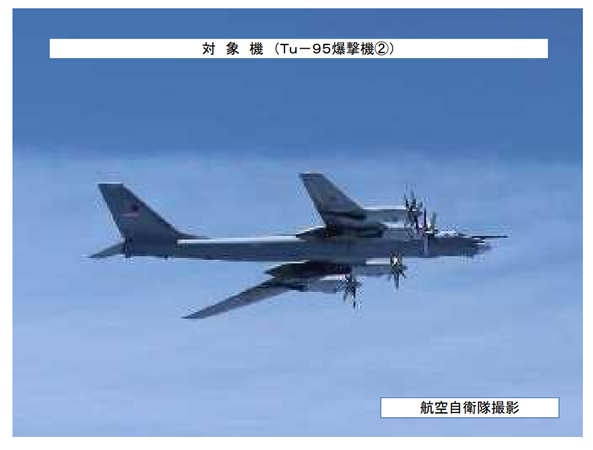

日本は冷戦の時代から、アメリカ陣営の前線として、量より質で且つと言った防衛方針をとっている。 空自も海自も、兵器、装備から、訓練までの質は、朝鮮、中国より高かったが、近年、中米の対立は表面になり、日本は量だけではなく、進歩しない＝後退のため、質も劣っている現状である。

5/24、中露爆撃機共同訓練、日本国境へ接近した報道から、日本自衛隊の弱さ、空自は中露空軍の差は暴かれてしまったかと思われます。

総合幕僚監部の報道だと、[中露はH-6とTu-95、2機ずつ、合計4機の爆撃機](https://www.mod.go.jp/js/Press/press2022/press_pdf/p20220524_01.pdf)だけど、中国の報道だと、[2機のJ-16戦闘機も、同行](https://www.guancha.cn/military-affairs/2022_05_29_641906.shtml)していた。

何故、空自は戦闘機を見えなかったのか、ステルス性能でレーダーの探知から隠したのか、妨害で、見えないようにしたのか、いくつかの理由は想定できます。

過去の記事にも記載した通り、中国の最新悦ステルス機のJ-20は、既に日本周辺でステルス性能をテスト済みだろうと推測しました。今回、J-16も見えない所、正直、個人的に意外でした。

日本の政治家は暴言を吐き続いてる現状、自衛隊の状況は全く気付かないというか、パイロットは負荷が高いといった不満は報道されたが、今回は、本当に実感してるかと思います。 いつも、きれいに写真を撮れていたのに、なぜか今回、モザイクをかけたようなモヤモヤした写真とは、パイロットのストレスはそのもの、反映してるかと思います。

質で且つ日本自衛隊は、もう、嘗ての話で、今は、パトロールだけでも、窮境は見えてきた所である。 相手の戦闘機を見えない現状ですから、中露対抗ということは、あり得ません。 防衛予算を増やしても、中露並み、又は以上の技術力がないと、相手にならない現実である。

日本はもっと賢明な外交、防衛は必要なる時期は迫ってきてるかと思われます。
