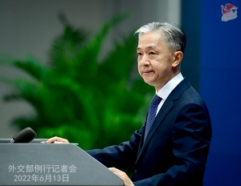

6/15、習近平国家主席は、[戦争以外の軍事行動要綱にサイン](https://news.yahoo.co.jp/articles/947275e5931522abb44352efb7a043c0a6d41caa)しました。日本での報道が少ないが、少ないほど、重要ではないかと思います。

まず、戦争とは国家間の軍事行動である。 台湾と関係なくはないが、あくまで中国の一部で、いざの時、内戦ですから、わざわざ要綱を定める必要はあるかと私は疑問を抱えていました。 6/13、中国外交部、汪文斌報道官は、[台湾海峡が中国の内海であるとの発言](https://japanese.cri.cn/2022/06/13/ARTIoM2ffCGd3b07EjrjDTJd220613.shtml)を含めて、確認してみよう。

同要綱は発表される目的は、主に台湾ではなく、今まで、曖昧なところ、又は、外国へ軍事行動だが、戦争に当てはまらない場合を指すかと推測します。 こちらは、明らかにロシアのウクライナでの特別軍事作戦をマネーしたものであろう。

何で日本と深く関わるかと以下です。

- 曖昧なところ
    - **台湾海峡への通過** 今まで、米軍は内海じゃないと軍艦で通過し、中間線を描いていた時、中国軍は追尾だけで監視してきたが、これからどうなるか？ そして、民間船、日韓の生命ラインとなる航路ですから、中国内海に通過する時、どうなるか？ 国際海洋法云々と言いたい人は多いでしょうが、米国は国際海洋法のメンバー国ではないから、関係ありません。
- 外国への軍事行動
    - **琉球独立** 中国は琉球を占領する意図がない。 米軍を追い出す時、日本から分裂し、独立させる必要がある。 勿論、中国の一部として占領しないから、侵略ではない。 法的に、日本領土でもないから、日本と宣戦する義務もないでしょう。
    - インドに侵略された地域の取り戻し。
    - 南太平洋諸国への派遣 当事者国を侵略するつもりもなく、戦争もないので、米豪の侵略を追い出すときの軍事行動でしょう。
    - **朝鮮半島** 前回、米国など17国と戦争したとき、義勇軍の名目で参戦したが、 今度は、特別軍事行動になるでしょう。

以上、同要綱は使えそうな所を簡単にリストアップしました。 本当はどこまで使われるか、今後の進行を観測しましょう。
