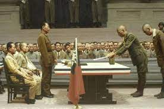
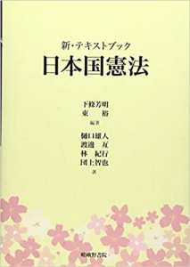

正確に言うと沖縄(琉球)は日本領土ではありません。以下は日本国憲法に基づいた内容と抜粋です。

中国の軍事演習で、日本のEEZにミサイルが落下したとの日本政府の主張はなぜ無視されたか？ 中国は日米のような、勝手に他国を侵す強権じゃないから、[中国外務省のいう日本の不正](https://www.jiji.com/jc/article?k=2022080800908&g=int)とは何か、日本国憲法の観点をもとに説明します。

今の日本国憲法の設立の前提は[ポツダム宣言](https://ja.wikipedia.org/wiki/%E3%83%9D%E3%83%84%E3%83%80%E3%83%A0%E5%AE%A3%E8%A8%80)である。日本国内の変革を求める一方、ポツダム宣言を実施するために、[日本国憲法は制定](https://www.ndl.go.jp/constitution/gaisetsu/00gaisetsu.html)されました。 ここでポイントとなるのは、ポツダム宣言でいう日本領土とは、 「**日本国の主権は本州、北海道、九州及び四国ならびに我々の決定する諸小島に限られなければならない。**」 であること、つまり、沖縄や、奄美諸島、小笠原諸島は日本領土ではありません。

ということは、今まで、マスコミ、知識人、日本議員の主張する尖閣諸島は日本固有領土とは、違憲というか、法的な根拠がありません。 なぜ、沖縄には免税店があるのか？色々解釈はあるが、厳密にいうと、日本人にとって、沖縄は外国だからです。

改憲すれば今の状況を可決できるか？ 勿論違います。日本が本当に国際法、国際秩序を遵守する国ならば、自らの主張について、国連常任理事国、各隣国の承認が必要である。 外交の知恵が必要でしょうが、殆どの国民は、自らの定めた憲法の常識さえも理解できない現状ですから、そのような知恵があるのか、私は疑問を持ちます。

**沖縄が返還されたでは？**

確かに、今、沖縄の行政を行ってるのは日本政府である。 但し、[沖縄返還協定](https://www.mofa.go.jp/mofaj/gaiko/bluebook/1972/s47-shiryou-4-1.htm)について、サン・フランシスコ市で署名された日本国と米国間の条約であり、日本が降伏したとき、ポツダム宣言等を定めた当事者、中国や、ソ連(ロシア)はかかわっていません。 認められてないものである。

正確に言うと、沖縄の主権は、いまだに未定である。

上記、基本、筆者個人的な観点ではなく、日本国憲法をベースにした解説です。 日本国憲法と沖縄の関係を記載するテキストがあるので、以下は抜粋です。 原文については「[新・テキストブック 日本国憲法](https://amzn.to/3p5v1oo)」をご参照ください。

> **日本国憲法と沖縄**
> 
> 日本国憲法は、日本国民の総意に基づいて新日本建設の礎が定まり、帝国議会の議決を経て成立したことが上論に記されている。また、前文には「日本国民は、…ここに主権が国民に存在することを宣言し、この憲法を確定する」(1項1文)として、日本国民が憲法を確定したと明記されている。ところが、この上論や前文にいう「日本国民」の中に、当時の沖縄県民が含まれていなかったことが忘れられている。ポツダム宣言は日本国の主権を「本州、北海道、九州および四国並びに米・中・英が決定する諸小島」(8項)に限っていた。ここに沖縄や奄美群島、小笠原諸島等の諸小島は含まれていなかった。これらの諸島はアメリカの施政権下に置かれ、奄美群島は昭和28(1953)年12月25日、小笠原諸島は昭和43(1968)年6月26日、そして沖縄は戦後27年目にあたる昭和47(1972)年5月15日にようやく本土復帰が実現する。このように歴史を振り返ると、日本憲法が成立した時期に沖縄県は日本国から離れてアメリカの施政下にあり、帝国議会に議席をもつ代表はいなかった。だから、日本国民総意といってもそこに沖縄県民は含まれていなかった。

こちらの内容について、反論は自由ですが、 反論する前に、ちゃんと勉強してからでお願いします。
