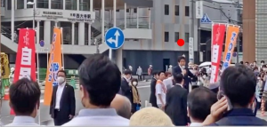
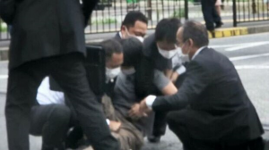
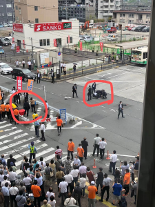
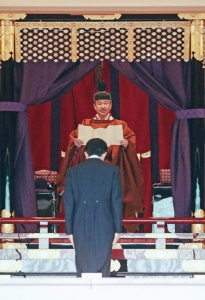
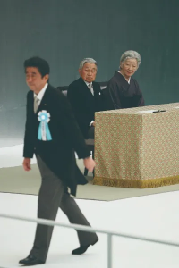
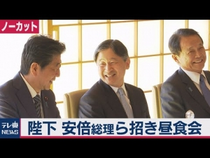
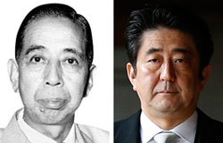

7/8、安倍晋三元首相が刺殺された過程から、色々情報は隠されているようです。  
あの銃？らしいもので、一人で年間数億円予算の安保から、一発で暗殺できたとは、一人の元自衛官だけでは、実現できません、日本の政治闘争の結果であると、確実に分かるでしょう。  
刺殺の背後の政治勢力は、徳仁天皇であると推測します。

**安倍元首相の刺殺は元自衛官の任務である**

刺殺の動画とボディガードの仕事から確認します。  
1．一発目の発砲音を聞こえた直後、ボディガードの全員は、無反応ほど、動きが遅い  
2．二発目の後、全員は発砲した人を一斉に抑えた  
3．犯人の山上氏は反抗なしで、逮捕された  
4．事件の発生した時刻：11:30(午時三刻)、場所：奈良市の近鉄大和西大寺駅(古都の繁盛な商業地域)

結論からいうと、  
・山上氏の刺殺作業完了まで、安保の担当する全員はほぼ待っていた。  
・山上氏の使っていた水道管で出来上がった銃とは、拳銃より、18世紀ごろの火縄銃(鉄砲)に近いもの。  
・干支の時間午時三刻(11:30ごろ)、古都の商業地域で、後ろから実行することは、中国古代の礼法をマネした処刑である。  
上の2点から、安倍元首相を処刑したのは、天皇らしい？  
勿論、これだけで、特定するのか？と言われるでしょうが、以下に展開します。

**現場から処刑の跡**

安倍元首相は現役ではなく、最上級の安保はなくても、ボディガードがついてる自民党のTOP人物ですので、年間数億円の予算で出来上がった安保である。  
ボディガードの常識として、一発目の発砲音を聞こえたところで、保護対象の安倍さんの元で、人の盾にすることです。  
ところで、周りのボディガードは何をやってたか、明白です。誰も安倍さんを体で守ろうとしなかった。  
実際は、プロのボディガードであれば、発砲する前に、犯人の山上氏は動き出して、銃を出す前の時点にも、気づくはずです。

動画を繰返して確認するほど、この刺殺は、周りの安保の関係者たちは、事前に暗殺を分かったものだと分かるでしょう。  
一発目の音が聞こえて、隠すのではなく、向いて行ったところ、安倍元首相本人は、侍のような死を覚悟してもおかしくないかと、1つの可能性だと推測します。

前述通り、事件の時刻、場所、方向から、古代中国死刑の礼法をマネしたように見えます。  
それでは、各関係者の動機について、展開します。

**安倍元首相を刺殺する動機**

日本の正常化を懸命に推進する安倍元首相の敵は誰ですか？  
利害関係の各者：

①中国  
安倍首相の時代、中国の関係改善、日中韓FAT、ＲＣＥＰの推進等、日中関係に貢献したが、  
尖閣の国有化など、右傾の森元首相も、小泉元首相も、誰もしない、実質的に、中国と対抗したことをやりました。  
しかも、台湾有事＝日本有事の暴言も、日中関係を台無しにする発言である。  
中露とも、軍艦、爆撃機の日本周航で、在日米軍と自衛隊にプレッシャーをかけるのは有効であり、安倍元首相を殺しても、何の意味もない。  
だから、**中国には動機がない**。

②米国  
安倍は親米では？と疑問する人は多いが、日本の平和憲法を定めたのは米国である。  
日本の所謂正常化とは、実質的に反米である。  
一回目の安倍首相の辞職も、中国と近すぎたところ、米国に怒られたらしい。  
但し、日本政界は全て米国にコントロールされてるので、命令を下ればよくて、元首相を殺す必要がない。  
だから、**米国には動機がない**。

③岸田政権  
下克上、他の派閥の要人を暗殺するなど、日本では過去事例があり、  
林芳正外相は、安倍の好きな人じゃないとはいえ、  
岸田政権の内閣は、ほぼ安倍派の人で、政権を始めたばっかりで、まだ、安定していない。  
関係各国の反応を見るために、元首相の暴言は使いやすいから、**殺す動機がある訳がない**。

④徳仁天皇  
日本の天皇は飾り物では？勿論、違います。  
結論からいうと、安倍晋三の政治主張は天皇家、特に徳仁天皇の子孫に脅かすものである。  
安倍さんのボディガード等、安保にまで手を出して、元自衛官に刺殺してもらった。  
勿論、事実を隠さないといけないので、刺客には表向けのストーリーが必要なわけです。

続いて、なぜ、元凶は徳仁天皇であるか、掘り下げます。

**君主立憲制の本質まで理解しましょう。**

徳仁天皇は126代目、神話を除いても、千年以上継続してきた政治家族である。  
なんとなく長年崇拝される家族はどこにもありません。  
昔は、幕府の将軍は一番強いと思い込むでしょうが、天皇を反乱しようとしたやつは、必ず失敗します。  
今の日本は米国の植民地だが、国内の本質がかわりません。  
[民主制度の本質は、民主と関係なく財閥に左右される制度である](https://blog.loveapple.cn/politics/202108207248.html)と以前紹介させていただきました。  
君主立憲制とは、元の国王や天皇等の君主は、裏側に下がって、首相の内閣を表にやらせてもらう制度である。国策で何が失敗したら、内閣に責任を負ってもらえばよく、責任もリスクも上手く分散できます。  
選挙などは、君主に翻弄されるものであると、いつも変わりません。

日本の近代史は分かりやすいです。旧日本軍は天皇の皇軍です。  
軍人たちは天皇の為に死んで、大東亜共栄圏を築こうとしたわけです。  
天皇は日本人の信仰だとまとめたい人は多いでしょうが、天皇も凡人ですから、信仰としてい続けるには、実力、知恵は必要なわけです。

敗戦して、戦争を興した天皇は投降と発表して、何故、裁けるのは東条たち、内閣、軍部中心の人だったか？  
この人たちは天皇を強制したのか？違うのであれば、天皇のしじがなければ、戦争がないわけです。  
米国は日本へ上陸して、政治上も、精神上も、天皇の怖さを感じたからこそ、天皇政権を維持したわけでしょう。

**徳仁天皇は安倍元首相を殺す動機とは？**

まず、[安倍晋三は皇位の男系継承を堅持](https://www.nikkei.com/article/DGXZQOUA082820Y2A100C2000000/)する政治勢力である。  
こちらは徳仁天皇の子孫に関わり、非常に怒るものである。  
次は「台湾有事＝日本有事」である。これは、日本をウクライナ化にして、天皇家そのものをなくす行為であるからです。

日本天皇家の夢は北京太和殿へ入りたいわけ。但し、中国への侵略は、中国の弱まった時でないと、勝手に手を出すことは禁止である。こちらは、戦争を興した昭和天皇と異なって、明仁天皇から、中国や、アジアへのメッセージ、そのものです。

安倍さんの台湾有事や、皇位継承についての発言は、最近ではないのに、なぜ、刺殺されたのは今なのか？  
それは、ロシア軍艦の日本周航です。  
通常の揉めるだけなら、普通にあるからどうでもよいが、[7月頭、ロシアの軍艦は台湾周辺経由、尖閣、東海まで通った](https://news.yahoo.co.jp/articles/d3504d4955747a495f9d9a9817e74852eb0537db)こと、いざの時、中国だけではなく、ロシアと一緒に、日本をアジア版のウクライナににする意味、明らかである。

日本マスコミ、勿論、安倍晋三の自民党中心で、日本は核を持つべきだと、世論を作ってる。  
但し、ウクライナのNATO加入の本質は、日本のいう核共有と同じものである。  
この点を知ってる、又は、ちゃんと言える日本の学者も少ないようだから、一般の国民になると、誰もしらないといってもよいでしょう。

簡単に日本国民を誤魔化すが、天皇や、各国のTOP等、政治のプロを騙せません。  
日本の核共有＝中間地代へ米勢力の前進、中露は、必ず止める。  
しかも、米軍は中露に反撃する実力がありません。  
中露軍艦の日本周航、本来、日米安保条約の定めた通り、米軍の艦隊も出て、対抗すべきだが、全く反応がないところから、核兵器なら、ロシアに負け、通常兵器なら、中国に負け、勝てないから、逃げてるわけです。

ちょうど、米国は国内の問題に悩まされて、中露と緩和したいところ、  
ロシア向け：英国のジョンソン  
中国向け：日本の安倍晋三  
それに対して、何とかしようと、天皇は手を出したでしょう。

**まとめ**

安倍晋三は侍らしく死去したところ、本人も悔みなどはないでしょう。  
天皇は自らの地位の維持は最優先ですから、「台湾有事＝日本有事」の話は誰も言わなくなるでしょう。日本社会の世論が変わっても想定内である。

安倍の死亡で日本政治転換と言ってもよいでしょうから、一番焦るのは台湾の蔡英文政権です。  
あの副大統領の訪日についても、[林外相はいち早く、政府と関係ない](https://news.yahoo.co.jp/articles/f69c98393868a41dad0ae4cd4f7042d7b92b46eb)と中国向けに説明します。

選挙で、改憲支持の議員は2/3も占めしたが、改憲が進まないかと思います。

安倍元首相の死について、国民向けには説明しなくてはなりません。  
韓国は関わりたいが、政府と言えないので、韓国の統一教会は責任を負うということでしょう。

**ちょっと脱線：**

確かに、「改憲はなしに」はあくまで、こちらの願望と言ってもよい。  
改憲しないとできないことは、まず、ありません。  
1950年代から、既に破れています。  
するかしないか、米国次第であり、議員と直結しません。

「改憲」の日は、米国が日本を犠牲にして、戦争を招く日ですから、世界規模の経済危機の現在、何でもありえます。

https://twitter.com/taiyonoibiki/status/1501099556364513283?s=20&t=vZnuFmFOWYZsZi-8SIPDFw

https://twitter.com/sohbunshu/status/1546978517057150977?s=20&t=zI57NnoJeQ6c6H9dYKubPQ
