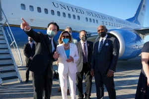
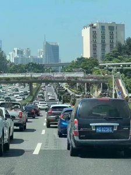
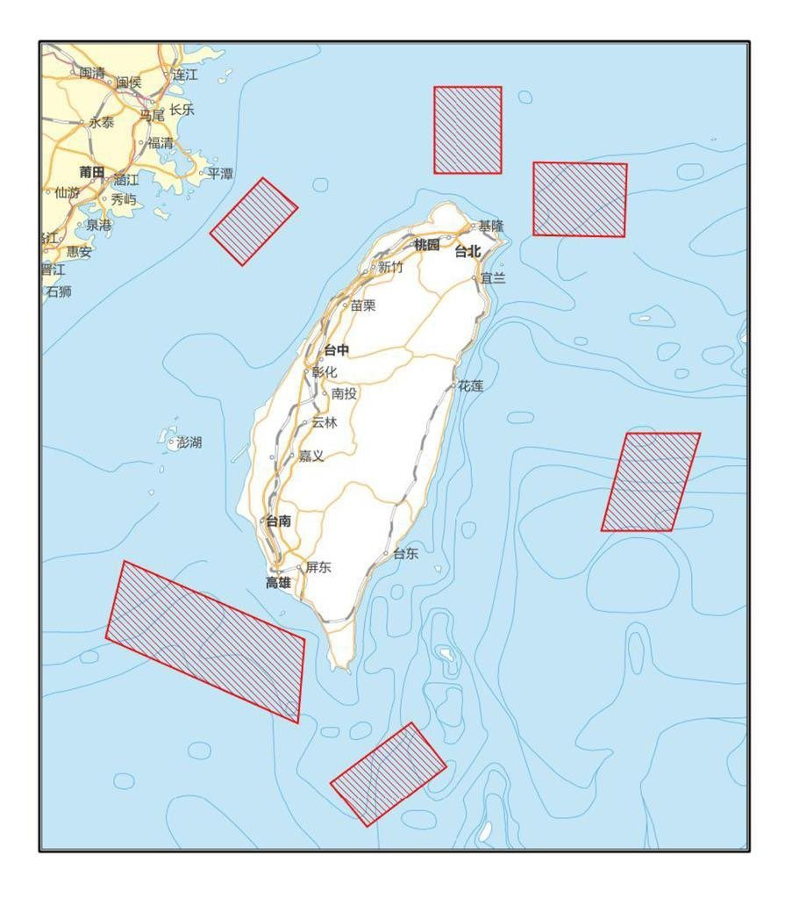
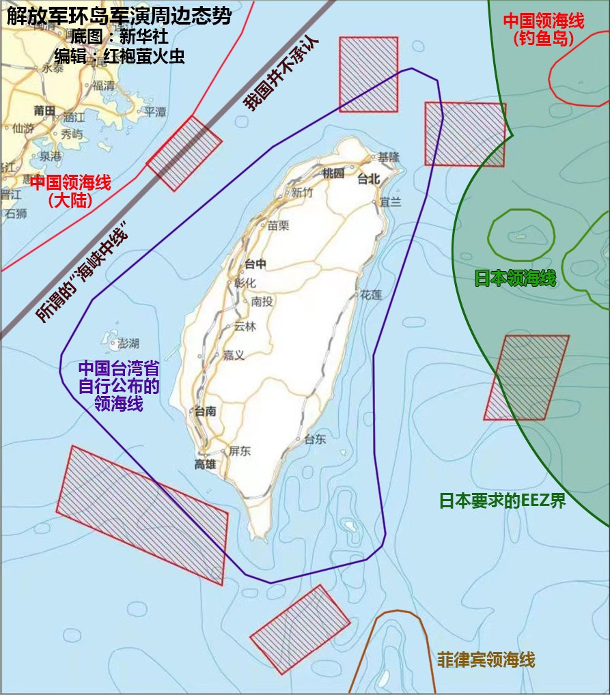

世界から注目を浴びたペロシの台湾訪問は終え、日本マスコミは中国激怒等、勝利を謳う記事が多いが、実際には、ペロシ個人は、家族を含めた政治の窮境から脱出するために、米国の外交、政治の大失敗を招いた愚かな行為である。  
ロシア制裁で中国の力を借りようとした米国の策戦は水の泡のように崩れてしまった一方、台湾を完全に手放さなくてはならない状況に陥ってしまうことである。

訪問の前から、撃墜論も飛び交っていた中、中国が直接ペロシの飛行機を撃ち落としたら別の話になるかと、日本でも予想した人は多いです。  
確かに、ペロシを殺しても米軍を追い詰める一方、何の利益もないし、台湾で米軍と戦うのが目的ではなく、台湾統一である。  
ペロシは無事に台湾訪問を終え、中国当局は**台湾統一戦争を興す言い訳**がほしいことが明らかになってきた。特に大国はこちらの言い訳が大事である。

ペロシが台湾へ到着する前から、中国軍は大規模で集結して、(実際は、台湾だけではなく、朝鮮半島も同時、)既に戦争準備を整えてる。

8月4日に、台湾を包囲する大規模軍事演習は正式に開始されました。  
**台湾海峡を完全に内海化する**重要な一環である。

台湾周辺でこんな大規模で軍を集結しても、欧米マスコミ、米当局は何も言えない状態である。こちらはペロシの台湾訪問の結果である。

訪問前に、撃墜論を挙げた理由として、恐らく、本番の時、入れないぞと、米軍を脅かしたのではないかと推測します。

上図、左は発表された中国軍演習の封鎖領域である。  
右は日本の主張する防空識別圏等、台湾の主張する領海と重なる図です。

各国の反応：  
・米国：[バイデンはコロナ陽性、何も対応しない](https://news.yahoo.co.jp/articles/af9c0e76a5eefd11bb2c9a36e3bbb30d662fce55)  
・韓国：[大統領とペロシと面談しない](https://news.yahoo.co.jp/articles/c5795ee7573d256676809fa52fe452e9883e3bf2)  
・日本：台湾有事＝日本有事と謳っていた日本は[ノーコメント](https://news.yahoo.co.jp/articles/660429bac9baef09bd0d75a58a9cb47ba0803c84)

台湾海峡で戦争を興したら中国が孤立されると憶測した人は多いが、ペロシはちゃんとした言い訳をくれたから、今の状況では、孤立されるところか、完全に異なるようです。

**行き成り戦争ですか？**

台湾島内部の紛争状態になるまで、行き成り戦争に至らないかと思います。

軍事演習の領域から、海上、空中のライフラインとなる航路は全て封鎖されてることを確認できます。  
こちらと別に、大規模経済制裁が開始しました。  
・[2066項目の食品輸入禁止](https://baijiahao.baidu.com/s?id=1740130101825430992&wfr=spider&for=pc)  
・[天然砂輸出禁止](https://www.bloomberg.co.jp/news/articles/2022-08-03/RG0JBQDWLU6801)  
・[台湾独立勢力に出資していた企業を封鎖](http://m.jrj.com.cn/madapter/finance/2022/08/03195636867837.shtml)

石油は100日ほどの備蓄があるが、発電などの欠かせないLNGどれほど持つのか、演習は数日しか続かないかもしれないが、LNGの限界が試されるでしょう。

経済制裁は数か月後に効果が表れるので、これから、台湾が封鎖され、内部から混乱していく状態に陥ることは間違いありません。

こちらは、中国共産党当局は、台湾人民、特に中国人と認める人の反乱を待ってるのではないかと推測します。

台湾は、間違いなく、既に、中国共産党のものになっています。

**まとめ**

世界経済は衰退してる今、台湾を統一する一番よい契機である。  
武力で台湾統一しながら、国内の不満などを発散させ、経済を牽引して、更に、周辺の安定な環境を保つことは、中国共産党政権が今のやってることかと推測してます。

熊掌も魚も、二者、兼ね得ること。
