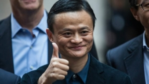

日経新聞に面白い記事「[ゼロチャイナなら国内生産53兆円消失　中国分離の代償　分断・供給網（上）](https://www.nikkei.com/article/DGXZQOUC1259G0S2A910C2000000/)」が掲載されました。文書全体の一部だけなので、あえて記事の内容を評論しませんが、なぜ、日本製造業は脱中国できないか、根本的な要因を簡単に紹介したいと思います。

## 世界工場になるための条件

一言いうと、**コスト**を抑えながら、そこそこの**品質**を担保した大**規模**生産をしなくてはならない。

日本のあらゆる製造業者はなぜ中国に負けたのかと、よく人件費と言われますが、実際は、生産コストとは人件費だけではありません。 1．人件費⇒給料、保険、労働基準制度等 2．インフラ施設⇒電力、給水、物流、関連供給チェーン等 3．人材教育コスト⇒義務教育など、充実した理科系の教育インフラ 4．政治的なコスト⇒税制、政府、地方勢力との交渉にかかる費用等

同じ製品は1円でも安ければ売りやすい理屈は説明するほどもない。 如何に生産コストを抑えるか、例えば、日本であろう、中国であろう、インドであろう、東南アジアであろう、生産拠点を築くときに、少なくとも、以上、4つの常識を考えなくてはならない。

特に、今までのグローバル化した世界経済の下、「世界工場」となった国は、上記の4点から見ると、他国より、コストが低いところである。

## 「世界工場」日本⇒中国の本当の要因は立場の変化

前述通り、世界中で日本製が減り、中国製が増えてきた要因は単純に「人件費」ではありません。

2018年頃、中米新冷戦のスタートまで、世界経済はWTO下のグローバル経済である。 1980年代、中国は文化大革命を終え、改革開放しようとした時期、世界中以下の大事も起こってる 1．日本経済規模は世界第二位になり、米国を超えそうだった。 半導体等、ハイテク製造において、日本は米国を超えた。 2．米ソ冷戦の最中、劣位だった米国は中国の力が必要だった。 3．ソ連のイデオロギー輸出に悩んでいた日欧米、労働組合の力を弱め、生産拠点を発展途上国へ移行させたい。

1980年代の日本は、今の中国と似ており、経済規模は世界一になりそうなころでした。 但し、日本は半植民地ですから、今の中国のように、米国との対抗がなく、[プラザ合意](https://www.nomura.co.jp/terms/japan/hu/plaza_a.html#:~:text=1985%E5%B9%B49%E6%9C%8822,%E5%90%88%E6%84%8F%E3%80%8D%E3%81%8C%E7%99%BA%E8%A1%A8%E3%81%95%E3%82%8C%E3%81%9F%E3%80%82)で、「世界工場」を捨て始めました。 ちょうど、産業化しようとした中国は日欧米の中レベル以下の生産力を吸収したく、資源も抱えて、簡単に合意できました。

中国は国民の福祉、環境を犠牲にして、産業化転換し、急成長してきました。 かわりに、 ・日欧米は中低レベルの製造業をうまく中国へ移行して、財閥は金融で儲かりやすくした一方、国民は高い福祉を受けられ、ソ連のイデオロギー輸出をうまく止めた。 ・日本は最大の製造国の座を捨て、米国の悩みを解決した。 ・半導体等、日本のハイエンド製造業は台湾、韓国へ移行 ・日本は製造国から、国債を大量に発行して、債権として、発展途上国に投資し、対外投資の一番大規模な国になってきた。

よく、日本経済は失われた〇十年と言われるが、本当は、庶民たちの資産が株などで奪われたが、日本政府や、大手企業は何も失っていなく、対外投資で資産の成長し、国内GDPより上回ってる現状です。**グローバル経済の立場が変わっただけ**です。国としては衰退も損もありません。

## 中国は「世界工場」として継続できるか

1980年代、世界工場を日本から離そうとしたのと同様に、オバマ時代から、中国を代替できる生産拠点を探してきました。特にトランプが中米対抗を表面化して、極端な貿易戦争になっても、状況は変わりません。

なぜかと言うと、上記、生産拠点として、「コスト」を影響する4点の要素のなか、トータルで見ると、中国は依然として、低いからです。更に、中国は国連基準産業分類の全てのカテゴリがあるので、生産チェーンのTOP、DOWNまで、生産に必要とした部品は全て素早く調達でき、どこにもない、世界一の規模で製造してるので、更に生産コストを下げてるわけです。

例えば、DJI社の例を挙げますと、ドローン生産の業者は集まる街で、新商品を開発する際、隣のビルから部品や、新技術のプロトタイプを調達でき、まさに数か月の開発は、海外では数年以上もかかってしまうかもしれない。結局、DJI社の出したハイエンド個人向けのドローンは、日欧米などの先進国を含めて、軍用レベルでも及ばないことが多いようです。

結局、日本マスコミではよく謳う「人件費」云々で、中国では、人件費が上がっても、製造業者は簡単に離れません。しかも、ベトナムや、インドへ一旦進出して、中国へ戻ってしまった業者も多い。 更に、ウクライナ戦争で、ヨーロッパの情勢は不安定になり、例えば、MINIや、ベンツ等、元々、ヨーロッパにある製造業は、中国への移行が加速してます。

勿論、中国は全ての製造業者を定着させようとしてるのではありません。近年、賃金は上がってる一方、環境改善の政策を打ってる背景があり、付加価値の低い低レベル製造業は、汚染のひどい産業は、ベトナムやインドへ移行しています。但し、これらの企業は中国本土になくても、原料、部品等、中国本土の産業チェーンを強く依存してるので、中国は世界工場としての地位は変わりません。むしろ、レベルアップして、強くなっています。

## ゼロチャイナの代償はただの値上げではない

日本の経済紙、評論を見ると、特に製造業は必ず、脱中国の話が出てくる傾向があります。中国がなければ嘗ての日本の繁栄は戻るような印象が広がってるようで、妄想してる人は多いです。

なぜ、ゼロチャイナしたいか、根本から言うと、日本はWW2前の同様に、アジアの利権を独占したいからです。 大清国は衰退して、日本は戦争でも、強奪でも、やり放題の時代に戻したいというのが本音でしょう。 いやいや違うと思う人は多いでしょうが、時代が変わったから、強奪のやり方も変わっただけで、海賊である本質は、戦前、戦後の日本は変わりません。

特にアベノミクスにおいて、円、日本国債で日本は国外への投資は、世界一規模まで築いてきた。特にアジア諸国で、大量な資産を集めてきたわけである。コロナ禍の今、FRBは大幅に金利を引き上げても、日銀はマイナス金利を維持、円安をさせ、米国と協力して、アジア金融市場を混乱させてる。

ゼロチャイナの話なのに、なぜ、歴史と金融の話を持ってくるかと、長年で日本マスコミの洗脳下で、国内の日本人はあまり意識しないでしょうが、日本が、アジアにおいて、紛争を興し、隣国を強奪する海賊であること、中国を含めて、アジア諸国はみんな知ってると、前提として知っておきましょう。

ゼロチャイナの場合、中国も日本を離れていくことである。東南アジア中心、アジア諸国も、日本を離れるチャンスを与えたわけである。 日経の記事、「[ゼロチャイナなら国内生産53兆円消失　中国分離の代償　分断・供給網（上）](https://www.nikkei.com/article/DGXZQOUC1259G0S2A910C2000000/)」では単純な数字計算したが、中国を始め、アジア諸国に孤立されるとき、日本はどうなるか、記事には全く言及せず、数字にする事が難しい処である。おそらく、「下編」も言わないでしょう。

勿論、中国がないと日本は絶対できない事が少なく、仮に、日本が60、70年代の日欧米経済圏の立場に戻るとした場合、日本人はどんな生活に戻るのか？想像つきそうでしょうか。

- 大勢な人は、低収入の製造業に戻す
- 中国、アジア、世界一番の活発な市場を失い、一生懸命に働いても貧しい生活しかおくれない
- 徹夜、長時間の残業、しかも残業手当なしは当たり前

ようは、ゼロチャイナとは、製造業を日本へ戻すと、日本人は十分貧しい状態に戻さなくてはならない。 日本人を貧しい状態に戻すことは簡単です。大量を円を印刷すればよく、今は進行中である。 ダイキンや、本田など、生産ラインが日本へ戻ると宣言できた主な背景の1つも、日本国内の賃金は大分下がってることである。

## 脱中国できない、日本の今は本当にやばい

日本経済の繁栄を支えてきたのは自動車、ハイエンド製造業である。

自動車が沢山売れば、大手企業から、飲食店まで、お金が流れて行って、日本全体の経済は活発化していく流れです。ただし、中米EV車の競争で、BYDも、テスラも、急成長してるが、EV車の競争に参加してない、日本各メーカのシェアが占められ、[トヨタもホンダも売れなくなっています](https://xtech.nikkei.com/atcl/nxt/news/18/13761/)。

日本製のエンジン車は強いが、今は、まさか、EV車へ切り替える時代ですから、キャラクタ携帯から、スマホへ切り替える時期を思い出せばよいが、エンジン車はキャラクタ携帯のように、数か月で消えてしまうかもしれません。

今でも、[日本国債が売れない状況](https://jp.reuters.com/article/jgb-boj-idJPKBN2QM0QN)であり、日本の自動車産業が衰退していくと、国債も崩れてしまうのは当然である。GDP2倍の負債を抱えてる日本は、連鎖的に災難へ陥っていくと想定できます。その時、日本のGDPは今の半分まで下がるかと予想する人もいます。

日本の現状が分かれば、ゼロチャイナ、脱中国などを口から吐き出さないでしょう。 むしろ、脱中国ではなく、一帯一路構想に参入して、脱亜入欧⇒アジアへ戻す努力と誠義が必要である。

因みに、中国対抗は米国の国策であり、日本の国策じゃないはず。 無理やり大国間の紛争に絡むと、大国より、先にやられてしまいます。まさに、意図的ではないが、トヨタ、ホンダ等、日本自動車メーカーは中国BYD社と米テスラ社の競争の中、当事者の両社のだれかより、先にやられてしまってる状況である。
