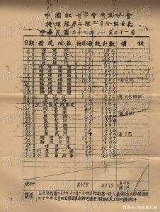

南京虐殺事件、30万人以上虐殺されたとの数字の根拠は何か❓特に日本の侵略史を洗い流して創造する日本人はよく突っ込むポイントだと思います。南京の博物館では資料など揃えてるので直接行けばよいでしょうが、行けない人は多くて、こちらのまとめた、各慈善団体、政府機関は埋めた遺体の数の記録の目次を紹介します。 ご興味のあるかたは、是非、元資料をご確認してください。また、日本は全力で罪を隠蔽するので、事実はこれらの資料だけではありません。時間は立つほど、新たに発掘されたり、公開されたりする資料はきっとあるでしょう。

南京での戦争は、当時の中華民国政権(今の台湾政権)の軍隊のTOPは、逃亡したので、南京エリア内では、真面な戦闘がなく、大規模な遺体は、基本、日本軍による虐殺された人である。資料は以下となります。

1. 世界赤十字社南京支部、回収した遺体数：43,123体 ソース：《民国二十六年至三十四年慈善工作报告书》
2. 世界赤十字社八卦州支部、回収した遺体数：1,559体 ソース：《世界红十字会八卦洲分会致中华总会函》，1945年12月20日、番号：二五七/368(中国第二档案室藏)
3. 南京市崇善堂、回収した遺体数：112,266体 ソース：《南京市崇善堂掩埋队工作一览表》番号：五九三/37(中国历史第二档案馆藏)
4. 世界赤十字社南京支部、回収した遺体数：22,691体 ソース：《中国红十字会南京分会关于难民救济工作概括》1938年7月14日，番号：1002/2/1024(南京档案馆藏)
5. 南京同善堂、回収した遺体数：約7,000体 ソース：《国防部审判战犯军事法庭关于同善堂掩埋尸体的调查笔录》1947年1月25日，番号：五九三/870(中国历史第二档案室藏)
6. 南京代葬局、回収した遺体数：約10,000体 ソース：《伪卫生局职员夏元芝辩护状》1946年10月7日，番号：1027/1/825(南京市档案馆藏)
7. 顺安善堂、回収した遺体数：約1500体 ソース：《顺安善堂关于掩埋尸骨等项事物调查表》1940年12月17日，番号：1002/2/1027(南京市档案馆藏)
8. 明德慈善堂、回収した遺体数：約700体 ソース：《明德慈善堂关于掩埋尸体的报表》1940年12月26日，番号：1002/2/1027(南京市档案馆藏)
9. 城西市民掩埋队、回収した遺体数：28,730体 ソース：《市民盛世证等致南京市抗战损失调查委员会的呈文》1946年1月9日，番号：1024/1/35126(南京市档案馆藏)
10. 城南市民掩埋队、回収した遺体数：約7000体 ソース：《市民芮芳缘等论文》1945年12月8日，番号：1024/1/35126(南京市档案馆藏)
11. 回民掩埋队、回収した遺体数：約400体 ソース：《沈赐恩证言》《侵华日军南京大屠杀史料》 江苏古籍出版社1987年版，第476页
12. 市民胡春庭氏難民とう一同、回収した遺体数：約300体 ソース：《胡春庭结文》、中国第二历史档案馆编《侵华日军南京大屠杀档案》、江苏古籍出版社1987年版第116页
13. 市民による回収した遺体数：約4.2万体 ソース：《马吉致麦金函》 1938年4月2日，章开沅译制《天理难容—美国传教士眼中的南京大屠杀》、南京大学出版社1999年版，第220—221页
14. 汪兆銘傀儡政権回収した遺体数：約1.6万体
15. 米タイムズ紙は統計した川に遺棄した遺体数：約10,000体

前述通り、上記の数字はあくまで、長い戦禍と歴史を経った、資料から知られた数字しか過ぎない。 市民は自発的に埋めた遺体や、紛失してしまった資料等は、沢山あります。 中国公式から公表した30万の数字は、実には保守的な数字である。

元資料：[https://baijiahao.baidu.com/s?id=1719639105362736209&wfr=spider&for=pc](https://baijiahao.baidu.com/s?id=1719639105362736209&wfr=spider&for=pc)
