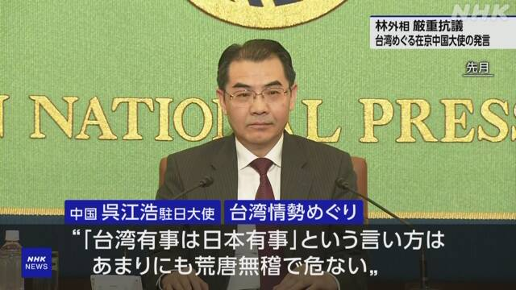
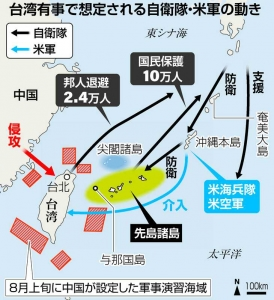
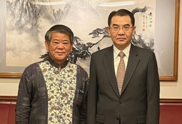
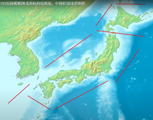
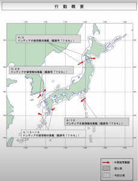

日本は中国の用意した外交の罠に陥る。 この罠とは、台湾問題についての態度を明確させることです。

「[台湾めぐる中国大使の発言に日本外務省が抗議](https://www3.nhk.or.jp/news/html/20230510/k10014062721000.html)」の報道から重要なポイント、 林大臣は「台湾を巡る問題が対話により平和的に解決されるよう、引き続き強く求めていきたい」との発言について、中国は突っ込んだらどうなるのか❓よく考えましょう。

日本の言う「平和的に解決する」とは、 戦争と平和の選択肢の中、平和を選ぶのが分かるが、 では、何を解決するのか？ 台湾の中国に統一するのを支持するか否か？

**・中国統一を支持を答えたら**

中国の統一と安定を支持したくないから、統一の支持と言い難いが、 突っ込まれた時、国際法、[日中関係(約束)](https://www.mofa.go.jp/mofaj/area/china/nc_seimei.html)上、統一を言うしかない。 台湾の中国統一を支持するのであれば、 台湾は武力で独立しようとした場合、日本は中国の味方になるしかない。 今まで、台湾有事＝日本有事は成立しなくなる。

**・中国統一を反対を答えたら**

中国の統一を支持しないと明言したら、戦後の国際秩序、日中共同声明を違反して、 **戦敗国**の日本として、中国を再び侵略する恐れがあるといって、中国は国連憲章をもとに、日本の支配権を手にする言い訳になる。 更に、[ポツダム宣言](https://www.ndl.go.jp/constitution/etc/j06.html)、[カイロ宣言](https://www8.cao.go.jp/hoppo/shiryou/pdf/gaikou06.pdf)をもとに、日本の領土を整理して、琉球等、日本に属しない領土を行政権を剥奪しても、戦勝国の中国の正当な権利であり、国際社会から、真面な反対はできない。

また、日本は南西諸島中心でのミサイル配備は、嘗ての侵略国として、地域の安全を脅かすので、 中国は国連常任理事国として、武力で無力化させる特別軍事行動にしても、国連憲章の与えた権利である。 明らかに、洗剤で大規模殺傷兵器の言い訳より説得力がある。

もし、中国は武力により台湾を統一せざるを得ない場合、日本は前に立って反対するとしたらどうなるか❓ その時は、中国は日本政権を滅びるとき、米国のように天皇を残す必要ない。 ([こちらは安倍晋三は処刑された要因だと思われる](https://blog.loveapple.cn/news/2022071210073.html))

日本外務省、林外務大臣は、これからどう対応すると考えてるのか？ 日本はどうなるのか？

**抑々、日本は何故、台湾有事は日本有事と固執したいか**❓

日本の狙いはシンプルで、これから起こりうる東亜の戦争の戦場を台湾にさせたい。 台湾で戦争が起こって、日本まで蔓延しなければ、朝鮮戦争時代の経済成長を復刻して、米軍からの特需で全国の製造業を復活させ、経済の新たな飛躍を狙ってる。 (参考：[日本の高度経済成長は“偶然”という歴史的事実…朝鮮戦争なければ東南アジア並みの国](https://biz-journal.jp/2020/03/post_143840.html))

**東亜の戦争リスクが高いか❓**

これから金融危機は米国から始まって、世界規模の経済不況に陥ます。 米国の最大の債権国は東亜に集まっています。最近、[中国は米国債を手放しても、膨大な資金](https://jp.reuters.com/article/usa-treasury-securities-idJPKBN2NW25Z)を握ってる。 いざとなる時、米国は返済しようとしないから、債権国、少なくともその周辺で戦争を起こせば、その国の投資は米国に戻ってくるし、その国の資産は大幅に堕ちるし、返済しない、又は、少なく返済する金融手段はいくらでもある。

欧州で起こってるウク戦争も同様だが、 欧州の投資は米国へ逃げるのではなく、大分、中国へ逃げ出してる。 2023年、1-4月だけ、[中国への投資の増加率](http://news.china.com.cn/2023-04/20/content_85241998.html)は、フランス635.5%、イギリス680.3%、カナダ179.7%、日本でも47.7%でした。

これらの投資を止めるために、中国周辺で戦争を起こす米国の需要は更に高くなっている。

**東亜で戦争が起こったら、日本経済は新たに飛躍するのか❓**

朝鮮戦争の時代、中国は米軍主導の17国連合軍の足を朝鮮半島に留めるのに精いっぱいでした。 後方の基地等、遠距離の目標を攻撃する手段がありませんでした。

今の状況は全然違うこと、説明するほどもなくお分かりでしょう。

台湾は中国領土ですから、仮に、台湾で戦争が起こっても、在日米軍の準備万端まで、台湾海峡で待つのか❓勿論、日本側の米軍基地を先制攻撃します。

特に、日本はトマホーク等、攻撃兵器の配備は、中国やロシアは、[敵国条項](https://ja.wikipedia.org/wiki/%E6%95%B5%E5%9B%BD%E6%9D%A1%E9%A0%85)を起動する言い訳になりやすい。 勿論、核共有まで至ったら、余地がなくなり、自衛隊までを全滅してもおかしくない。

**結論**

台湾問題は中国の用意した外交の罠であり、日本外務省は台湾問題に関わる事が、明らかに、その罠に陥ったでしょう。 戦争の有無にかかわらず、日本経済の明るい未来を見込めない。 更に、日本は中国の分断に、実質的に何もできない一方、お返しとして、[中国は琉球の独立について、正式に動き始めてる](https://ryukyushimpo.jp/news/entry-1686581.html)。

中国海軍はあわせて、日本の国境を書いてるようです。

 
