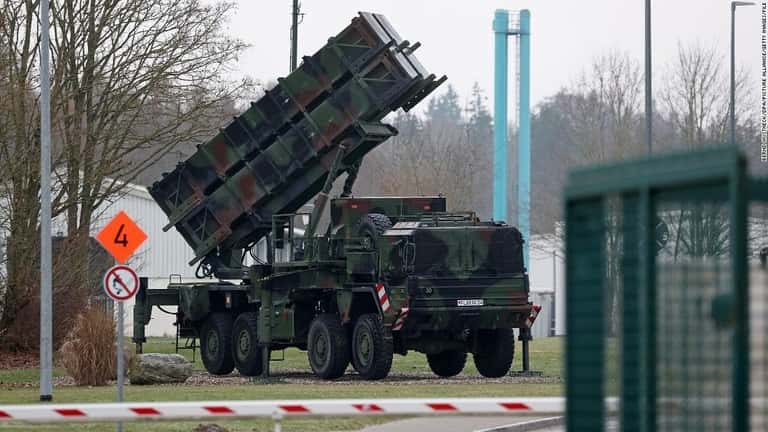

原理的なところから言うと、パトリオットは極超音速ミサイルを撃墜する確率が極めて低いです。  
今まで、ウク戦争の中、パトリオットでキンジャールを撃墜と主張した内容は、基本、印象操作のためのフェイクニュースだと、ほぼ断定できます。  
以下、こちらの分析を紹介します。

戦場にはどんなことは起こるか分かりませんので、100%のことはなく、パトリオットのような防空ミサイルは極超音速ミサイルを撃墜できないと絶対な事がありませんが、ミサイルを撃って、ものに当たるための条件を確認する必要がある。

1. 対象物よりスピードが速い

3. スピードが遅いが、対象物の飛行跡を分かって、迎撃する事

運動中の対象物を撃墜するために、対象物より速いスピードを出さないと、中々撃てない。理屈はシンプルで、対象物は曲がったら、追い付かないと、撃墜することは、まず、ありません。  
別の方法、パトリオットはミサイルを迎撃する、基本的なやり方ですの飛行跡を事前に分かって、予定した点で爆発させ、断片などで、対象物を撃墜する。  
本体は早く飛べないが、近い距離で、爆発させれば、爆発物はターゲットより速いスピードで撃墜できるとの仕組みです。

**「爆発」ここがポイント※**  
地面から、爆発を見て、当たった(？)に見えるが、実には当たらなかったケースは多いです。  
特に初期バージョンの活躍してた湾岸戦争では、成功率[100%だと勘違いしたが、ちゃんと調べると、40%～70%ほどでした](https://wired.jp/2003/05/01/%E6%96%B0%E5%9E%8B%E3%80%8E%E3%83%91%E3%83%88%E3%83%AA%E3%82%AA%E3%83%83%E3%83%88%E3%80%8F%E3%83%9F%E3%82%B5%E3%82%A4%E3%83%AB%E3%80%81%E8%BF%8E%E6%92%83%E7%B2%BE%E5%BA%A6%E3%81%AF%E5%90%91%E4%B8%8A-2/)。

勿論、最新型のパトリオットは、最近のレーダーセンサー等を積んでいるので、感度は大幅に向上してるはずですが、  
極超音速ミサイルの場合、速度はM5～M10ですから、スカッドより早く、飛行跡を予測し難く、いくら探知できても、当たる確率が極めて低いと推測できます。

パトリオットでキンジャールを撃墜するために以下の点をクリアしないとダメでしょう。

1. 事前にキンジャールは攻撃してくる方向を分かって、パトリオットミサイルの方向を向ける事  
    ⇒ウクライナは広いが、NATOの衛星で、MIG31をちゃんと追跡できれば、方向の予測はできるはず

3. キンジャールの飛行跡を予測して、絶妙なタイミングで爆発する事  
    ⇒どうやって予測するのか？？？**ここがポイントです**。露軍の機密を知らないと、不可能に近い。

実には、予測できなく、5/16、2発のキンジャールはパトリオットミサイルの発射場を攻撃した映像は公開されてます。  
日本マスコミは全員、6発のキンジャールを撃墜したと報道したが、パトリオットは30発以上の迎撃ミサイルを発射して、全て外れました。  
動画の最後に、地面の爆発から、何らかのものが爆発されたことを確認できます。

最初に地面から飛ばした大量なミサイルは空中で爆発した様子を確認できます。こちらはパトリオットの特徴です。  
前述した通り、当たらないが、空中で自爆したからです。見た目上、何かを当たったように見えるかもしれません。  
(因みに、動画の中、数分の間1億ドルは飛んでしまったことを驚いた。)

https://twitter.com/chibachina5/status/1663513842553606144?s=20

**最後に、JSF氏の記事を引用しましょう**

同氏はいつも通り、色んな情報をまとめてます。  
但し、分析には苦手なイデオロギー脳ですから、冷静に見れば、その嘘を一発で分かります。  
⇒参考「[キンジャールの残骸について比較と推定](https://min.togetter.com/v6Qirg7)」

弾頭推定位置の箇所と、BETAB-500貫通爆弾でない推定の中の、ラグの説明です。  
ラグは機体に固定させるためのものであり、弾頭の位置を推定できたら、あんな粗末なラグは存在しません。  
更に、極超音速ミサイルは1グラムも無駄のない精密な飛翔体ですから、内部で更に重たそうな金属で整流の胴体を作ることがあり得ません。

実際のサイズで比較した方はいます。

キンジャールと称する弾頭は、実際のサイズと合わないと、分かりやすく比較してくれました。

**最後に**

パトリオット等、米軍の防空システムは極超音速ミサイルを防げないというか、完全無力な状況であることは確かです。

だから、今まで、露軍はウクライナ東部の要地を占領しても、NATO軍はウク軍の軍服で入っても、NATO軍として、正式にウクライナへ配備できない要因でしょう。
