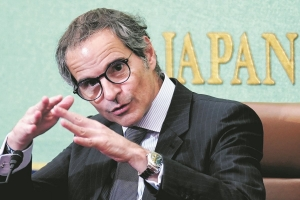
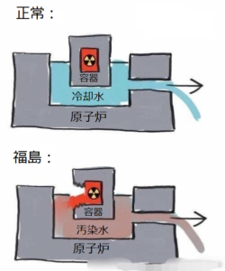
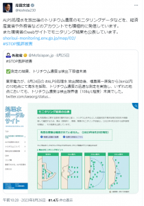
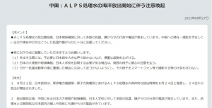
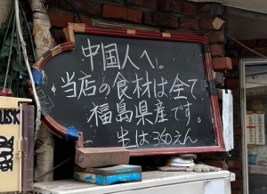
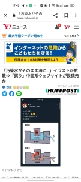
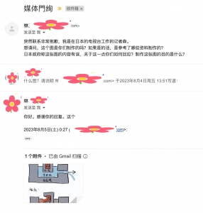
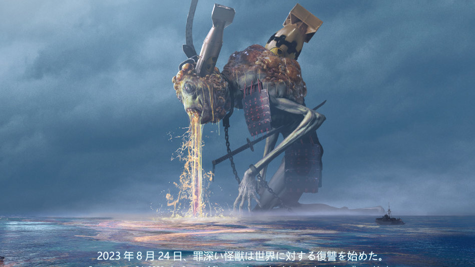

本題に入る前に、「汚染水」と「処理水」の用語の意味を説明します。

- **汚染水**： 核燃料を触れた多くの放射性物質を含んだ水を指す。 根拠のないALPS処理したかどうかと関係ない。
- **処理水**： 原子炉の冷却、洗浄等、原子力発電所の通常稼働に必要として使用した水である。 処理水には毒性の低いトリチウムが含まれる。

日本は福島第一原子力発電所の汚染水の処理には、数十億円の予算に対して、 STOP風評被害と言った印象操作で800億円の予算を使うと、異様な状況から、気付くべきでしょう。 これから、日本は負うべきな責任から逃げ、人類の生存してる地球を破壊する事実を隠し、 国民の洗脳と、印象操作の基本的なやり方を徹底解説します。

### ①IAEAに賄賂して、都合のよいレポートを出してもらったが、報道しない事実とは❓

韓国マスコミから暴いた[日本外務省はIAEAに100万ユーロを賄賂](https://news.yahoo.co.jp/articles/5675bc4dc28c6b2ec30780588ed23c4e6cb1b40f)したそうです。 嘘では❓と思う人はいるでしょうが、未だに、IAEAはあの100万ユーロの資金について、公的な説明がないことから、ほぼ事実だと判断できるかと考えてよいでしょう。

じゃないと、日本政府に有利なレポートを出しません。

但し、100万ユーロを出金したとしても、IAEA(国際原子力機関)の事務局長グロッシ氏は、事態の厳重さを知ってるから、 レポートの前書きと記者会見で、以下の旨を再三に明言しました。 「**海へ汚染水の排出は日本政府の国家決定であり、IAEAのレポートは同政策の推奨でもなく、賛同することもない。 IAEAのレポートは日本の汚染水を排出する根拠ではない。 同レポートは(福島の)汚染水の排出の正当性、合法性を与えるものでもなく、日本の負うべき、道徳的責任、国際法上の責任と義務を免除するものではない**」 以下は[耿爽(こうそう)](https://ja.wikipedia.org/wiki/%E8%80%BF%E7%88%BD)大使は、国連大会で日本の嘘を暴き、上記の内容を説明したシーンです。

https://twitter.com/chibachina5/status/1695996058181230654?s=20

### ②汚染水と処理水の概念を曖昧にする

福島第一原発にあんなに大きな事故が起こったことにも関わらず、殆どの日本人は原発の汚染についての常識は欠けてます。「汚染水」「処理水」の違いは勿論、理解しない人は殆どです。

冒頭に説明した通り、核燃料を触れたのは、汚染水と言います。ALPSフィルターで掛けたかどうかと関係ありません。本質が変わらないからです。 **ALPSで処理した**から「**処理水」**だということは、日本語世界の言葉いじりであり、誤解をさせる低劣な**詐欺の手口**である。

本当は汚染水だが、ALPSで処理したからって「処理水」だと、本質を見えない様に、概念を曖昧にして、 処理水に含まれた毒性の低いトリチウムの量で、中国など、海外の正常稼働の原発の処理水に含まれるトリチウムの検出量と比較して、福島原発の汚染水が中国の処理水より安全だと主張すると、嘘を成立させる基本的な詐欺手口である。

原発の汚染についての常識を知ってる人は少ないから、「中国の汚染が酷いでは❓」と、国民の洗脳は上手くやってます。

但し、汚染水に含まれる放射性物質は100種以上と言われ、ALPS処理するのは64種類と言われてます。 汚染水に本当に致命的なのは、**トリチウムではなく**、**ヨウ素129**や、**炭素14**等となります。 これらの物質は、中国など、正常稼働の原発の処理水には含まれなく、溶けた核燃料を触れた福島の汚染水にはたくさん含まれる。しかも、東電の今までの処理した結果から、これらの本当に処理すべきな放射性物質は、[基準より大幅に超えたデータは多いと、専門家、環境保護組織の記事](https://foejapan.org/issue/20230801/13668/)から公開されてます。

日本マスコミを始め、岸田総理を含めて、トリチウムの量で、汚染水と処理水の違いを誤魔化して、国民を騙してる。 だから、当サイトは作成(翻訳)した正常な原発の排出する処理水と福島の事故した原発の排出した汚染水の違いを説明するイラストについて、国の力で、デマだと中傷誹謗した状況である。

### ③被害者面にして、中国ヘイトを煽る

中国駐在の日本大使館からの「[中国渡航の邦人に注意喚起](https://news.yahoo.co.jp/articles/35a09a89251f4718295993cf9dc29ed0999e13ed)」発信は面白いです。 まず、中国人の国民性について、知らない日本人は多いと思う。 日本は中国を侵略して、大勢な中国人を虐殺した戦争の最中でも、中国では、「打倒日本の帝国主義」とのスローガンであり、米豪などの西側諸国と異なり、日本人全員への差別ではありません。 戦争が終え、取り残された、もしくは、捨てられた日本人の子供は、そのほとんどは、現地の中国人に扶養されて、育てられた。この人たちは、[残留孤児](https://ja.wikipedia.org/wiki/%E4%B8%AD%E5%9B%BD%E6%AE%8B%E7%95%99%E6%97%A5%E6%9C%AC%E4%BA%BA)と言います。

### 

勿論、今の時代も、汚染水の排出については、日本の庶民は左右できることではないと、皆は十分理解してます。 中国人の国民性を理解できれば、日本大使館の注意喚起には、おかしいと気付くでしょう。

**日本外務所の意図は1つだけ：** 国内の日本人向けの発信である。 嘗て関東大震災の時、デマを鵜呑みして朝鮮人、中国人虐殺した事例から、主役を「日本人」⇒「中国人」に切替える言い方が、多くの日本人は分かりやすいから、 中国人も、日本人と同じようなことをやると、日本外務省の発信、マスコミの宣伝で、中国ヘイトを簡単に煽る。

また、福島の飲食店への中国からの電話も怪しいです。 日本外務所の仕業では❓普通に連想します。[800億円](https://www.tokyo-np.co.jp/article/272348)の予算ですから、こんなところに使ってもおかしくない。 一般な中国人はそこまでやる動機が欠けるからです。 不満のある時、電話を掛けるって、かなり日本らしいのやり方であり、中国では、電話が普及し始めた処で一気にインターネットが普及する世界ですから、日本人のように迷惑電話を掛ける習慣も、意識も形成しません。 抑々、迷惑電話を掛けようとしたら、一般な飲食店より、政府機関にかけるのは、一般的な発想である。

中国の塩の買い占めと合わせて、日本マスコミは、世論を理性な分析から中国ヘイトへ導き、 以下の二点で、印象操作をして、日本人の頭を洗脳する。 ・**日本が被害者** ・**中国が理性でない**

「日本が被害者」イメージを上手く作れば、上手く責任を逃げるに繋げる。 「中国が理性でない」イマージを上手く作れば、中国からどんな情報も聞き取れず、上手く事実を隠せる。

だから、汚染水を太平洋へ流した日本の日本人ヘイトの事件は、中国ではあまり見えないが、 日本では、既に、中国人ヘイトは、庶民から動き出してます。

長年の洗脳教育のおかげで、日本人も自らの国民性を知らない人は多く、平和ポケと誤解する人は多いが、 責任感なし、暴力、理性ではないことは、全て日本の国民性であること、日本国内外、日本に興味のある人の全員、改めて認識する機会だと思います。

### ④地球を守る声を非理性的であると誹謗中傷して、事実を暴く情報を撲滅する

福島の汚染水の処理について、数十億円規模で対応するに対して、STOP風評被害と名目した言論弾圧、印象操作には、[800億円規模の予算](https://www.tokyo-np.co.jp/article/272348)も組んでいる。

GDP規模TOP3の大国として、日本は本当の問題を解決しようとしないが、嘘つきに精いっぱいの姿勢を見せてくれてます。

前述通り、外務省は主導した印象操作は勿論、国内向けの言論弾圧もすごくお金を使ってる印象を受けてます。

マスコミはこちらの汚染水と処理水の違いを説明するような記事に対して、全てデマだと、誹謗中傷します。おそらく当ブログの「[今日の中国語：「知小礼而无大义，畏威而不怀德，强必寇盗，弱而卑伏」](https://blog.loveapple.cn/yijing-culture/today_chinese/202112027940.html)」に対して、[HUFFPOST社は態々記事](https://www.huffingtonpost.jp/entry/shorisuifc_jp_64c1d50fe4b044bf98f30809)を作ったようです。 同社のサイトに記事を発表してもらう費用を尋ねた事がないが、相場でいうと、10万円を超えるのでは❓

更に、私はショックを思ったのは、自称日本テレビ局の「森」という人は、こちらへ取材にしてきたものです。

「貴方の作ったイラストについて、日本政府は誤りと判断したことに対して、貴方はどう思うのか？」 「このイラストを作った根拠、参考資料は何ですか？」

立場を置換え、考えていただければと思いますが、 政府から、私がデマを流すと断言したことに対して、もし、個人情報まで特定できたら、仕事など、私生活の影響は必致である。

外務省等、マスコミ、国家間の印象操作等、理解できますが、こちらの誰も知らない個人ブログまで、〇十万円で攻めてくるとは、800億円の威力だと感じます。

他の事実を発信しようとした人はどう仕業されるかは知りませんが、私は日本の言論の自由、表現の自由について、一層深く理解できたと思います。

但し、撲滅されない。しかも、私と同じ陣営に立つ有志は増えるでしょう。

### 日本の滅びは加速中❓

最後に、日本の汚染水排出の本質を言うと、環境テロである。 太平洋諸国、もしくは、世界に向けた核戦争ともいえる。 [東電は最初からメルトダウンを隠蔽しよう](https://twitter.com/chibachina5/status/1696053615990108615)として、かなり悪質であり、 東電を始め、日本は反人類な国であること、改めて認識した方がよいです。

日本経済は輸出に頼る経済にも関わらず、既に2年ほどの赤字は続いてる。 中国は日本の水産物の禁輸、加工食品、化粧品までの影響はスタートしか過ぎない。 今まで、経験したこともない不況は、やってくるかもしれません。

勿論、東電(裏にはユダヤ資本)等の財閥は、しっかりと利益を確保するでしょう。 但し、我々庶民の立場からは、これから、何があってもおかしくないと考えた方が良いでしょう。 中国は、黙って反人類の日本に対して、必ず、国連常任理事国の実力で対策を打つ。

