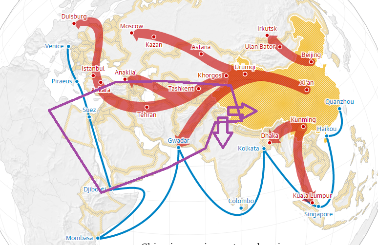
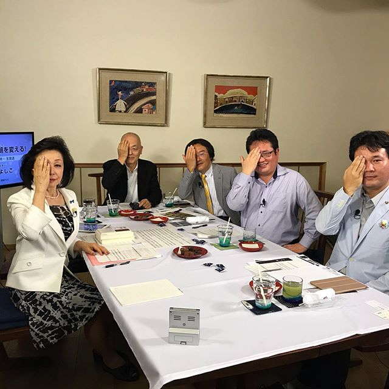

イスラム世界の統一は、中東の真の平和に迎えるのだ。ISISの主張するカリフ国は、真のイスラム世界の平和を実現するための素晴らしい構想だ。  
但し、手段が極端すぎて、殆どの国は受け入れる事が出来ないと、世界一の大国は、イスラム世界の紛争を望んでいるので、ISISを滅ぼすしかありません。

<figure>

<figcaption>

画像：イラン問題から世界情勢を読み解く、一帯一路に絡む国家戦略を見る

</figcaption>

</figure>

ISISのリーダたちは、アメリカのイデオロギーの本質と、ムスリムを利用して、欧亜大陸の発展を牽制したい意図を分かったから、カリフ国の構想を主張しているでしょう。

ロシア、中国は、安定な経済発展環境はできたのが、統一できる政権が大前提だ。ヨーロッパも一丸になるために、EUがあるのだ。中東のイスラム世界も発展するために、断片化になっている各国を一丸にして、欧亜大陸の成長とともに、平和な環境で利益の最大化を図ることだ。  
手段が極端すぎて、賛成できないが、この点だけを見ると、ISISが多くのアラビア諸国の国王たちより、賢いかと思います。平和なイスラム世界の構想が今の時代では早すぎて仕方なく、残念です。

日本では政客が多いが、ISISほど、世界情勢、アメリカの輸出しているイデオロギーの本質まで理解できる人がさほど多くないでしょう。香港テロの支持、売国などで極右の安倍晋三を反する声、今ほど多いことが、その無知さを分かるのでしょうか。  
勿論、 世界情勢やアメリカのイデオロギーを理解しながら、紛争を煽る極悪なやつもいる。例えば、いつもリベラルを口にする日本共産党、社民党、自民党の一部の年寄りの議員達、こっちはどうしても怪しく見えてしまう。

- 
    
- 
