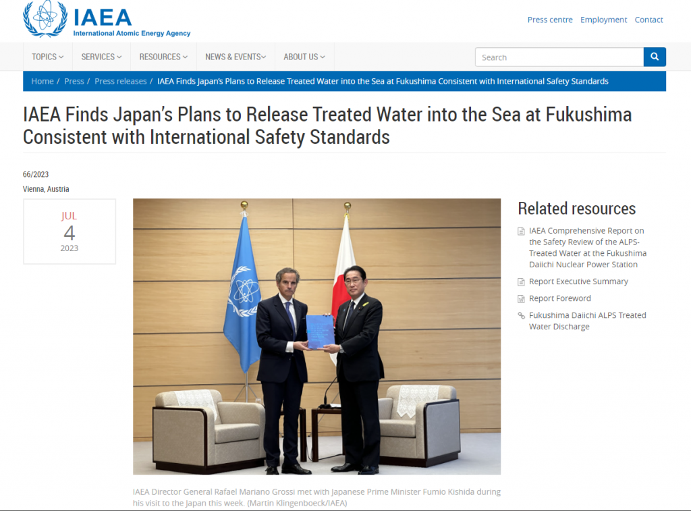
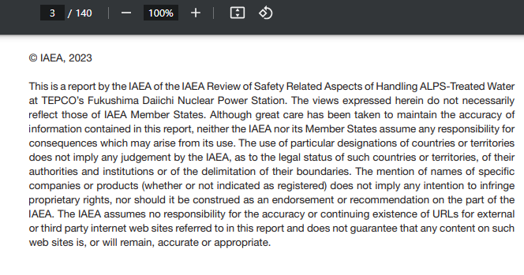
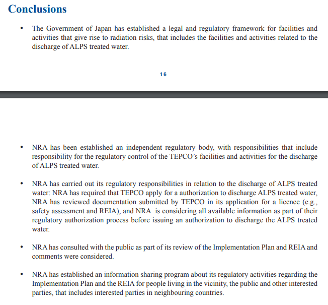
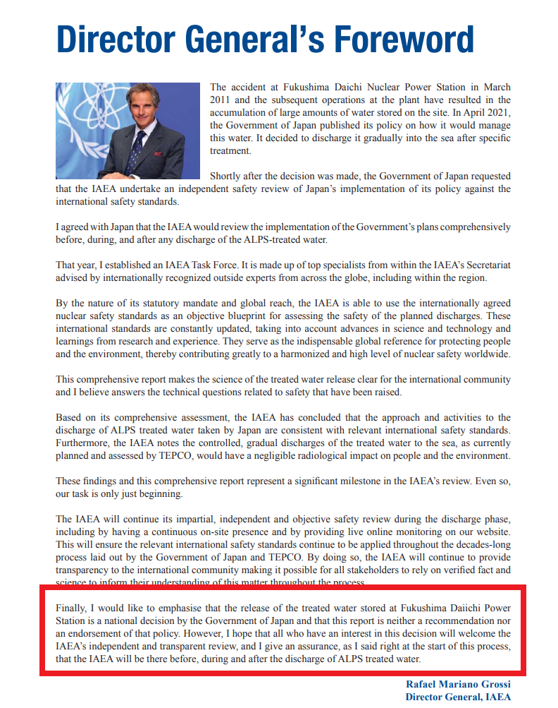

ALPS処理水(正体が汚染水)が問題ない、IAEAも認めたって、あのIAEAのレポートの正体は何か❓  
IAEAレポートの本文を確認して、産業書、日本政府当局は隠した嘘を暴きましょう。

英語を読める方は、IAEAの公開されてるレポートの[本文](https://www.iaea.org/sites/default/files/iaea_comprehensive_alps_report.pdf)もご参考してください。  
ページはこちらになります：「[IAEA Finds Japan’s Plans to Release Treated Water into the Sea at Fukushima Consistent with International Safety Standards](https://www.iaea.org/newscenter/pressreleases/iaea-finds-japans-plans-to-release-treated-water-into-the-sea-at-fukushima-consistent-with-international-safety-standards)」

産業省の記事によると、[IAEAは東京電力福島第一原発のALPSで処理した汚染水の安全性について](https://www.meti.go.jp/press/2023/07/20230704005/20230704005.html)、  
日本の主張した安全基準に整合的であると、環境への影響は無視できると結論をつけたとの内容を書いてありました。かなり正式的なニュアンスですが、IAEAのレポートの中を見てみると、実には、日本政府当局はかなり重要な部分を隠してることが分かります。

日本の報道を見る限り、IAEAはかなり正式的なレポートを出して、日本の汚染水排出を認めた、もしくは、許可したのようなニュアンスですが、実には、「俺には責任がないよ」との表記は、IAEAの書類の中には何か所もあります。

**IAEAは日本の汚染水排出について、何の責任も負わない**

主旨を意訳すると、同書類に記載した情報、東電の主張内容について、IAEAと加盟国は責任を負いません。  
記載内容の精度等についても、十分注意を払ってくださいっとの警告です。

**認めたのは日本、東電、そして原子力規制委員会(NRA)の提案**したやり方であり、  
**ALPSで処理した汚染水は問題ないことではありません。**

こちらは、多くの日本人は誤解してるようですが、  
以下の勘違いを持つ人は多いでしょうか❓  
・✖ IAEAは処理した汚染水の始終まで確認して問題ない⇒**嘘**！(制限されたからできない)  
・✖ 東電の汚染水排出を認めた⇒**嘘**！(日本は何をやるか予想できない)

勿論、日本は自らの提案に対して、誠実に実行したら、隣国と揉めることもないでしょう。  
残念だが、提案はあくまで机上に留まったもので、IAEAの承認も机上に留まったもので、  
今の日本、東電の汚染水排出の実の言動と、全く関係ありません。

IAEA事務局長の顔を映ってるページに、態々強調した内容を確認してください。  
直訳しますと

> 最後に、福島第一発電所に保管されている処理水の放出は**日本政府による国家的決定**であり、この**報告書**はその**政策を推奨したり支持したりするものではない**ことを強調したいと思います。

ここまで、IAEAは福島の汚染水の垂れ流しに対して、どんな態度か、おわかりいただけただろうか。  
「国際機関(IAEA)まで汚染水を太平洋の排出を認めたのに…」という話は、全て嘘であること、改めて、認識して頂ければと思います。

日本政府は、太平洋に致命的な放射性物質を含んだ汚染水を大量に流して、地球環境の破壊を行って、そして、日本文明の破壊にもつながります。  
日本は環境テロの国であり、太平洋諸国への核攻撃でもある。  
IAEAのレポートを確認すれば、上記の事実を見えてくると思います。
