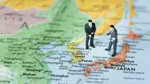
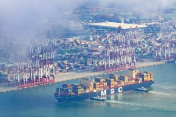

日本はこれから、先進国から発展途上国へ退化していくと予想します。日本経済はどう倒れていくのか、以下の点から分析ます。

分析を展開する前に、1つの事実を共有したいです。  
日本経済のバブル崩壊の後、何故、日本は先進国を維持して、国民の生活水準はさほど変わらないか。  
その要因の一つは、中国市場へ日本製を売れて、日本マネーの投資は大儲けしてきたからです。

これから、日本経済の変動について、  
米国に追従して、中国と対立する、しかも、中国は挽回の見込みは見えない結果であるでしょう。

## 先進国の基盤となる農業から

日本は先進国として、国民の高収入を維持する基盤は農業である。財閥系、特別に優秀な人を除く、庶民の中では、一番の富裕層は農業者である。  
福島汚染水の垂れ流しで、中国は日本の全ての水産品を禁輸する制裁を発動しました。  
中国(香港を含む)へ輸出する水産品の禁輸は、水産業、そして、食品加工系製造業への破壊であり、今後、農業全体へ蔓延する傾向が強い。。

他の国に買ってもらえば❓  
残念だけど、基本、難しい。  
中国ほど、明確に反対と言わなくても、日本の水産の輸入を減らしてる。[特に2023年上半期、日本の水産輸入の最も激減させたのは、米国である](https://news.yahoo.co.jp/articles/bd2e0fc8c85c3ebdb79de6937ec6fb40f9ecb176)。  
中国への輸出は割合が多きい一方、[付加価値高い高級品](https://www.bloomberg.co.jp/news/articles/2023-08-25/RZXCD4T0AFB401)が多い。  
多くの水産業者の直面する課題として、高い付加価値商品をやめ、経営規模を縮小して通常の水産品にシフトするか、廃業するかになるでしょう。

中国市場向けの商売は、元々、日欧米の需要が溢れて、回ったものが多く、中国へ売れなかったら、基本過剰な生産になります。政府から補助と言って、今年は維持できたとしても、政府の資金も無限じゃありません。  

## 先端半導体製造装置の輸出規制で、日本の半導体製造業は崩壊

米国に追従して、[中国への先端半導体製造装置の輸出規制](https://www.nri.com/jp/knowledge/blog/lst/2023/fis/kiuchi/0725)について、恐らく、レアアースや、希少金属の禁輸や、規制など、想定されたでしょうが、中国は既に7nmより先進な半導体の製造力を持つことは、想定外でしょうか。今の窮境をまったく予想できなかったかな❓

半導体製造業において、ニコンや、キャノン等、日本企業は半導体製造装置の生産は中国の弱みであり、先端半導体製造業において、両国はライバルではなく、お互いに利益を図れる、WINWINしやすい分野である。  
日本は愚かに米国に追従した結果、中国は先端半導体製造装置まで生産するようにして、7nmプロセスの量産力を示した。

結果として、元々、2026年頃、先端半導体製造装置の輸出で、大儲けする見込みしたニコン、キャノンは、中国市場を失った一方、中国以外はASML系の製品は主流ですから、その事業自体、廃業かどうかは知りませんが、大幅に縮小して、中々売れないことは間違いない。

しかも、先端半導体まで生産する中国は、半導体の価格も激落ちするでしょう。  
これから、日本は半導体製造業を取り戻そうとした計画も、赤字プロジェクトだけでしょう。  
まず、中国に売れない、欧米に売ろうとしても、格安な中国製と競争しなくてはならないので、基本、売れないと考えてよいでしょう。  
日本の半導体製造業は生き変わる前にも、死んでしまっている？

## 汚染水を巡って、日本海運の影響と巨額な賠償請求

まず、こちらのニュース「[中国、日本の海水を独自調査　入港貨物船から採取、影響監視か](https://www.tokyo-np.co.jp/article/277466https://news.yahoo.co.jp/articles/ac23664beb62e7f934fb04f557d098d3d9f28fd2)」をご注目してください。その目的は何でしょうか❓

船に積むバラスト水を検査して、勿論、何もなければどうでもいいが、もし、基準を超えた放射性を検出したらどうなるか❓考えて見て下さい。

基準値を超えた放射性物質を検出したら、その場で入港禁止や、直ちに退去だと想像できるでしょう。  
1つの船は基準値超過を検出したら、殆どの船は同じ海域からの水ですから、全てアウトになるでしょう。

日本経済に影響するビッグニュースになるから、世界の各国はどう思うでしょうか❓  
バラスト水について、細かい条約を説明できませんが、日本海運の影響、混乱は避けられないでしょう。

もっと最悪な場合、福島汚染水の海洋排出から、中国水産業への影響、損害賠償の証拠として、賠償を訴えたら、日本はどこまで賠償できるのか❓

## まとめ

日本経済の破綻は中々想像したくない。  
但し、中国と対立の結果、日本経済の衰退、そして、先進国から発展途上国への退化は加速することが間違いないでしょう。  
しかも、脱中国と謳う人たちも、リアルを見えてくるチャンスになる。
