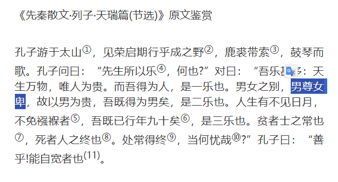
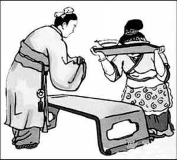

誤った解釈：[男性を優位に女性は劣位に位置づけて男女平等を否定…](https://kotobank.jp/word/%E7%94%B7%E5%B0%8A%E5%A5%B3%E5%8D%91-564378) 正しい解釈：易経の言葉を借用すると、天尊地卑、乾坤定矣、乾道成男、坤道成女。 詳しい説明は後にしますが、本来の意味は全然違うと、伝わればと思います。

よく知られる説明は、男性を優位に女性は劣位の解釈の出典は『列子』の「天瑞篇」と主張してます。 但し、単語の出典だったら、分かるが、意味の出典ではないと、原文を確認して分かりました。 原文には男として、幸せと感じた意味であり、高いと低いので解釈すると、強引です。 このロジックは、右傾知識人のよくある詐欺ロジックと同じく、〇〇さんは△△を言ったから、〇〇さんの国は△△と決まってるような、本当は関係ない馬鹿馬鹿しい内容になります。 中国でも高いと低いの解釈で誤解する人は多くて仕方ないが、古文を読めない人だからです。 また、中国文化は大清国時代で、退化の経緯があるので、日欧米と同様に、女性を卑しくした時代があったのも事実です。

**本題へ入りましょう。**

「男尊女卑」の本来の意味を一言で意訳しますと、男性と女性のバランスを上手くとる事です。

『列子』の著者は列子、列御寇氏は道教の学者です。同氏の著作、もしくは、論語等、同時代の賢者の作品を読むとき、勝手に現代の言葉で解釈するのは禁物であり、同じ字でも、易経での意味は何か、意識しなくてはならない。

「男尊女卑」と同様、易経に「天尊地卑」があります。 高いと低いの解釈でしたら、天は高い、地は低い意味って通じるのか？勿論違います。日本語での四字熟語での解釈は大勘違いだと分かります。 「男尊女卑」細かく訳すると、男(陽)が家族をリードする役割であり、女(陰)が男のバックアップで、支える役割であり、謙遜(中国語で谦卑)すべきである。現代のイメージにすると、夫婦2人で、夫は社長、妻は経理、財務をやる感じでしょう。社長は仕事を取りに来る人だから、強力であり、妻(経理/財務)も、社長並みに強力な印象でしたら、会社が上手く回すケースが少ないでしょう。

現代社会は、肉体労働だけではなく、オフィスワーク等、力を求めない仕事も多いので、家庭の関係で言うと、主婦だけではなく、主夫も普通にあります。ここで「男尊女卑」の言葉を理解すると、稼ぎと家事、各々メインの担当する事を責任をもって対応して、お互いに支える意味になるでしょう。 職場では、上司(陽)、部下(陰)の関係上も、上下ではなく、「男尊女卑」が各自の役割を果たすことを指します。
