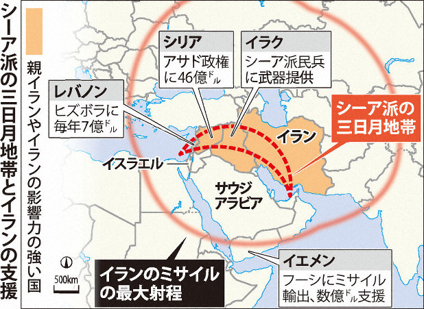
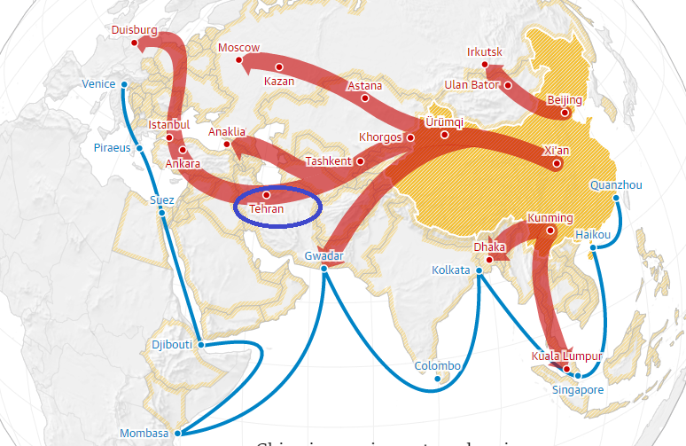

昨日の[イラン問題](https://blog.loveapple.cn/news/20200106940.html)についての記事をもとに、予測した[シナリオ](https://blog.loveapple.cn/news/202001071095.html)を説明します。

前述のように、アメリカの戦略は中東で火をつける事だ。イランにとって、アメリカと対立の道しかありません。但し、中東でやりすぎると、アメリカは日韓や、ヨーロッパ諸国の不満を招くので、直接戦争をやらずに、代理人間の戦争に発展させる事だ。勿論、イランは米軍の相手ではない事も分かるので、米軍と直接の衝突を避けるでしょう。  
結果的に、スンニ派もシーア派も、相手と決戦を求め、その戦場は、両勢力の中間地帯、イラクとなります。  
こちらは、米軍がイラクからの撤退、及び、イラクは決戦の戦場の結果を得たロジックです。

ロシアの戦略は、亜欧大陸の商路、一帯一路を制御することだ。中間通路の重要な一環であるので、中東での勢力を拡大させている。 そして、ヨーロッパ、日中韓原油の重要な輸出地域であるので、ペルシャ湾周辺で戦争が起こると、原油価格に影響するので、自国の原油輸出の利益を確保しなくてはならない。  
原油価格の上昇はよいが、上がりすぎると、各消費国は再生可能エネルギーへの投資が大きくなるので、長期的に不利になるのだ。  
ですから、原油価格の高すぎない、安過ぎない、 バランス良く、ロシアの短期的にも長期的にも、有利な方向へ誘導する事は非常に重要である。

但し、ロシアの原油は中国、ヨーロッパなどへの輸出ルートは既にあっても、世界中に広げるのが難しい事が現状だ。アメリカ産の原油は、中東の戦争のきっかけで、世界中に広げて、不足と思われる原油の需要のギャップを埋めるでしょう。

繰り返しますが、アメリカは中国とヨーロッパの経済を牽制するために、中東で火をつけて戦争を興している。アフリカ、 一帯一路の北側路線、及び、将来の北極路線があるので、中欧の発展は止まりません。  
2020以降は、中欧の崛起の新たな時代に迎えるが、中東は数十年、又は、百年の間、紛争の終わらない暗い時代になるでしょう。
