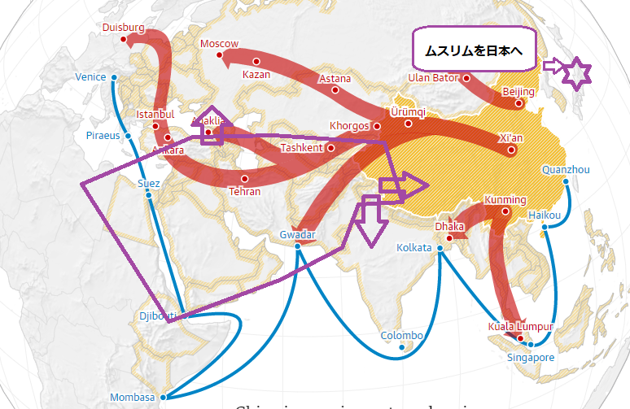

日本崩壊論の中、中国からの侵攻説があるが、実際に戦争の必要がなく、平和な手段でも日本を壊せるかと思います。  
但し、ムスリムのネタを挙げたく、一番うまくムスリムを使うのがアメリカですし、本当に日本を壊したいのが中国ではなく、アメリカかもしれないから、タイトルに「米中」にしました。  
以下、私の考えた日本崩壊のシンプルなシナリオを紹介します。

**1．極右と反安倍勢力を支持**

櫻井よしこ、川添恵子、門田隆将など、極右作家に出金して、ウィグル弾圧のデマ情報を広く流してもらう。小野寺まさるのような極右政客を支持して、再度議員になってもらうほど、お金を出す。  
この人達に、もっと反中してもらって、ウィグル弾圧の悪イメージを日本で根強くする。

この爺婆たちは、長年の工作経験はあり、リベラルを口にするだけで、ちゃんとしたロジックが基本ありません。お金さえあれば、本業でもあるし、上手くやってくれるでしょう。

併せて、日本共産党、社民党や、自民党内部の反安倍勢力を支持する。別に具体的なことを言わなくても、阪大すればよい。所で、裏ネタ提供など、タイミングよく漏れちゃうなど、協力してあげる。

**2．反中のNGOを支持**

<figure>

<figcaption>

目的は一つ：ムスリムを日本へ輸出

</figcaption>

</figure>

「1．極右と反安倍勢力を支持」下準備で、これから本作業に入ります。  
反中NGOにお金をだして、迫害と主張するウィグル、チベットのテロリストを日本への密入国を支援する。勿論、裏側でやって、表では反対と宣言するのだ。  
輸出する主な地点は、関東、関西、そして、北海道にしましょう。沖縄が熱すぎて、寒地の生活になれた人は向かないかもしれないからだ。

政府は、国家の力で、NGOの人口密輸行為を裏側で支持する。表の反対、NGOの反中のイメージを強くするために、時に、失敗事例を作ってあげても良いでしょう。結果的に、北海道、関東、関西に沢山のムスリムを集めるような状況を作るのが、最終目的だ。

**3．極右と反安倍勢力で更に反中**

沢山の不法滞在のムスリムを日本にいても仕方ないので、極右勢力の力を再度、借ります。  
今まで、築いてきた反中の空気の中、このムスリムたちを中国へ返したら、迫害されるなど、デマを広げる。 反中NGOも併せて、ムスリムの生活しやすい環境構築に努力してもらう。  
これらの事は、安倍政権の代表した有識者からの反対は必至だが、小野寺らの出番はここだ。  
反中の極右の議員に何かしたらのルートで大金を流して、優位になってもらって、大量なムスリムは日本で合法に滞在できるような政治環境を作ってもらう。

**予算について**

今まで、お金ばかりと書いてるが、予算は？例えば、200億円としたら、J-20一機分、F-35なら1/2、国にとっては大したお金ではないが、この政客、作家、NGOにとっては大金でしょう。  
大量なムスリムを日本への輸出は、数十機のJ-20で戦争を興すより、コスパ高いから、仮に、数年を渡って、1000憶円の予算を立てて、十分ではないかと思います。

**最終の期待成果**

- 極右勢力の台頭により、日本経済がさらに悪化。状況によって、東亜経済圏からマージナライズしてもよし。
- 大量なムスリムを日本への輸出により、日本固有文化を崩壊し、原住民と対立勢力を育つ
- ムスリムと日本原住民との紛争を挑発し、内乱を興す。  
    こちらについて、今の中東と新疆のテロリストを参考すれば、イメージをするでしょう。

このシナリオは如何でしょうか。未熟な所沢山あるので、大筋は通じるのではないかと思います。  
勿論、僕は反日ではないので、日本崩壊を望みません。  
但し、物事の本質を理解するために、見る観点を変えてみて、見えやすくなることは多いので、今回の記事を作成しました。

いつもリベラルを口にする奴の本当の目的は自由も民主もない。裏側に潜んでいる勢力のエージェントとして、何かしたらの目的を達成するために、情報を発信して、世論を誘導しているのである。これは、言論自由の本質である。
