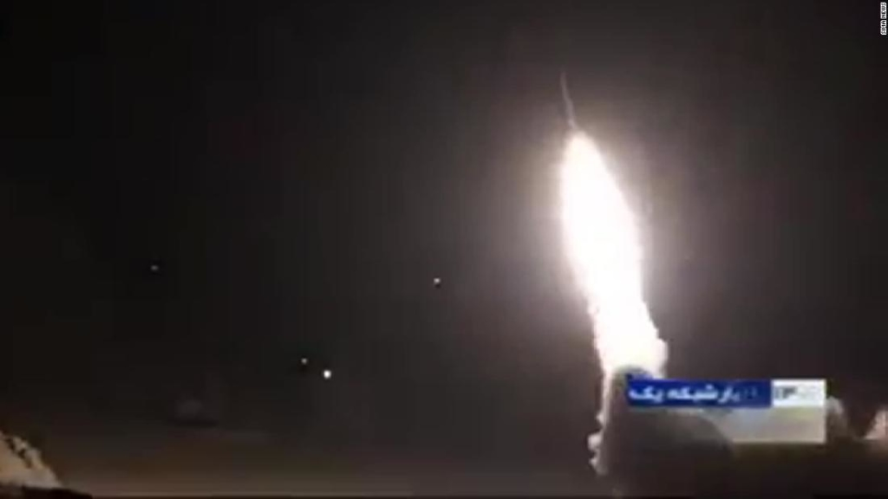

今後の進捗については要観測ですが、[私の予測したシナリオ](https://blog.loveapple.cn/news/202001071095.html)通りに進むかどうか確認したい。  
本気で戦ったら、イランはアメリカの相手にならないので、今回の攻撃は、非常に賢く見えます。

- テロをしない。アメリカの本土に戦争を及ぼさない。
- 軍事施設限定すること。

米軍は強硬策でしたら、イランはイスラエルを含めて攻撃するでしょう。もし、イスラエルはイラン侵攻したら、スンニ派もイランと団結して、イスラエルへの反撃は必至でしょう。

今の米軍は、同盟のイスラエルを捨てて、戦場に向かわせるか、撤収するかだと、トランプ氏の決断を待っているかと思います。

この中、一番妙な所に立っているロシアの役割だ。アメリカの火は燃やし過ぎない、程よく、燃やし続ける所で、今後はどんな動きになるか観測したい。

最近、中国を読み解くなのに、何で中東のネタ連発？と文句する奴はいるが、中東情勢は中国と関わり深いからです。  
トランプの判断次第ですが、2020年、中国の内戦は終焉に迎える可能性が高くなるからだ。
