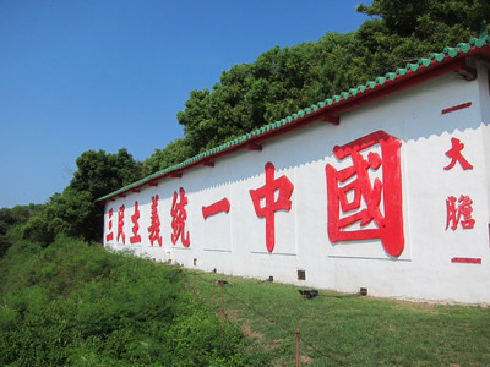
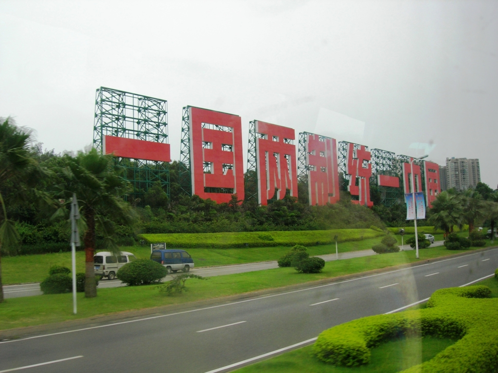
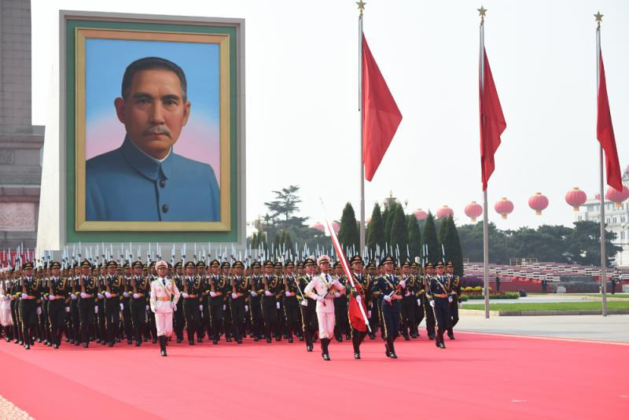
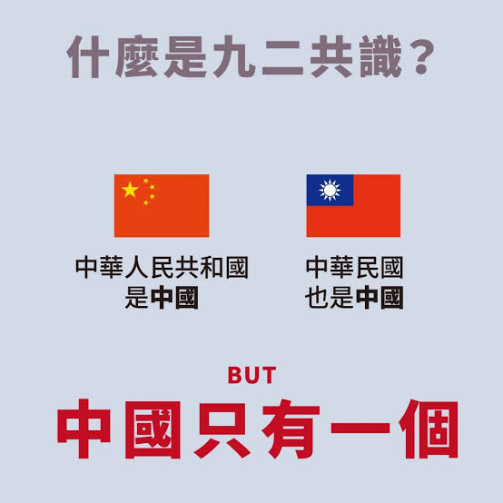

中華民国、 中華人民共和国の解釈について、色んな人は色んな政治目的を持って、色んな解釈をしています。特に日本では、色んなデマは流れているわけです。  
掘り下げると、沢山の内容になるが、正式な条約、法律の内容を基に、その関係をざっくりと解説します。  
本質へ直入するから、ざっくりでも「徹底」的だと思います。今後、議論の内容をもとに、掘り下げていけるかと思います。

中華民国、 中華人民共和国は別国の関係ではなく、政権の交代しようとして、中途半端な内戦状態です。両方とも、中国の正統性のある政権を主張していること。こちらについて、各自の憲法には明記してある。

<figure>

- 
    
- 
    

<figcaption>

金門と夏門の両岸に立ている宣伝看板

</figcaption>

</figure>

中華民国を立ち上げた国民党、中華人民共和国を立ち上げた共産党は、全て、孫文の新民主主義革命から生まれたもので、但し、古い中国を救えるために、ソ連の社会主義と欧米の資本主義のどちらかを選ぶところで分岐がありました。  
特に国民党2代目のリーダ、蒋介石はソ連の社会主義を非常に反感したようだ。  
ただ、蒋介石と毛沢東は、いくら対立しても、政権の正統性の主張するだけで、分裂を反対して、統一を擁立する点は一致でした。  
これは、蔣経国と鄧小平時代の1990年代までの主軸でした。

<figure>

<figcaption>

2019年、中華人民共和国の国慶パレードで挙げた孫文の写真

</figcaption>

</figure>

1980年代から、中共は改革開放で経済発展したく、国民党側も戦争状態を終える要望が強くて、両岸側は会談を始めた。  
蔣経国は孫文、蒋介石の思想を忠実に実現しようとして、三民主義で中国を統一すると主張した。鄧小平は中国の内乱等を恐れて、国民党政権と異なる制度のままで統一すると主張して、「一国二制」の案を出した。同案について、蔣経国は猛反対したらしくて、そこで会談は結果ないままで中断された。

**共産党側が、一国二制で統一できれば、国名、国家、国旗は全て中華民国側に合わせても良いところまで言及した。**

1990年代に入って、台湾が一党独裁を終えたきっかけで、独立の勢力は台頭した。  
鄧小平も蔣経国も歳が重なり、早めに統一をさせないと、中国は分裂されるかと懸念して、会談を復活した。会談の途中で蔣経国はお亡くなり、最終目標の統一までは至らなかったが、「九二共識」の成果は、その後の数年を経てた所で、築きました。

「九二共識」の主軸は、両岸側、すべて**一つの中国**であることは**前提**として、対外の文書や、発言など、中華民国、中華人民共和国とそれぞれ表現して良いという共通認識を定めた。

<figure>

<figcaption>

何方も独立しない、一つに中国であることは共通認識

</figcaption>

</figure>

この両岸側は一つの中国であることは、当時の国民党だけではなく、現職の中華民国総統、蔡英文も支持していた事は、今は明らかになっています。

中華民国の憲法により、台湾は中国の一つの省であり、統一ための憲法であることは、はっきりと定義しています。  
中華民国の政党として、台湾独立の主張は明らかに違憲です。中共側の主張は最初から変わらず、統一のために、中華民国政権と会談を繰り返してきたわけだ。  
中国共産党の立場から、中華民国の政権と会談し続けて、真の平和に迎えたいわけだ。

台湾の独立勢力は独立を実現するために、「中華民国」を滅びたがるのが間違いないです。「中華民国」がなければ、両岸側今までの統一ための会談などの母体、中華民国が消えてしまい、改憲しなくても、すべてなしにできるのだ。最近の蔡英文など、独立を主張する政客の発言から、「中華民国台湾」「台湾民国」「台湾国」など、通常はあり得なく、勝手に国名を変えたりしている。  
直接憲法の統一の内容を削ればよいのでは？気づく賢い読者の方はいると思うが、その改憲は、両岸の現状変更になるとみなし、アメリカは許さない。  
だから、独立主張の陳水扁前総統は、（僕と同様）蔡英文も独立実現できないとの発言がありました。

台湾独立勢力の裏側に日本もあるので、日本、台湾では、独立の正当性を粉飾するために、色んなデマは交わっているのが現状です。

中共側は経済発展のために、戦争を成るべく避けようとしている。逆に、台湾海峡危機を利用して、アメリカから利益の最大化を図っているところです。  
こちらについて、「[一帯一路の戦略を理解するーー海上編:その二](https://blog.loveapple.cn/politics/national-strategy/20191204109.html)」でも紹介しております。

中華人民共和国、中華民国の関係について、これ以上です。今までのおさらいでもあります。  
中共は台湾問題で、アメリカと利益交換をしてきた。中米貿易戦争以降、アメリカの中国牽制の政策は明らかになり、大統領が変わっても、主軸が変わらないでしょう。利益交換の余地はなくなば、今の台湾政権が存在する意味がなくなり、統一に近くなるではないか、私は推測しております。  
特に2020年は重要な一年であります。
