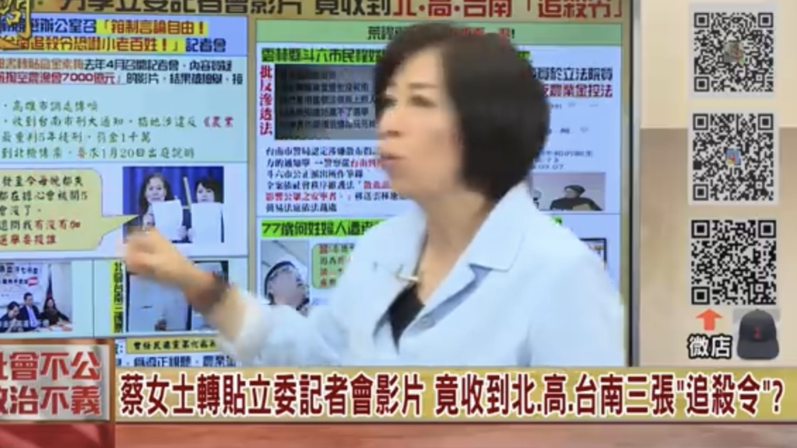
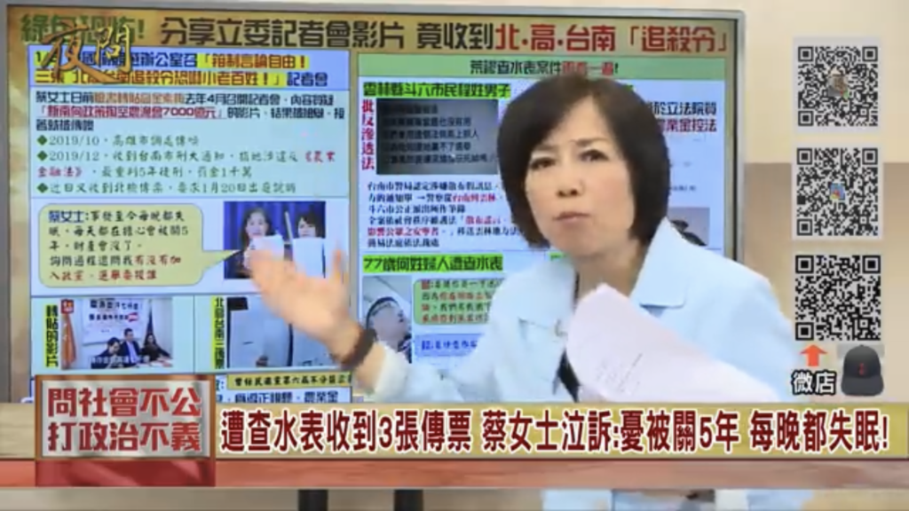

明日(1/11)は中華民国の総統選となります。民進党の蔡英文政権は、総統選優勝するために、あらゆる手段を尽くし、行政機関の不正利用、言論弾圧などの手段も使っています。

ネット上で、民進党に不利の内容をいいねや、シェアだけで、逮捕される人は数人でも出ている。  
更に、親国民党の地方の投票スポットを緊急に変更して、投票しずらくするなど、色々対策しているようだ。

<figure>

<figcaption>

言論弾圧で逮捕された被害者

</figcaption>

</figure>

反[浸透法案の支給可決](https://blog.loveapple.cn/news/20191229874.html)も、民進党の経済政策に無作為に不満の多い、本土にいる台湾人は、選挙期間中、帰省し難いために、設立したと、台湾の専門家より分析されています。

<figure>

- 
    
- 
    

<figcaption>

民進党の言論自由弾圧を紹介する台湾番組のシーン

</figcaption>

</figure>
