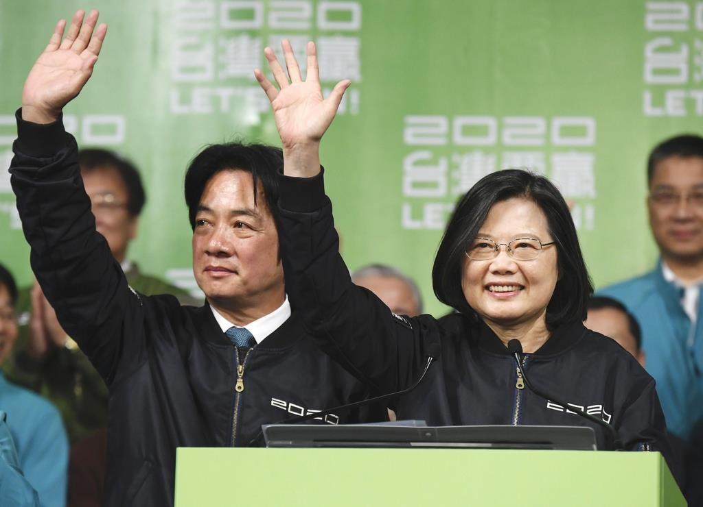
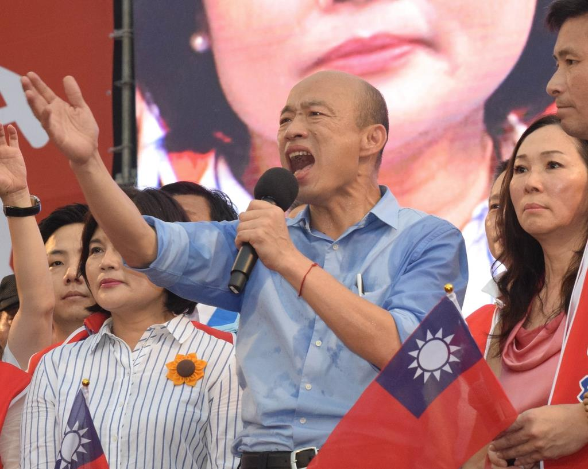

台湾民進党は2020の総統選挙で圧勝しました。**中国との距離**で勝敗の要素だと報じる日本マスコミは多いが、実は、台湾の未来は、少数派に拉致された結果だと分析しており、 勘違いが多いかと見受けています。

Googleからの選挙結果をうつします。  
・蔡英文(DPP)：57.1%(8,170,231)  
・韓国瑜(KMT)：38.6%(5,522,119)  
・宋楚瑜(PFP)：4.3%(608,590)

中国と台湾、両岸の関係については厳密にいうと、[内戦状態](https://blog.loveapple.cn/politics/202001101180.html)ですので、「**中国との距離**」のポイントは重要でしょうが、本質から言うと、今の台湾では、中国と近い、影響力のある政権はありません。  
蔡英文は独立を謳って、両岸の現状を変えようとしています。特にペアとした頼清徳は「台湾独立を忠実に実行する者(务实的台独主义者)」とのスローガンを謳っています。  
国民党は両岸関係の現状維持を主張しています。現状維持とは、中国と良い関係を保ちながら、独立を図ることです。韓国瑜は2018年の高雄市長選挙で、急に人気が高くなり、今回の総統選挙の代表とされたが、元々マージナライズされる人で、勢力が強いわけではなく、国民党の方針そのままでしょう。  
宋楚瑜も民進党と国民党の方針さほど変わらないようです。

現在の台湾人は、各政権にも不満が多いわけで、立法院、総統の選挙で、一番できる党を選ぶのではなく、一番ひどくない党を選ぶのだと台湾社会の中での共通認識だそうです。  
1990年代の大学生新卒月収の3万台湾ドルから、今の月収2.2万台湾ドルを維持できるかできないか所です。曽て「[アジア四小龍](https://ja.wikipedia.org/wiki/%E3%82%A2%E3%82%B8%E3%82%A2%E5%9B%9B%E5%B0%8F%E9%BE%8D)」の中では、激しく衰退しています。新卒の若者たちは、本土、シンガポール、マレーシアなどへ、出稼ぎに行かざるを得ないのが現状です。

台湾経済の飛躍は蒋経国時代の国民党政権のおかげです。但し、今の国民党は変質になり、民心を失っているのだ。国民党の主張する現状維持とは、統一もしない、独立もしない事を表に謳っているが、世の中は常に変わるものだから、現実的には本土と離れつつあり、現状維持とは矛盾の多いパラドックスです。緩めな独立の本質は、中国政権も、両岸の民衆も分かるようになっている。

世界のどこでも平和を望んで経済発展を優先に考える民衆は大多数だといっても反論する人はいないでしょう。台湾も同じです。  
但し、民進党の独立を主張する政権でも、対大陸の貿易黒字、台湾の経済を支える重要な部分は急成長の状況は変わりません。ですから、平和と経済発展を支持する一般の民衆にとって、どの党に投票しても結果は変わらないでしょう。しかも、強硬策をとる民進党にとっては、統一を望んでいる大陸からもっとお得な条件を得られないかとの考え方もある。実には、Acerなどの大手企業のみならず、独立を主張する政客たちは、大陸の商売は重要な財源でもあるようだ。勿論、民進党政権の腐敗、言論弾圧等に不満の人は少なくなく、この人達は国民党を選ぶでしょう。**この平和と経済を望む普通の選民は国民党と、民進党に投票する人は、約半々だと思われる。**

**選挙結果の切り目は極端に独立と統一を望む少数派の選民です。  
**前者は民進党だと分かりやすいが、後者は何故民進党へ？国民党の現状維持のウソを看破したのが要因の一つです。独立急進と謳う民進党を支持した方が、武力で統一される時期が早くなるかもしれないので、現状維持の国民党より、現状を変えようとする民進党の方がマシだと判断されたようだ。

民進党の投票率と国民党、親民党の差は14.2%、国民党の差は18.5%、この十数パーセントは、極端的な政策を支持する少数派と言えるでしょう。台湾の未来は、多数の人達に拉致されるのが現状です。  
こちらについて、台湾だけではなく、民主制度のどこでも共通です。平和、経済発展をメインにしたい人は大多数で、極端な手法を支持するのが極一部だ。台湾のような選択を直面する場合、中間の人より、極端の考え方を持つ人の支持を得られるかどうかは肝になります。これによって、選挙で勝つために、政府の政策も、マスコミも、大多数向けの対策、発信ではなく、極端思想の少数派向けに力を尽くしているわけです。  
選挙に参加する党が多い程、断片化されれ、極端の少数を奪う合戦になりがちでしょう。  
断片化は民主制度の本質の一つで、極端の少数により、全員の行方が決められてしまうのが民主制度の欠陥でもある。
