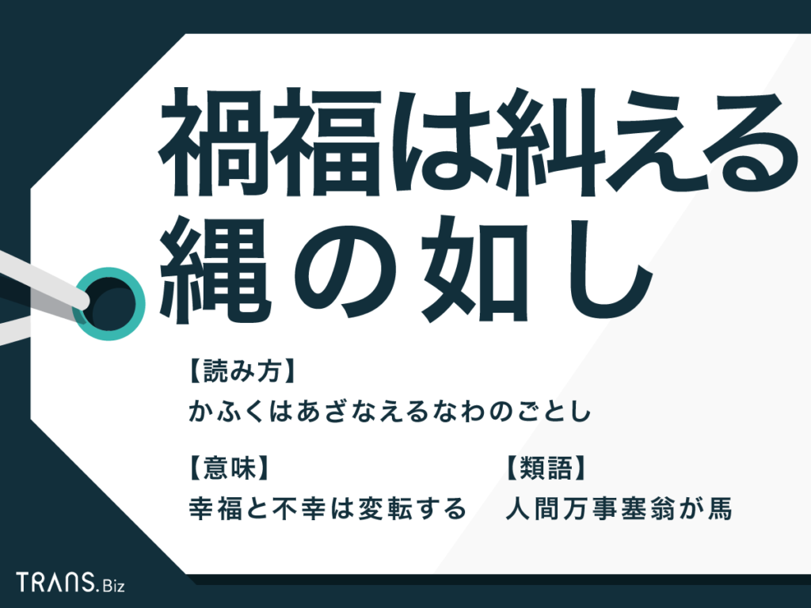
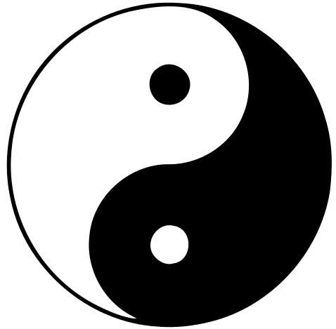

易経、占いと勘違いする人は殆どでしょう。  
本屋へ行って、易経関連の本は、基本占いのもので、勘違いしても仕方がありません。日本でも中国でも同じだと思います。  
なので、私は易経は占いだけじゃないと、暫く間、うるさい程繰り返します。

前回の 「[お箸にある知識(易経文化](https://blog.loveapple.cn/yijing-culture/2019120399.html)」 では、「一陰一陽、これを道と謂う」 を簡単に説明したが、ちょっと変わった観点で、「禍福は糾える縄のごとし」から展開していきたいと思います。

> 「禍福は糾える縄の如し（かふくはあざなえるなわのごとし」とは、人生をより合わさった縄にたとえて、幸福と不幸は変転するものだという意味の故事成語です。

これは完全に易経の考え方であり、禍福の禍が陰、福が陽と読み替えましょう。  
対立の陰と陽、「陰陽は糾える縄の如し」、常に共存してお互いに影響しあって、両状態が切り替わる様です。  
これは易経の 「一陰一陽、これを道と謂う」 と同じ事を表現しているとも言えます。  
「禍」の中に「福」もあり、「福」中に「 禍 」もあることです。

例えば、就職活動は中々上手くいかず、同期と同じように就職にならなく、困った場合とします。  
就職できないのが、多くの人にとっては、「禍」と言えるでしょう。  
但し、就職にならない事は、時間と組織(会社)の縛りもなく、自ら好きな事を見つけたり、創業したりすることは可能で、「福」とも言えるでしょう。  
私の周りでも、学生時代では、勉強できなくて、まともな会社に就職できず、特に20代前半、仕事関連のトラブル「禍」が多く、30代以降、創業してビジネスの成功を収めた人は何人かいます。  
逆に、学生時代から優秀で、希望した企業の就職はスムーズにでき、中間職へ昇進したが、儲かる観点では、中々前者と比べられません。  
勿論、成功の概念はそれぞれ解釈が違うので、一概に「禍」か「福」かと言い切れませんが、「禍」か「福」か、直ぐに判断する必要がなく、将来は「福」かどうかは、貴方自身の対応次第です。  
要は 「禍福は糾える縄のごとし」 、今は「 禍 」と見えても、実は「福」かもしれません。前向きが大事です。

個人レベルの事から国の事へ移ります。  
「[一帯一路の戦略を理解するーー海上編:その二](https://blog.loveapple.cn/politics/national-strategy/20191204109.html)」で紹介した、中国は1996年頃、台湾の現状(独立に近い)維持で、弱気でWTOの加入と交換して、当時の中国人でしたら、基本「禍」と見受ける人は多いはずです。日米からは「福」と見えて、認めたでしょう。  
20年後、日本は中国と対立できなくなり、世界一のアメリカは単純な貿易戦だけでは、勝ち目が見えなくなるほど、中国は成長してきました。間違いなく、日米にとっては、「禍」になったでしょう。

「一陰一陽、これを道と謂う」自分にとって、禍か、福か、定量ではなく、変わらないのが常に変わってる事です。

参考、画像の引用元：  
[「禍福は糾える縄の如し」の意味と由来とは？例文と類語も紹介](https://biz.trans-suite.jp/20135)
