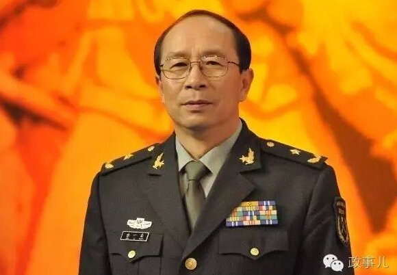

鄧小平の提出した「一国二制度」について、「[一国二制度の本質](https://blog.loveapple.cn/politics/20191206252.html)」にて紹介させていただきました。  
中国人民解放軍、軍事問題専門家金一南氏より、紹介した「一国二制度」の内容を踏まえて、背景や、米軍向けの談話内容について、追記させていただきたいと思います。

金一南氏は中国の軍事問題専門家として、アメリカで米軍向けに講演を行った際、米の将軍から、「一国二制度は台湾側受け入れなければ、もっと緩めな条件で、会話にして戦争を避けるべきではないか」と質問した。同氏は逆に質問して「一国二制度」について説明を行いました。

「一国二制度の内容について、ご存知ですか？」  
具体的な内容をしらないようで、「one country tow system.」？  
金一南氏は続いて、以下に一国二制度の内容を説明した。(超意訳)

  
一国二制度の内容は、元々、台湾側、中華人民共和国の国旗を揚げて、法律、司法、行政、軍隊、軍隊の人事、文化、社会制度などなど、現在と同様、そのままとしていた。これは最初の案だ。  
この後の新しい案は、中華人民共和国の国旗さえ、無くしても良く、一つの中国である前提であれば、国旗、国歌、国の名前まで、議論してお互いに納得できる案にしようとの主張でした。

国共は今までの紛争を解決するには、全て戦争でやっていた。共産党側、今度こそ、平和な手段で解決しようと決心したから、一国二制度の案を主張してきた。中国史上、世界の歴史の中でも、一国二制度より、寛容な条件で政権の紛争を解決しようとする案は、私の認識の中、それ以上のものはありません。  
米軍の将軍の皆さん、貴方達は私より本を多く読んでいて、知識の量は遥かに多い訳だ。人類の歴史上、政権の紛争を解決するために、一国二制度より、寛容な政策はないと思います。反論する人は手を挙げてください。  
しばらく経っても、反論する人がいなかったようで、金氏は「連邦共和国と主張する人がいるようだが、アメリカの例として、各州は自らの司法、法律はあるが、軍隊は持てない。一国二制度は、自らの軍隊を許可する制度だ。何故、こんな寛容な案を台湾側が反対するのか、僕に聞くより、アメリカの国防長官と大統領に聞くべきではないか？」(中国の統一がアメリカは望まないこと)

<figure>

https://youtu.be/bGezyPp9coY

<figcaption>

金一南氏の談話内容の映像

</figcaption>

</figure>

一国二制度を提出した鄧小平は、1985年に、当時の台湾情勢をもとに、蔣経国が亡くなった場合、混乱な状況になり、統一できないと恐れて、蔣経国のいる1990年まで、解決しようとして、急いで(?)、一国二制度の案を提出した。残念なことは、その後、蔣経国氏は2年間も経たずに、1988年1月にお亡くなった事は、本人も想像できなかったでしょう。同氏の糖尿病のかなり酷かった状況は、周りの誰も伝わらなく、人生の残り、僅かしかなった事を認識できなかったようだ。

更に残念なのは、当初、鄧小平氏の予想していた混乱な状況は、台湾では現実になり、統一への歩む道は見えにくくなっているのだ。

最後に、金一南氏は一国二制度について、強調した事は、  
1．「一国二制度」は中国の統一をしたい国民党政権が大前提だ。民進党は勿論、今の国民党も蔣経国時代の国民党と全然異なるので、「一国二制度」将来も実現できないでしょう。  
2．「一国二制度」は対談の結果としてありかも知れないが、協議の前にこれを持ってくることって、台湾で笑われるだけだ。これを挙げるだけでも、マージナライズされるのだ。  
3．2002年まで、こまま発展すると経済で問題なく台湾を融合できるだろうと、経済関係の専門家は非常に楽観的で、軍に言ってたが、それは大きな勘違いであること、今は分かった。  
論理上、貿易額は増加し、経済が良くなれば統一しやすくなるはずだが、実は逆方向になり、両岸の貿易急成長するほど、分裂の勢力、独立を支持する割合は急成長してる現状だ。これを改善しなくてはならない。  
曽ての計画した平和と武力で統一する二手法以外、戦争をしなくても統一する別の方法があるかと私は信じていると同氏は言いました。

以上、金一南氏、一国二制度の内容の抜粋です。  
台湾の統一は、本土の中国人だけではなく、海外の数千万の華人の多数も望んでいる事です。中国共産党は中華民族の復興の責任を負うと、非常に責任感の強い政党で、中国の統一に力を尽くしています。  
台湾民進党は独立を実現するために、色んな嘘で一国二制度の歪曲等、別の方向で力を尽くしています。歪曲した一国二制度の内容と中国の正式発表した内容、比べてみれば、嘘をすぐ暴くはずです。  
これは意外する必要がなく、台湾の政客は詐欺常習の人は多いからです。今の独立を主張するリーダーたち、李登輝、陳水扁、蔡英文、全ては中国の統一を謳って支持した時期があります。どんな自己矛盾してもおかしくない。
