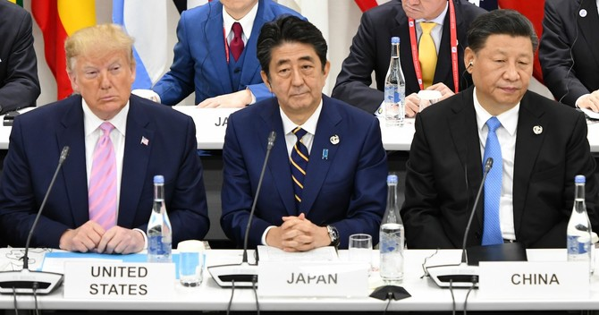

米中貿易戦争は米の衰退し始めている証だと私は主張しています。しかも、アメリカ側の勝ち目ない戦争だ。では、中国を買った貿易「戦争」とは？日本に事例があります。

日本は勝ったという所か、中国は相手にならず戦えなかった所です。  
私の記憶的な所、正確とは言えませんが、恐らく2015、2016年頃？、中国は日本製品を爆買いし始めた頃、何かしらの理由で、中国の国内で反日の論調は多くなり、ボイコット運動があったようです。  
そのボイコット運動を実行したのは、極一部の人であって、批判の声は圧倒的に多かったです。

私の貿易専門の友人の話だと、中国の反日活動は激しくなり、全体的に日本製品は売り難いと判断された場合、日本の大手電機メーカーは中国向けの輸出製品は値上げる見込みらしいです。日本製がなければ、中国のあらゆる製造業の工場はまわりません。中国は日本と貿易戦争できない、やるとしたら、負けるしかなかった。最終的によい方向に収束して、総理大臣レベルまでは、表からは何の動きもなく、中国側が自ら鎮静化させたようです。

それでは米中貿易戦を見てください。最初は中国崩壊を妄想する奴らはワイワイしていたでしょう。今は、米大統領は中国と条約を結んで、○○を買ってくださいレベルまで発展してきた。  
Made in USAはマーケットではなく、政治で売り込み時代に迎えてる事は、日本の事例と比べれば分かります。  
中国は大金を出してるじゃね？疑問する人いるでしょうが、ハイテック、原材料、農産品など、この合意がなくても、世界工場ですから、色々買わなくてはならない。しかも、アメリカの現在の生産量以上契約している意味は、これからの2年ぐらいの間、殆どのUSA製品は中国は握って、中国より再販になるのでは？  
ざっくり見た所、中国は勝っているのでは？

米国は本当に強かったら、日本のように貿易戦までやる必要がない、米中貿易戦は始まる時点から、米国の衰退、特に製造業が回復できないほどの衰退は決まっている。2019年、中国の貿易統計を付属します。米中貿易戦のおかげで、成長し続けています。

https://twitter.com/sohbunshu/status/1217230695602327552?s=20
