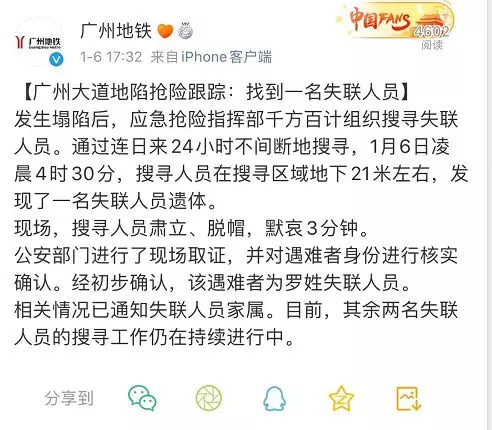

<figure>

<figcaption>

広州市記者会見時に黙禱

</figcaption>

</figure>

2019年12月1日午前、 広州地下鉄十一号線砂河駅の建設現場には、路面の崩壊が発生し、3人の行方不明になった事件について、1月10日まで、3名の行方不明者の遺体を発見しました。1月6日4時30分、救助現地の地下21メートの所、行方不明者の羅氏の遺体をはじめて発見した。

救助作業の状況を共有するために、1月11日17時40分、広州市は第4回目の記者会見を開催し、開始する前に、全員起立して黙禱しました。

<figure>

- 
    
- 
    

<figcaption>

広州地下鉄はweiboを通じて最新情報を配信しました。

</figcaption>

</figure>

**ポイント：**

**ポイント1：事故の調査結果について**  
事故の原因などについて、只今調査中で、結果があり次第、開示する予定です。  
調査結果の開示について、広州市応急管理局の副局長、羅伝亮氏は「我々は皆さんと同じく高く関心しております。専門家の調査チームも救助チームと同じく、色んな困難を克服して努力を尽くしています。今回の事故について、大量な詳細情報は必要としていますが、政府として、事故の直後に救助を最優先にしたため、多くの調査、分析作業が進まず、頓挫していた所が現状です。」と言いました。  
そして、救助作業は一旦終了になったので、現在、調査、分析作業は中心で進んでおります。  
調査結果は全ての分析結果を整理した上、公開します。

**ポイント２：十一号線砂河駅の建設は継続するか否か**  
十一号線砂河駅の建設について、広州地鉄集団建設総部マネージャー、孫成偉氏より、砂河駅は十一号線と六号線の乗換駅であるので、周辺市民の交通の利便性、交通状況の改善、環境の改善など大きなメリットがあるので、駅の建設を再開します。そして、品質高く駅の建設を完成させます。

**ポイント３：40日以上かかったのは何故？**  
中国中鉄広州軌道交通工程指揮部のエンジニア、譚小春氏は「約40日の中、我々は複雑な地質環境、周辺の敏感な建物、複雑な配管、配線に向けて極めて困難な救助作業でした。現場の水量豊富、地下水が高く、流砂層の対応も同時にやらなくてはならなく、非常に大変でした。しかも、崩壊箇所の最大斜面の角度は70度になり、周りの高架橋、建物の周辺を増強させ、事態の拡大を防がなくてはならない。そして、周辺の配管、配線が多く、迂回工事や状態の監視、保護もしなくてはならなく、更に救助作業の難易度をあげました 。」と言いました。

原文：http://m.sohu.com/a/366309009\_737307
