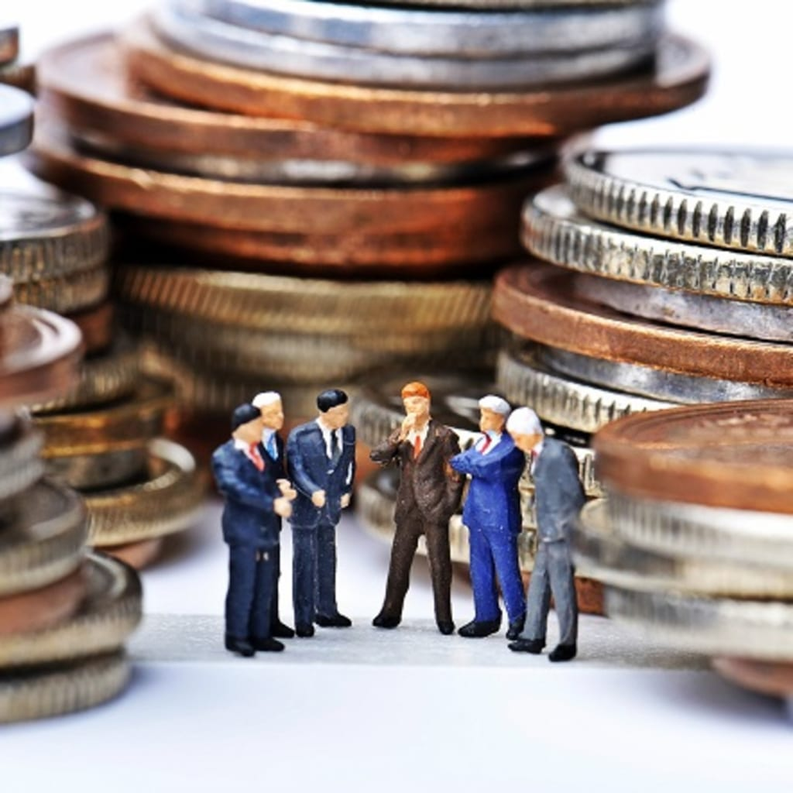
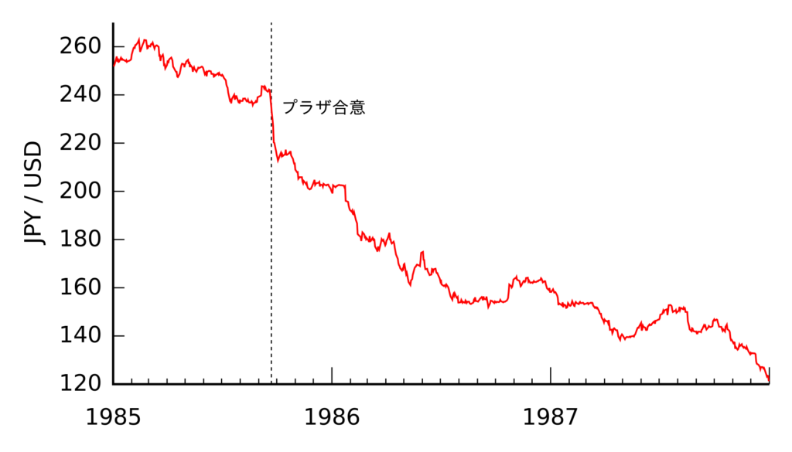
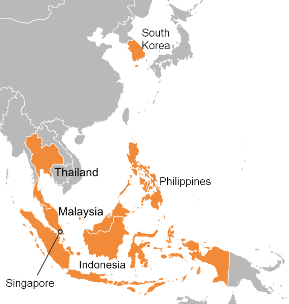
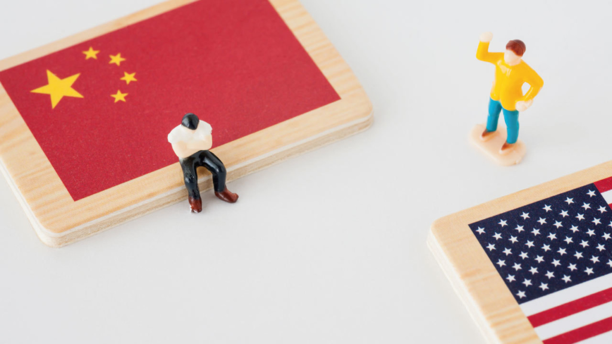
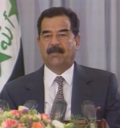
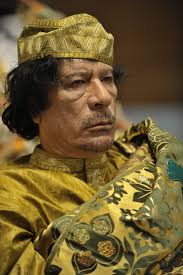

米中貿易戦について、表に謳うような貿易の赤字とか、著作権侵害、セキュリティなどって信じますか？疑問を持つ方に向けて、こちらの見えた本質を単刀直入に説明させていただきます。

**背景：米ドルの本質**

米国といえば世界一進んでる科学技術、最強の軍事力等のイメージがあると思いますが、今の米国経済の成長を牽引する主な産業は金融産業であり、金融の覇権になっています。これらの世界一は米国の強力な金融産業で支えています。  
乱暴かもしれませんが、 米ドルの本質を簡単に言いますと、金融覇権で、大量に印刷した紙(ドル)で、質良い商品、優秀な人材等、世界から、一番良いものと交換して、米国に集める事です。

但し、ドル自体は財産ではなく、負債です。借用書のようなイメージを持って頂ければと思います。中国や、ヨーロッパ等は、ドルという借用書を使って、生産に必要とする石油を交換します。これは、他の通貨が変わりとしてできない、ドルの覇権になっている事です。  
この過程の中の中心として、注目して欲しいのが、**米国は物を生産しない、石油を掘らない、紙(ドル)を印刷だけだ**。

勿論、発行したドルに対して、財産の交換といわれたとき、大量に同値のもので交換しない事は米国の基本な原則だ。例えば、100ドルに対して、それに値する財産で交換したら破綻します。他人持ちの借用書(ドル)は多すぎるとは「返済」の義務が多くなる事で、膨大なリスクになるわけです。このリスク管理の通常の手段としては、原油価格を変動させることです。例えば、元々100ドルで2バレルの原油を買えたところ、1バレルしか買えないようにすれば、「100ドル」の価値が半分に下がるわけだ。同じく100ドルの借用書を持っても、米国に財産を返してくれといっても、元の50ドルのものしか交換できない。逆にドル⇒原油の価値が下がりすぎると、米の経済に悪影響を与えるので、原油価格を下げる方法でよいバランスをとります。  
これは、何故、米国は石油を輸入しなくても、中東の原油をコントロールしなくてはならない理由だ。石油の採掘より、ドルの覇権を維持するためだ。

**No.2キラー：ドルを持ちすぎた奴の特別対策**

通常のドルという借用書のリスクを管理するのに、原油価格の操作を利用する。それで収まらなさそうな場合、別の方法はあります。日本は世界工場の時、[プラザ合意](https://ja.wikipedia.org/wiki/%E3%83%97%E3%83%A9%E3%82%B6%E5%90%88%E6%84%8F)を使いました。日本は世界一、大量なドルを持つことで、リスクが高いと米国は懸念したときの対策として、やり方もシンプルで、円高にしたのです。日本製品の価値を実質的に下げて、ドルの日本への流れを留めたのだ。プラザ合意のおかげで、[失われた20年](https://ja.wikipedia.org/wiki/%E5%A4%B1%E3%82%8F%E3%82%8C%E3%81%9F20%E5%B9%B4)といわれた長期な経済低迷が始まりました。日本のバブル時代をご経験された方はご存知るかと思います。

プラザ合意はあくまで防衛策?であり、攻めた事例としては、有名、且つ、大規模なアジア通貨危機はあります。細かい説明を割愛しますが、簡単にいうと、ソロスの代表した米財閥が裏側に動かした結果です。しかも、去年、香港の騒動でもソロスが香港で金融危機を興そうとしたようだ。

米国はこのような金融覇権、ドル覇権で、世界一経済大国の座を保っています。米国の各財閥だけではなく、国民も安い物価で、品質良い生活用品を手に入れています。世界の工場に当たるところから、大量に輸入することになります。  
しかも、自ら生産するより、金融覇権では遥かに儲かりやすくて、米国の製造業はどんどん衰退になったわけです。こちらは、米の貿易赤字の根本原因です。**米国は世界工場を潤うために輸入するのではなく、製造業より収益高い金融で儲かってるから、何も生産しない現状で、輸入しなくてはならない事です。**

**米中貿易戦の本質**

日本の次、安い労働力を大量に持つ中国に、世界工場が移りました。当然、中国の対米輸出黒字は、恵まれている事ではなく、安くて品質良いものを生産できる生産地になったからです。世界工場となった中国は、全分野の産業チェーンはできた事と、技術力はそれなりに成長した事と、大量なドルを儲かりました。かわりに、環境の汚染等は大きな代償もありました。

世界工場になった中国も、曽ての日本と同様、米国にとってドルのリスク大きいので、対策が必要だ。 中国は日本と根本的に違う所が、独立した政治、経済、軍事力を持っています。比較的に強い中国に対して、「プラザ合意」はそのまま通用できません。そして、金融産業に頼り過ぎた構造を改善しようとして、既に衰退した製造業を復活しようとすることも図っているでしょう。

それで、米は日本と別の方法、貿易戦を発動しました。前文に言及した香港でのソロスが興そうとした金融危機で利益を呑み込もうとしたが、中国に看破され、結局大きな損失を招いたようだ。そして、2年間ほどの貿易戦が続いた結果、2019年の中国は高成長が継続している中、米の最大な貿易相手はメキシコとカナダになりました。  
これが、米国は、実質上、世界大国から地方大国の方向へ進んでいることを示している。こちらも、私の主張する、米中貿易戦は、米国の衰退し始めている一つの証です。

米中貿易戦の第一段階合意について、主に以下の意図が含まれるかと見受けています。

1. 中国を米の最大の貿易相手の地位を戻させて、地方大国への進展を歯止め
2. 中国の持っている米ドルを使って、米の製造業を復活させようとする
3. 農産品の販売
4. 米国の石油販売(こちらは中国の望みでもある)

トランプ氏は製造業を復活させるために、アップルの工場建設など、色々試みたが、産業チェーンはなくなったため、中国と離れません。結局、iPhoneは中国製のままで変わらず、テスラも中国で工場を設立しました。

但し、一点を注目してほしいことは、劉鶴副首相曰く、具体的に何を買うのか、マーケットの状況にあわせて決定する事だ。言い換えると、中国は利益に必要とする米製品の購入、又は、転売に興味深いが、余計に高く買うつもりないと宣言しているでしょう。

そして、「[中国の「為替操作国」解除](https://www.nikkei.com/article/DGXMZO54345690U0A110C2000000/)」ということは、中国に対してのドル収穫は一旦終わりと宣言した。日本など「監視リスト」に入っている事は、次は、日本などの国から、ドルのリスク管理のために、何かしらの収穫作業をやるかもしれないと示しているでしょう。

**米ドルの金融覇権が強みでもあり、弱みでもある**

米の金融覇権、ドル覇権で世界から財産を集めている。第一産業は勿論、比較的に利益の高い製造業よりも、はるかに儲かりやすいモデルであるわけだ。何も作らない米国は、第二次世界大戦後、世界一の成長を数十年も維持し続けている。  
前文にアジア通貨危機での大成功例を紹介したが、ソ連の崩壊を含め、世界あらゆる所の経済危機などは、米(FRB)の利息操作の陰があり、米財閥は財産を米国に集める過程だそうです。

米の金融覇権の前提はドルで石油の主な売買通貨であり、ドルの覇権を維持しているからです。もし、石油の売買はドルを使わなくなったら、米ドルの覇権はなくなり、価値も崩される。製造業の産業チェーンはなくなっている米は、第一産業しか残らず、経済は崩壊になるわけだ。ドルで世界財産を集めるには、米の強みでもあるが、誰も分かる事であり、脆弱な所も暴露しているから、弱みでもある。  
例えば、EUはユーロにしたことは、ドルのリスクを避けるためだ。それを応えるために、コソボ紛争があったでしょう。カッザーフィー氏、サッダーム氏の死去も、独裁、大規模殺傷武器と関係なく、石油の取引はドルをやめようと宣言したからだ。米は常に世界一の軍事力をで、金融の覇権とドルの覇権を守っている事だ。

- 
    
- 
    

当方の一帯一路の記事にて説明した通り、中国は新たなマーケットを見つける世界工場です。米国の金融覇権も、ドル覇権も、今のところは興味がないでしょう。だから貿易戦は第一段階の合意まで、一旦とどまることは可能でしょう。

但し、欧亜大陸の紛争はないと、米国はマージナライズされるので、中東の紛争で米ドルの覇権を確保する一方、中国との戦いは終わらないでしょう。但し、貿易戦だけでは効果が少ないので、2020年、次期の米大統領は、FRBを使って、本気で戦う可能性は高いでしょう。

米中貿易戦はあくまで米の金融覇権、ドル覇権の維持であり、中国は米を崩壊させる意図も、実力もない。しかも、No.2として、中国は、日本のよう、米に壊されることもないでしょう。
