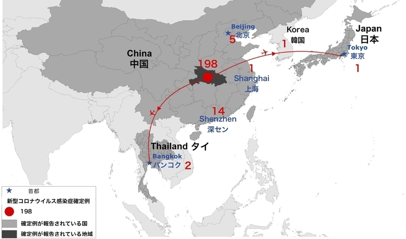

武漢で発見された新型コロナウイルス感染症(新型肺炎)は、SARS程ではないようだが、致死率高いSARS、MERSコロナウイルスと非常に近くて、現時点まで、既に死者4人まで出ていると報じられています。

SARSの時代と比べて、中国より、日本は要注意ではないかと、分布図から見受けています。

<figure>

<figcaption>

新型コロナウイルスの分布図(Yahoo!ニュース)

</figcaption>

</figure>

今はちょうどう中国の帰省ラッシュの時期で、一年中、交通は最も大繁忙の時です。武漢→北京、武漢→深圳等、真ん中に幅広い地域を越え、ポイントtoポイントで感染しているようです。SARS時代、地域と地域繋がるような平面で感染拡大の形は明らかに違います。この情報から以下の結論は得られるかと思います。

1. 感染性高いでしょうが、人口の密度、確率から見ると、それほど高くない
2. 発達した物流のお陰で、人は集まる場面は非常に少ないので、 SARSの時代の大範囲の感染はまずないでしょう。経済への打撃も限られるでしょう。

日本は今まで空港で留められているのが何よりです。もし、国内まで蔓延してきたら、中国のほど、楽観に見えません。日本のIT産業は中国より大分遅れているからです。

中国での生活パターンとしては、ネットでの買い物は勿論、外食もネットから注文する形になります。勿論、日本のビザなど個別な店舗での宅配ではなく、まちの殆どの飲食店は繋がっているわけです。  
外出も、マイカーを利用する傾向は強くて、人の集める所へ行く場面は非常に少ない環境は、中国で整えています。しかも、時期的には学校の休み期間で、小中大学、全て休みに入っています。

逆に日本の場合、地方はマシでしょうが、特に首都圏の場合、公共交通機関の利用は当たり前、ビザや、特化した宅配の料理でない限り、店舗へ行かなくてはならない。外食でなければ、スーパーになるでしょうから、人の集まる所へ行かなくてはならない。  
中国の報道された数字から、それほどの確率は高くないが、いざ、空港から国内まで入ってきたら、逆に要注意で、中国より感染しやすくなるのではないかと思います。
