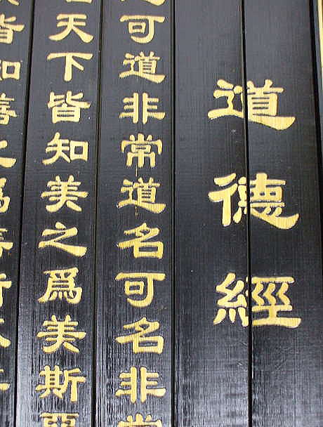

「道」の字は日本語でもよく使うが、みちを表す所以外、意味合いが、大体違います。  
例えば、剣道、茶道など「道」を使うが、具体的なものですから、中国だと、「術」に当てはまります。  
ここでいうのが老子の道徳経の「道」が、具体的なものがありません。具現化にしたら、意味合いが外れて、道ではなく「術」になる事です。

中国語の「道」と近い日本語は「もの」だと思います。「物」でもあり「者」でもあり、 「物」でもない「者」でもない、抽象的なものかもしれない。

道徳経、老子の「道可道非常道」の意味について、説明する前に、句読点をつけましょう。「道可道，非常道」一般的に教えられているようだが、私はこうします。  
「道可，道非，常道。」

ものの状態は常に変わっている。同じものに対して、肯定も否定も、前提条件、状態、周りの環境、見る観点など、変わると、同じものは、全く反対なものに見える事だ。  
こちらは、私の政治を論じる場合よくある考え方です。

例えば、台湾はアメリカの中国を牽制するカードは、誰も分かる常識でしょう。但し、観点を変えてみて、同じ台湾は、中国のアメリカを牽制するカードでも見えます。  
中国のあらゆる情報発信のところは、最近、武力により台湾統一と発信している。でも、中国にとって、今現在台湾を武力で統一する緊迫性がないし、経済発展に集中しているから、本当に台湾海峡で戦争を興すより、米軍を東亜に呼び込もうとする行為ではないかと思います。  
今、中国の国益は一帯一路にあり、中東の火をある程度冷やしたいのが中国の本音ではないかと思います。  
蔡英文の謳う独立で台湾海峡の緊張感を高めるので、中国に都合がよく、メンマの合同声明など、色んな所で刺激してあげているでしょう。

「道」は具現化にしたら、本来の意味とずれてしまうので、「道可，道非，常道。」で説明しようとしています。 但し、これは一つの側面からの説明しかすぎません。易経的な説明方にしてみると、道は陰と陽の状態があり、陰陽のバランス良い様を表すとも説明できるでしょう。具体的なものはありませんが、そのイメージは伝わって、ご理解されているのでしょうか。
