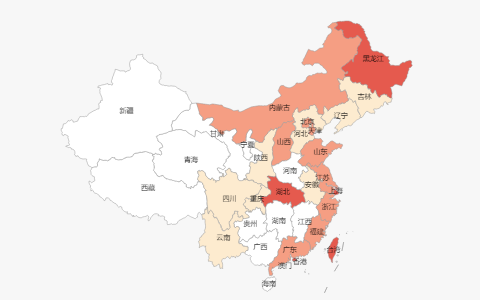
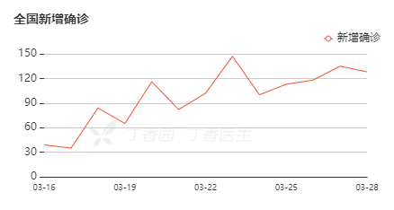
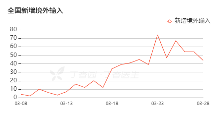
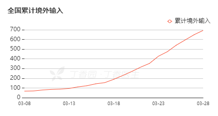
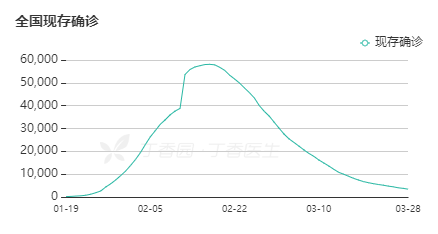
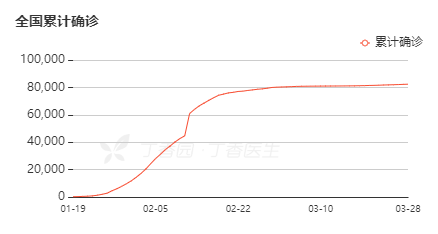
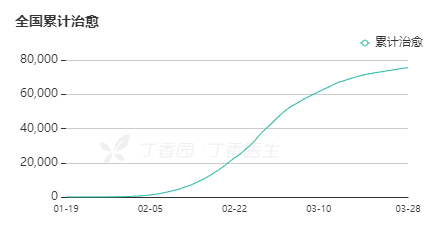
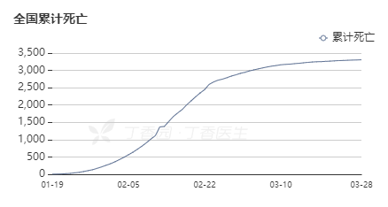

当サイトからの更新は一旦終了します。最新の情報について、[Google](https://www.google.com/search?q=COVID-19&oq=COVID-19&aqs=chrome..69i57j0l5j69i61l2.495j0j9&sourceid=chrome&ie=UTF-8)からご確認ください。

更新時刻：**2020/4/20 12:50  
**日本 ：確定 1545(累計：2007)人、治癒： 404人、死亡：58人  
中国全土：確定 1700(累計：84237)人、 輸入患者数： 1583人 、無症状患者数：990人、 死亡： 4642人 、 治癒： 77895人

新型コロナウィルス(新型肺炎) SARS-CoV-2、病名： COVID-19  
感染源： 新型肺炎の患者。**症状のない潜伏期間内**の人も全て感染源になる事  
感染経路：呼吸器経由の飛沫、接触感染。エアロゾル感染と消化管感染経路を要確認  
潜伏期間：1－14日、平均、10日(要検証だそうですが、最大24日の説もある)  
ウィルス変異のリスクが高い  
[新型肺炎の予防が最も重要：](https://blog.loveapple.cn/news/202001312363.html)**[注意すべきポイント](https://blog.loveapple.cn/news/202001312363.html)**

2/17 新型肺炎　受診の目安は「３７・５度以上の熱が４日以上」　厚労省公表  
厚労省のホームページ： [新型コロナウイルス感染症について](https://www.mhlw.go.jp/stf/seisakunitsuite/bunya/0000164708_00001.html)

首相官邸：[新型コロナウイルス感染症に備えて　～一人ひとりができる対策を知っておこう～](https://www.kantei.go.jp/jp/headline/kansensho/coronavirus.html)

真偽情報確認：[正しく怖がるために](https://fij.info/coronavirus-feature)  
中国在住ジャーナリスト谷崎光氏：「[新型コロナウイルス感染症対策　中国在住者が教える本当に効果のあった方法。](https://www.insideasia.click/entry/2020/03/01/200515)」

https://twitter.com/MHLWitter/status/1228909404361113600?s=20

現地のリアル情報をこのコンテンツで随時更新します。  
翻訳、データ更新に追いつかない時があるので、最新情報、各地方のの詳細について、  
[情報元のサイトへ](https://ncov.dxy.cn/ncovh5/view/pneumonia)ご参照ください。

<figure>

<figcaption>

新規感染増加推移

</figcaption>

</figure>

<figure>

<figcaption>

海外輸入新規感染増加推移

</figcaption>

</figure>

<figure>

<figcaption>

海外輸入新規感染累計推移

</figcaption>

</figure>

<figure>

<figcaption>

患者数推移

</figcaption>

</figure>

<figure>

<figcaption>

患者数累計推移

</figcaption>

</figure>

<figure>

<figcaption>

治癒人数累計

</figcaption>

</figure>

<figure>

<figcaption>

死亡人数累計

</figcaption>

</figure>
