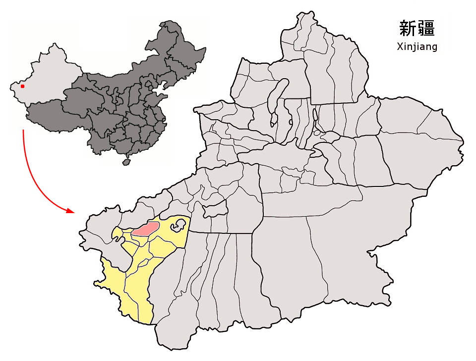

中国地震台網中心（CENC）の情報より、2020年1月19日、21:27、新疆ウイグル自治区、カシュガル地区のファイザバード県（北緯：39.83、東経：77.21）に、マグニチュード6.4の地震が発生しました。  
震源が地下16KMとなります。  
地震により、アルトゥシュ、カシュガルなど、明らかに揺れを感じました。

緊急対応部門は既に対応を開始し、即時、救助チームを派遣しました。現在、地震により、1人死亡、2人軽傷、一分の建物に亀裂や、壁の剝がれが発生しました。  
CENCの観測により、このM6.4の地震後、少なくとも8回以上の余震は発生しました。ファイザバード県の住民は「揺れを感じた。ビルなどに住んでいる人は街で非難して、帰宅できない状況だ」と言いました。  
現場の救助隊員より、「地震の負傷者は出ているので、治療を受けています。」  
現場の映像から、2人の子供は治療を受けていることを確認しています。

救助隊の責任者より、地震後、緊急対応管理部門は、当日の夜中に救助隊を被災地に派遣した。更に強い地震を備えて、対策案を練っている。コート、布団、テントなどの救助物資は被災地へ輸送中です。

情報元：北晚新视觉综合 新華社 央视新闻  
https://mo.mbd.baidu.com/bv3mg4z?f=cp&u=c02111efeddea2f3
