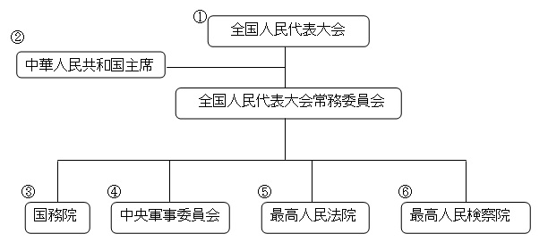

中国人民代表大会は日本国会と似てるが、差異を簡単に紹介したいと思います。

地方、全国の人民代表とは、議員と近いが、日本の議員の街頭演説はなく、基本、各業界のエリートから選ばれます。  
各民族、業界から定員を決めるので、お金持ちとか、90%人口を占める漢民族の代表ばかりのような事が基本ありません。  
業界も全国様々な業界から、代表が選ばれます。  
ウィグルや、チベット等少数民族の代表は勿論、台湾、香港、マカオ、そして、海外の中国人、華僑と呼ばれる団体も招待されます。  
人民代表は各地方の推薦、選挙で選ばれます。  

全国人民代表大会は立法権を持ち、その下は主席(習近平)です。  
主席以下は行政権の範疇になるが、裁判所に当たる法院の司法機関が、行政機関の下にある事は三権分立の民主制度と一番違い所を分かるでしょう  
近年、司法権独立のために、改革してるので、その結果を期待したいと思います。  
もう一点、主席下の常務委員会注目して欲しいです。

いくら独裁と言われてもワンマンではないので、主席の決定は常務委員(常委)達の意思決定と言えるでしょう。  
常委は内閣に近いもので、メンバの選定は民主国家と完全に違います。  
常委になるためには、以下の条件に満たさないといけません。

常委になる条件について、こちらでまとめ切れないが、簡単にまとめますと、  
①中国共産党内部、実績上、一番優秀な人  
②二つ以上の省の知事経験あり  
常委に入った数人の全員、1億人以上のリーダ経験済みを事をです。  
日米の内閣メンバと比較してみれば、素質の差を分かるでしょう。

国を人の体に例え、人民代表大会制度と民主制度の差とは、  
前者：脳みそ一番優秀だから、少数でも、決済権を持つ対象を選ぶのが、左脳と右脳の違いだけになる。  
後者：下半身は大多数ので、決裁権は下半身になり、脳みそは少数派だから、全体な勢力は劣るでしょう。  
  
脳みそで考えて行動する、人民代表大会制度は、他の部位は、苦しく感じる事があるでしょうが、全体的に良い方向へ向かいます。  
下半身で考える民主制度は、大多数の体の欲望優先で、非常に気持ちよいが、人間としてどうなるか非常に怪しくなる訳です。

以上、中国の人民代表大会制度の簡単な説明です。  
添付画像、各項目の説明は以下のページから引用したものです。  
[http://www3.pref.nara.jp/eastasia/1028.htm](http://www3.pref.nara.jp/eastasia/1028.htm)  
① 国の最高権力機関であり、各省、自治区、直轄市、特別行政区、軍隊によって選出された代表からなる。  
② 国権を行使する国家元首であり、全国人民代表大会常務委員会とも関わりがある。  
③ 最高国家権力機関。  
④ 最高軍事指導機関であり、軍隊への指令および統轄を行う。  
⑤ 最高裁判所。  
⑥ 最上級の検察機関。
