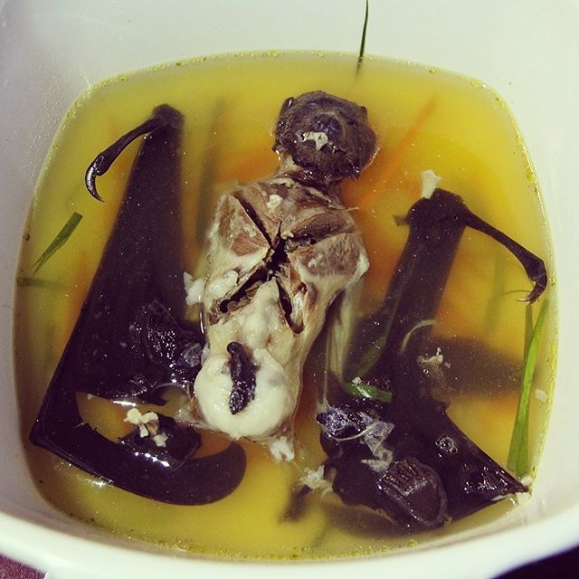
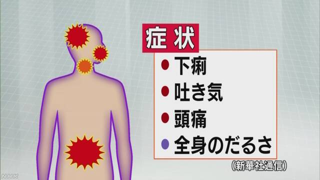

当然ですが、新型肺炎について、情報量も、一番詳しく研究しているのも、中国ですので、正しい対応するために、中国からの情報は基準になるでしょう。  
その特徴と危険性について、中国当局から発信した情報をざっくりとまとめます。

1．感染源が市場にいた食用コウモリであることは、確認済みだ。  
中国では野生動物の販売が違法、且つ、元々海鮮の売買がメインのはずの所なので、闇といってもよいだろうから、衛生面で、ほぼ無防備でしょう。  
コウモリを食用するのが中国南だけではなく、東南アジア、パラオなどもあるようなので、旅行に行くとき、注意を払うべきでしょう。

<figure>

<figcaption>

パラオの名物  
コウモリスープ

</figcaption>

</figure>

2．コウモリは常に沢山のウィルスを携帯する。  
コウモリは飛行に適するために、他の哺乳類より早い新陳代謝機能を進化しているので、免疫力も全然違う。  
多くのウィルスは、コウモリが発病しなくても、他の哺乳類は耐えられない。しかも、沢山の種類のウィルスを持つのは、コウモリの常態です。

3．40℃に適したコウモリのウィルスが人間の免疫力は退治し難い。  
人間の免疫力の仕組みを簡単に説明すると、有害な異物を発見した場合、吐き気、咳、くしゃみなどで排除しようとします。ウィルスの場合、最高、40℃の高熱を維持して、殆どのウィルスが24時間以上、40℃ぐらいの高温では生きられないので、それで治ります。風邪、肺炎など、殆どの病気は実に治る薬がなく、基本、人間の免疫力を利用して治癒します。治癒できない場合、免疫機能は人自身を自滅します。抗生物質以外、お医者さんからもらった薬とは、基本、免疫機能の過剰反応が酷すぎないように、症状を抑えるだけです。  
ですので、40℃に適するコウモリからのウィルスが、人間の免疫力には難しいでしょう。

**新型肺炎の怖いところは、感染経路は全部把握していない事と、40℃に適したウィルスに対しての治療方法でしょう。  
**アメリカ疾病予防管理センター(CDC)数字を見たところで、毎年のインフルエンザは明らかに被害が酷い訳です。但し、健康な人であれば、インフルエンザは免疫力で退治できるはずで、人間と戦う歴史が長いので、やり方も尽くした状況と近いでしょう。

新型肺炎は40℃ぐらいの体温にも適するから、自然に免疫力に頼ることが難しいでしょう。但し、治癒された人がいるのと、子供は命にかかわるほどひどい状況になりずらい所から、既に免疫力は発育した大人には、かなり危険でしょう。現在、死者の中、ほぼ、中高年で、一番若い人は36歳だそうです。  
個人のイメージですが、新型肺炎は水疱瘡のように、子供なら大したことがないけど、30代以上だと、命に係わる病気になるのです。感染をコントロールしないと、多大な被害がでるでしょう。

現在、武漢中心、色んな所は封鎖されたことから、中国はその拡散を抑えようと努力を尽くしています。前の記事でも書いてあるが、最悪、肺炎に効率的な治療方法はなくても、夏ごろになれば、自然に鎮静するでしょう。  
これからの2ヶ月ぐらいは、皆は一緒にこの災害と戦っていきたい。  
中共のことは嫌がる人が多いが、天災に向けて団結してほしい。新型ウィルスより、人災がもっと危険です。デマ流し、印象操作など、この時期だけ、控えてください。
