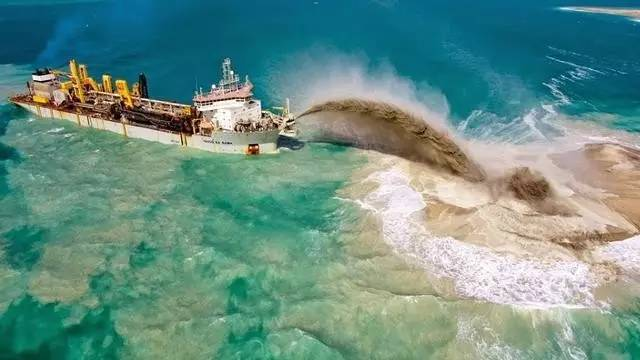
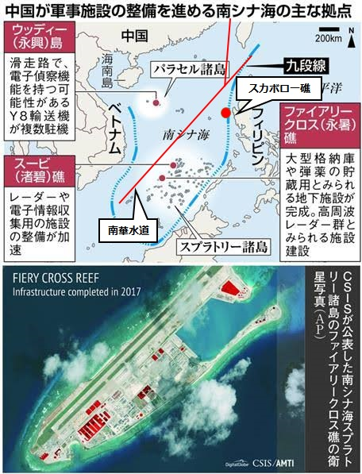

中国の南シナ海対策：戦わずして敵を屈服させる。  
[前編](https://blog.loveapple.cn/politics/national-strategy/2019120379.html)の紹介した通り、アメリカはベトナム、フィリピン等、東南アジア諸国を煽動し、マスコミ、国際裁判も協力してもらうから、当たり屋のように中国を挑発して、戦争を興せたらアメリカは武力でバックアップしてあげる事で、そこの島、領海は全て手にすることはできるとの約束をしました。  
だから、大体2000～2010年前後、フィリピン、インドネシアなど、まともな海軍も空軍もない小さい国々は、中国に対して色んな理由で、領海の主張をし始めた。  
領土、領海で揉める場合、お互いは色々言い訳があるが、本文の対象ではないので、内容を割愛します。元々中国漁民は代々で漁業の作業を行う地域、行き成り領海侵害と言われて、逮捕されたり、射殺されたりした、当時ニュースから、明らかにおかしいと見えるでしょう。

南シナ海で一番激しく揉めていたベトナムは、南シナ海周辺国、中国以外、軍事力一番強い国です。中国はベトナム中心の対策は展開し始めました。  
南シナ海では、島より、礁がはるかに多いです。最初は中国もベトナムも棚やで礁を占領して主権を主張するようにしました。但し、ベトナムの方は圧倒的に多いです。

<figure>

<figcaption>

中国の噴砂船。海の底から砂を吹出す技術は輸出禁止の最先端技術として開発され、幅広く利用されています。

</figcaption>

</figure>

2000年代頃、中国は礁を島にする大型プロジェクトを展開し、然も、島と立てる砂を遠方から運搬するのではなく、その場で、海の底から砂を噴き出すようにして、他国と断然違うレベルのコスパで島の建設は実現できています。  
且つ、世界一の建設力を持っていても、島を立てまくるのではなく、「南華水道」沿い、重要なポイントでボーイングのような大型民間旅客機でも利用できる、高水準な空港まで建設しました。  
空港の質にあまり求めない大型軍用機も勿論利用可能な沈まない空母として、釘のように、しっかりと、南シナ海に嵌めて、制空権確保することを実現しています。

<figure>

<figcaption>

[産経ニュース](https://www.sankei.com/world/news/171226/wor1712260010-n1.html)の画像を借用させていただきます。元画像の上に、スカボロー礁と南華水道を追記しました。

</figcaption>

</figure>

パラセル諸島、スプラトリー諸島、そして、これからですが、更にスカボロー礁を加えると、三角型で空港を建設し、制空権を確保する意味とは、ベトナムは勿論、米国等の海軍は勝手に入りません。但し、中国は軍事力ではなく、行政権を強調したのです。  
三砂市を設立して、観光業の発展を促進し始め、南シナ海のモルジブを目指して、周辺の経済を牽引し、経済の成長を図っています。  
暗礁の多い南シナ海では、モルジブに負けない綺麗な景色がありますので、観光業は成長できれば、島や、空港を建設する費用は世界から資金を集め、大儲けに繋がります。  
アメリカは紛争を興すが経済成長のために手を出さない事、南シナ海周辺の諸国の皆は分かります。中国の三砂市の観光業の明るい未来も皆は見えると思います。訳の分からない礁や島で揉めるより、中国と仲良くして、ビジネスをやる方が利益大きな訳で、国内の安定、福祉の改善にも繋がります。  
ベトナムはいくら中国と戦っても、財力も軍事力もく追いつけないので、曽ての強硬策は賢明ではないでしょう。  
因みに、ぺとナム沿いから、スプラトリー諸島周り、ベトナム占の島(礁)は多いが、今、棚やの建設ブームは落ち着くのは、一時的に占領したとしても、将来、中国に返さなくてはならないことを見えたでしょう。

最近、世界情勢のニュースなどに関心のある方は分かると思います。中国と東南アジア諸国の関係はかなり良くなっています。特に東アジア地域包括的経済連携(RCEP)を通じて、世界人口50％以上の経済圏を築くことはできています。  
中国は嫌われる、敵視されるような悪魔の共産国から、皆と良い関係を築き、アジア圏の経済をリードする事実は成り立っています。地域の平和、経済の成長、中国自身の利益の確保など、多方面から大きな成功を収めました。

次回は、一帯一路の海上編の中、一番重要と思われる日本の部分を説明します。  
ご興味のある方は、[私のtwitter](https://twitter.com/loveapple)をフォローしていただくか、RSSをリーダに保存していただく等にしていただければ、コンテンツを更新した際に、通知を受信できると思います。何卒宜しくお願い致します。
