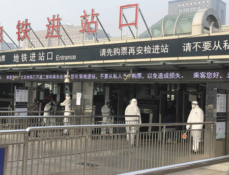

先ほど、北京の大手小売業経営者に聞いた所、北京はSARS(サーズ)の経験を活かして、政府側の対応は迅速、適切に行っている。  
市民の買い溜めなどの現象は特になく、安定している様子だ。  
マスクなどの消耗品は、旧新年から三日(1/24-1/26)ぐらい、一旦、品薄状態になったが、次の大量仕入れは月末に市場に投入する見込みだ。主要コンビニエンスストアの4社だけのマスク注文数は100万以上らしい。

現在、政府は悪徳業者の取り締まり強化キャンペーン中だ。  
本来、1元ぐらい/枚のマスクは85元で値上げた業者があったらしく、最高300万元の罰金を科したようだ。

