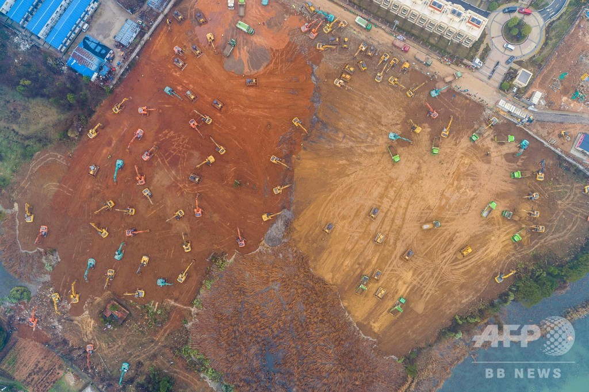
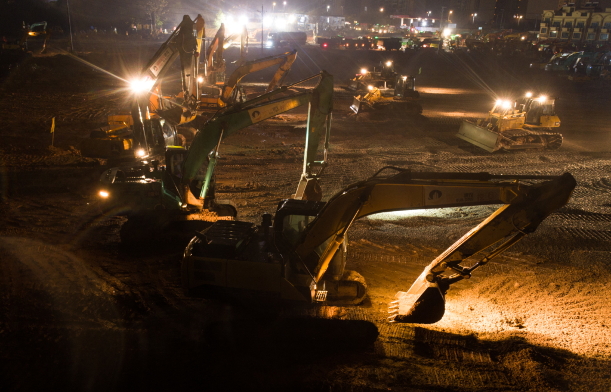

新型コロナウイルス(新型肺炎)の対応のために、10日間で1000ベッドの病院新設すると決めました。納期が極めて短いため、大量な大型建機の同時作業のシーンを見ると、人海戦術だと慨嘆する人は多いようです。  
この時代だから、そろそろ人海戦術の勘違いから脱出してみたらいかがでしょうか。

<figure>

<figcaption>

建設現場の空撮画像

</figcaption>

</figure>

人海戦術とは人の数で、技術や、機械化のギャップを埋めようとするやり方です。沢山の人は大量に集めれば人海戦術とは限らない。2019年の台風18号、19号を被害を思い出せば分かるかと思いますが、簡単に人を集めれば済む話ではない。どこに集めて良いかの所(情報収集)から対応が怠ったわけでしょう。

抑々、武漢の建設業では何が起こっているのか、10日で1000ベッドの病院を建築し、2月3日に運営し始める予定です。同時に、2つ目の1300ベッドの病院も、同様に、そろそろ完成する予定です。  
これだけではなく、 HUAWEIは同病院、医療専用ネットワークの構築、各通信業者は5Gネットワーク舗設して、５G医療時代は武漢で突入させます。

私は「人海戦術」の意見を反対しないが、日本を含めて、中国以外の事例からこれよりスマートな対応はあるのでしょうか。小規模で、早くて品質良く対応できる事例があれば、「人海戦術」の観点は通じるかもしれません。でなければ、今の武漢の建設現場では、どこにもない、中国の実行力を見せていると言えるでしょう。

<figure>

<figcaption>

建設現場

</figcaption>

</figure>

もうちょっと、視野を広げてみよう。  
建設現場の実行力だけではなく、1000万人都会の封鎖、14億人の自宅待機等々、中国人は世界最大規模の団結力を見せているのではないかと思います。

日本政府の中国を全力支援で、責任の持つ大国の姿勢を示しています。  
これから、大勢の邦人は武漢から帰国します。政府の適切な対応を期待しております。  
もし、大規模に拡散と発生したら、足を引っ張る以外、まともな事何もできない、野党や、民主カルトで、どこまで悪化するか、想像したくありません。
