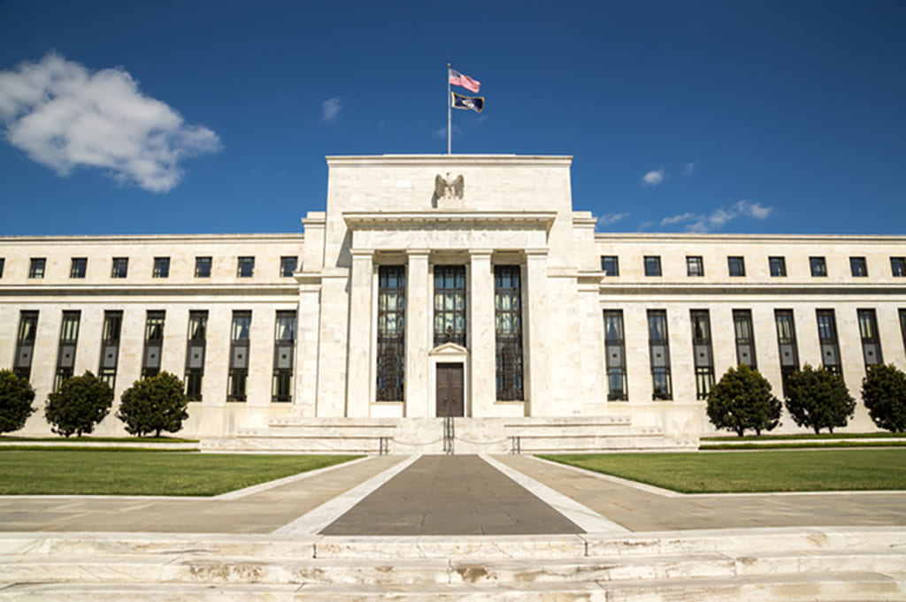

新型肺炎は全ての中国人の動きを留めているが、政府主導で全員は協力してしっかり対応しているので、間もなく元気に回復でしょう。但し、私の懸念するのが、災害の後、アメリカの大量な投資です。

目の見える災いが怖くない、見えるから、全員同じ方向に向かって戦えるからです。  
こちらで懸念するのは目の見えないアメリカの金融です。  
「[FRB、利下げ見送り　20年も「追加緩和ゼロ」](https://www.nikkei.com/article/DGXMZO53248640S9A211C1000000/?n_cid=SPTMG002)」利下げ見送りというが、トランプ氏はもっと下げて欲しいと言ってるので、利下げの可能性が高く、以下の中国を攻めるシナリオあるじゃないかと思います。

- 新型肺炎、中国、中国周辺の経済に悪影響で、不動産などの資産が値下げ
- FRB利下げ：アメリカの投資か達は大量なドルが溢れて、中国と周辺の資産を安く大量に仕入れ
- 中国と周辺の資産は価格上昇
- FRB利上げ：大量なドルは戻そうとして、中国と周辺の資産を大量に高く売却
- 結果：アメリカ投資家は大量に中国と周辺の利益を吸い上げて、経済の不況へ

見た目であまりイメージが付かないでしょうが、ソ連の崩壊、アジア金融危機、全て似たような手法でした。新型肺炎のパニックのおかげで、下準備などの作業も省け、非常に良いチャンスです。

中国共産党政権に、本当の試練はこれからでしょう。
