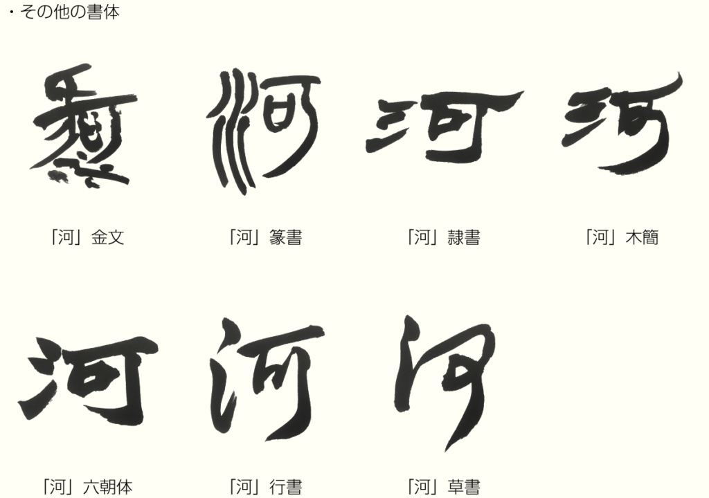

中国語を勉強される時、江と河、本質的に何の違いがあるか疑問ありませんか？  
中国人に聞いても中々答えが出てないでしょう。規模だけでいっても、長江と黄河がさほど差がないし、何故別々にするだろう？

実は、「江」と「河」の意味が同じく、大きな川です。違いとしては、北側と南側の方言の、表現の違いだけです。  
北側の一番大きい川が黄河、南側一番大きい川が長江です。

それでは、北側の東北地方では、何故「江」を使うのでしょうか。例えば、黒竜江、図門江等々。  
これらの川の名前が、殆ど中国の南北朝時代できた名前で、その時の文化は、朝鮮半島の影響が大きいです。しかも、朝鮮半島の文化は中国の南側からの影響が大きいです。  
結局、中国南側の文化は、朝鮮半島から遠回りして、東北に来たようです。

<figure>

<figcaption>

産経国際書会副理事長、勝田晃拓、河についての説明です。

</figcaption>

</figure>
