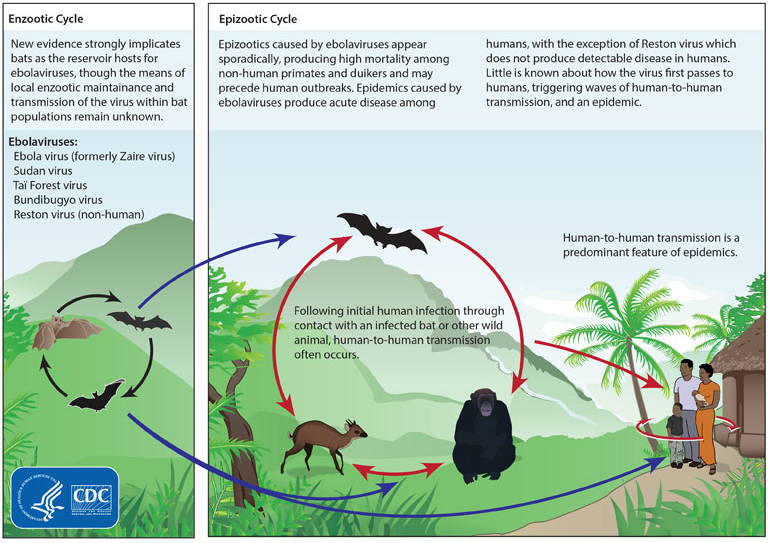
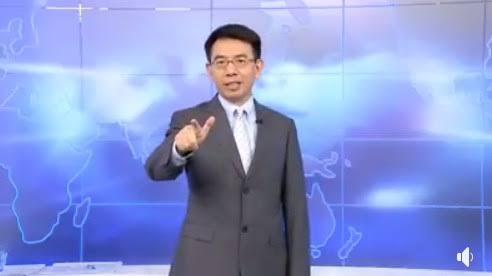

新型コロナウイルス(2019-nCoV)は人造の[生物兵器](https://ja.wikipedia.org/wiki/%E7%94%9F%E7%89%A9%E5%85%B5%E5%99%A8)だと疑惑する声が多いと思います。確実な根拠がないが、SARSも、新型肺炎も、人造でないことって、論理的に通じないことが多い。

ウイルスは常に変異して新しいもの生まれるのが常にあるもので、人類の免疫力はそれを適するために進化してきたわけです。例えば、風邪、通常の肺炎など、ほとんどは常に変異するもので、基本的に、人の免疫力で耐えられるものです。

人の免疫力は簡単に退治できない感染病、例えば、天然痘、ペストは大量な死者を出したものは元々アメリカ大陸、欧州大陸になかった病気だから、行き成り適応できないからです。  
もう一つ大量な死亡が発生しうる感染は元々異なる品種の動物から移った病気です。エボラ出血熱はこれが要因だそうです。

<figure>

<figcaption>

エボラウイルスのライフサイクル

</figcaption>

</figure>

**1．人類は野生動物を食べてきたからこそ、今まで生きてきたもので、何故か今更新種のコロナウイルス連発するのか？**

SARS、新型コロナウイルス(2019-nCoV)は、エボラ出血熱と同じく、野生動物からのウイルスだと言われています。  
但し、中国とアフリカの違いとしては、数千年の連続した文明、文字があるところです。もし、野生動物を食べる事で大規模な感染病があるならば、何故かその記載がなかったのでしょうか？2002年(SARS)～2019年(2019-nCoV)、ただ17年間の頻度で大規模な感染病が起こるものでしたら、歴史に必ず残ります。今更起こることは、抑々おかしい。

**２．自然界にあるものと証明できない(元々自然界にないものだ)**

新型コロナウイルス(2019-nCoV)はSARS(サーズ)と近いウィルスであることは正式に報道されている内容ですので、確実です。SARSは自然界にあるものと誰も確実に証明できません。ある中国の研究チームは、[雲南のコウモリからSARSを見つけた](https://www.nikkei.com/article/DGXNASDG3002W_Q3A031C1CR8000/)と発表したが、その時期は2013年頃でした。  
2002年～2003年流行っていたSARSコロナウイルスは、10年後のコウモリから見つかったって、人間から移ったか、元々あったのか、どう検証できますか？今までもSARSのライフサイクルがないようだ。

今の新型コロナウイルス(2019-nCoV)も、コウモリだと言っても、検出しただけで、元々自然界にあるかどうかについては、確実に言えない所です。今後はどうなるか、SARSと似てるものからで見ると、長年経ても、結果がないかと思います。

**3．新型コロナウイルス(2019-nCoV)の爆発タイミングが絶妙だ**

季節の変わり目では風邪などの病気にかかりやすい時期です。中国でも秋の10月ごろから風邪の多い季節だが、新型肺炎の最初に発見したのが12月7日ぐらい？12月上旬だそうです。  
10月、11月でしたら、風邪のひきやすい季節に入ってるからと思いますが、12月って、ちょうど、米中貿易戦の終わりごろで、台湾の独立を主張する民進党は勝った直後でもある。しかも、春節の帰省ラッシュで、感染病の拡散しやすい時期でもある。

**生物武器の自爆の説は？**

中国軍の研究施設から漏らした説があるが、中国側、細菌武器がないと主張する一方、軍レベルのセキュリティを理解しないか、敢えて嘘をついてるかと思います。  
軍用まで言わなくても、情報セキュリティの知識を持つ人は多いと思います。高いレベルの情報セキュリティ管理プロセスの中、一枚の紙でも、意図的に持ち出し可能でしょうか？よほどな事がない限り、基本、できません。勿論、軍用レベルはもっと高い訳です。  
このデマを流す評論家たち、又は、疑問なく信じる人達のサイエンス常識は、残念だけど、バイオハザード映画レベルしかすぎません。  
抑々、中国は自国に生物兵器を漏らして、どうするのか？論理はおかしいでしょう。  
中国軍より、**アメリカ軍と、台湾軍**の高い生物兵器の技術を誇る所が論理的には通じるのではないかと思います。

何故か台湾？思う人はいるかもしれないが、台湾が生物・化学兵器の大量殺傷兵器を持っているからです。中国共産党政権は生物兵器禁止条約、化学兵器禁止条約に加入してるので、変なことをやってはいけないが、台湾側がそれらの条約を認めなく、実質的に生物武器も化学武器も、進んでいます。

<figure>

<figcaption>

生物・化学兵器の大量殺傷兵器を紹介する台湾番組

</figcaption>

</figure>

新型コロナウイルス(2019-nCoV)は人造であること、単に私の憶測ではなく、[専門家も生物武器であると指摘する](https://headlines.yahoo.co.jp/article?a=20200129-00010003-flash-peo)人は多いようです。

**ここまで大混乱をさせる事って、何を図るのでしょうか？**

一つの可能性高い事として、災いを利用して、大金持ちは、[中国と周辺で、資産の吸い上げはこれから始めるでしょう](https://blog.loveapple.cn/politics/202001302217.html)。  
周辺ということは、日本も含めます。今の首都圏の不動産はオリンピックの影響で高くなっているが、間もなく、激落かと推測します。

もう一つは、反安倍、反東京オリンピックの右翼たちは、この中国の件を利用して、日本の大混乱を図っている可能性があります。  
日本マスコミの報道がヘイト中国へ偏る一方、潜伏期間で感染性高い新型肺炎について、殆ど言わないか、注目させないような表現する方法にしているかで、武漢の邦人を無理やり帰国させる世論にして、安倍政権にプレッシャーをかけたことです。

12下旬、1月上旬ごろ、微妙に流行ってたかの時期、武漢から来日した中国人より、今は流行最中の武漢から帰国邦人は遥かに危険です。隔離などしないだけではなく、受診拒否のバカ者も出てきた事は、新型肺炎の日本での流行を図って、あえて、武漢滞在邦人を帰国させたのではないかと疑いませんか?

日本では新型肺炎が流行ったら、最悪の事態だと、安倍政権だけではなく、東京オリンピックにも影響がでるでしょう。

悲しいから「武漢加油」⇒「日本加油」までやりたくないが、懸念する最悪の事態へ発展するリスクが高まっています。
