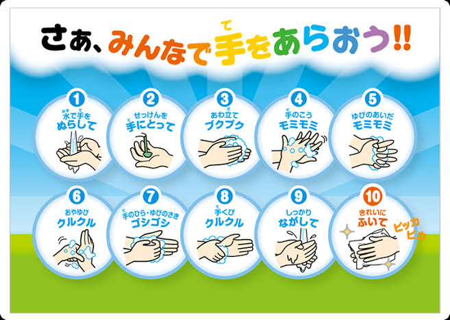

SARS(サーズ)の経験を活かして、感染病自体より、恐怖感のリスクが高い。  
新型肺炎を正しく認識して、改めて注意を促したいと思います。

新型肺炎はあくまで季節性インフルエンザ以上のものであり、中国以外の感染者数が限られているので、実質的に拡散しません。

**予防は最も重要だ**

1．手洗いを徹底しましょう。帰宅時に必ず手を洗ってください。  
**手を洗う事はマスクをつけるより重要**だと認識してください。  
2．正しくマスクをつけてください。鼻マスク、口マスクなどは、つけていないと同じだ。  
特に通勤など、人込みでマスクをつける事。  
3．咳や、くしゃみの時、エチケットは徹底しましょう。

**感染経路**

**口、鼻、目(粘膜)**  
飛沫など、 呼吸器官だけではなく、目(粘膜)からでも感染できること。

**症状のない潜伏期間でも感染性が高い！**  
特に12月以降、武漢(湖北)で渡航歴ある人は、速やかに病院へ診察を受け、お医者さんの指示に従ってください。

**政府を信じること**

日本人を守る責任あるのは日本政府である。  
目を引くための議員や有名人でもなく、内乱を図る右翼でもない。  
特別な時期であるこそ、デマ流しを控えますように。

この疫病は長く続きません。長くても、一ヶ月でも落ち着くでしょう。  
もうちょっと我慢しましょう。
