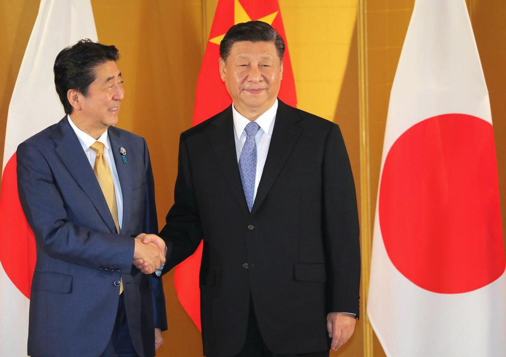

習近平の国賓来日は、恐らく日中韓ビジネスサミットの続きで、日中の間、合意したビジネスの協力をもっと深めようとして、沢山のお互いの経済を潤う提案や、投資などは、一緒に持ってくるかと思います。  
いい事を反対しませんが、今の時期だから、賛成もしません。

習近平の国賓来日を反対する理由は殆ど嘘ですので、別の理由で賛成しません。  
1．日本はあくまで米大陸マーケットの踏み台なので、特殊な時期ですので、米大陸より、国内消費マーケットを優先的に育てるべき  
2．近年、日本の不動産は高すぎるので、もうちょっと下がるべき

今は[中国中央銀行は既に市場に大量な投資](https://www3.nhk.or.jp/news/html/20200202/k10012269741000.html)をしている。新型肺炎の緊急事態について、各国の解釈はそれぞれでしょうが、貿易には打撃があるでしょう。当面、中国にとって、日本とのやり取りは優先度的には下がるでしょう。国賓としても訪日も見送りすべきでしょう。

日中韓ビジネスサミットの時、[私はかなり楽観視](https://blog.loveapple.cn/news/20191226840.html)でしたが、今はちょっとブレーキをかけた方がよいと思います。  
因みに、東京オリンピック後も、首都圏不動産は高いのままだと、不動産業界は予想されていたようですが、これから下がるではないかと、私は考えています。特に、新型肺炎の日本経済への影響が表れるところで、急落してもおかしくないでしょう。

習近平主席の国賓来日を賛成しません。見送りすべきです。日本経済はもうちょっと落ち着いたほうがよい。これが、多くの日本国民は望んでいるはずです。
