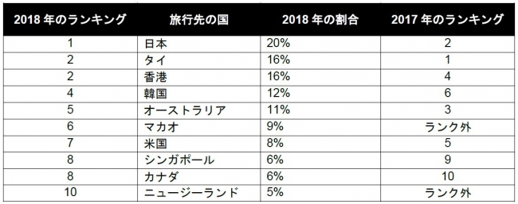

中国は[新型肺炎による経済への影響は限られている](https://blog.loveapple.cn/news/202001282091.html)のが、私の観点です。WHOの緊急事態として、中国人の渡航禁止場合、中国本土より、周りの影響が大きいかと見受けています。

**観光業の現状**

2018年の実績、中国人の海外旅行者数：1.49億回、消費額：1300憶ドル超え。([情報元：中国旅游研究院：2019年中国出境旅游年度报告](https://www.199it.com/archives/917075.html))  
2019年の数字を分かりませんが、前半の実績から、2018年より、14%の成長実績を出している。  
仮に、2019が2018の14%増加でしたら、消費額がおおよそ、1482憶ドルに上ります。

<figure>

<figcaption>

中国人が最も歓迎されたと感じた国ランキング ：[トラベルボイス](https://www.travelvoice.jp/20180813-116021)

</figcaption>

</figure>

日本に限りますと、2018年、インバウンド、中国人旅行者の消費額：1.537兆円(観光庁集計結果)

1482憶ドルって、どんな感じかと、アメリカは1年以上をかけて、中国と貿易戦をやった結果の中、最も重要な一つは、2000憶ドルでアメリカ製品を買う約束です。しかも、数年かけてです。  
この1482憶ドルは、たった一年の消費で、世界経済を潤う数字です。

データを集計する所が異なって、数字が合わない所があるでしょうが、日本向けだけでも、2019年は、恐らく、2兆円に近い数字では？2020年でしたら、2兆円を超えてもおかしくないでしょう。

**渡航禁止でどうなる？**

完全に渡航禁止したら、勿論、この1千数百億ドルの消費が消えてしまう。  
日本なら、１、2兆円ほどの消費がきえることだけではなく、観光者が日本へ訪ねることによって、帰国の消費、医療、不動産など、他の産業への消費も消える事になります。  
どれぐらいのGDPが影響されるか、いますぐ分かりませんが、多くの家族はこれから大変になることが間違いません。  
日本の新型肺炎に対しての反応が遅いと批判されているが、怠るのではなく、利益と損害のバランスを調整した結果でしょう。

アメリカも勝ち者ではありません。数百億ドル規模の観光者の消費が消えるだけではなく、あの2000憶の買い取りの約束は、どこまで行けるかあやしくなるわけです。中国は、必ず買うのではなく、マーケットの状況にあわせて買うからです。必要がないと判断されたら、勿論、買いません。  
アメリカは同盟国の対中国路線を強制させる脅かすために、一方的に中国へプレッシャーをかけてるでしょうが、いずれか、中国と利益交換のために交渉に入るでしょう。  
アメリカは〇〇をやったから、日本も〇〇をやると言った考え方はアホです。

**渡航禁止した中国は？**

海外へ行けなく、消費力が消えるものではないので、国内で消化するでしょう。  
2003年のSARS(サーズ)のお陰で、アリババ、JINGDONGなどのEC大手、そして、物流業の大手は急成長ができた。今回の全国的な新型肺炎対策も、新たなビジネスモデルは必ず生まれるでしょう。準備など何もないので、行き成り適するのが難しいが、柔軟的に危機対応スキル高い経営が勝つでしょう。

貿易の輸出にほぼ問題ないではないかと思います。  
世界は中国の製造業を欠けてはいけない存在位置であるのと、米中貿易戦の時、ベトナムなど経由のルートは既に使われているので、大きな影響はほぼないと見受けています。

**中国の観光客が消えるわけではない**

勿論、渡航禁止しても、米の同盟国中心であり、親中国への旅行者は消えません。元々、日米の観光者は、もしかしたら、他の国へ移るだけかもしれません。  
別の所での輝くを期待したいと思います。

感情で動く人は多いので、この大変な時期こそ、中国人の心の中の真の友好な国は分かるでしょう。それで適切な宣伝とあわせれば、今後の観光業の成長につながるでしょう。

**戦争の準備？**

武力で台湾統一を反対する声の中で、アメリカと同盟国に孤立されたら？のリスクが懸念されるのです。  
今回の反応は、明らかにSARS以上、軍の早期介入しているわけだと思います。新型肺炎について、中国も、アメリカも過剰な反応だと言えます。

貿易戦もあわせて、貿易戦、米の同盟国に孤立される事、全て、戦争なしで、最悪な状態のシミュレーションはできているわけ(**?**)です。シミュレーションで分かった課題を解決し、台湾問題を解決する日が遠くないでしょう。

**まとめ**

最終的に中国は孤立されません。遅くても2月いっぱいぐらい？新型肺炎は収まるでしょう。  
WHOの中国の緊急事態もなくなり、普通に戻るでしょう。  
中国とのつながり深いアメリカ、日本には、変に経済の打撃を受けたくないから、あまり酷くならない程度で、事態が変わると私は信じています。

特に中国国内の需要はこれから大幅に増加する見込みです。  
中国での商売にご興味深い方は、是非、今だからこそ、動向を深く関心した方がよいかと思います。

これから、本当に大変な状況に陥るのが、台湾です。  
今年は台湾とのRCEP期間が終わるので、そろそろ、本当の孤立に迎えるでしょう。
