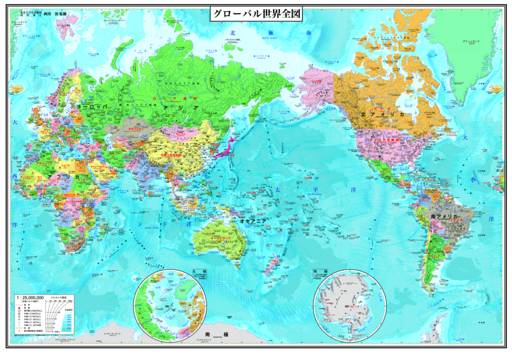

当サイトでいう大陸文明とは、主に中国の代表した、元々、主に農耕などを主要産業として発展した文明の事を指します。戦前の日本も大陸文明よりだと思います。尚、モンゴルは内陸ですが、遊牧を中心としたので、こちらでは遊牧文化として、別の扱いとします。今回は論外とします。  
海洋文明とは、西ヨーロッパ諸国始め、海上貿易を中心とした文明は海洋文明を指します。南アフリカ、インド、オーストラリア、シンガポール、マレーシア、米はすべて海洋文明とします。  
ヨーロッパでも、ドイツ、フランスも、特定の時代では、大陸文明よりだと思われます。

**特徴**

大陸文明の中心利益は内陸にあり、例えば、中国は昔から農耕を中心として、基本は外国へ出ようとしない。逆に外からの侵略などに恐れて、万里の長城まで立てました。  
勿論、シルクロードなど、商売もありますが、相手とWINWIN関係を築くのが中心です。

スペイン、イギリス、オランダ、そして、アメリカの代表した海洋文明の発足は海賊です。トルコにシルクロードが遮断され、大航海時代の新しい大陸を発見し、植民地にして、ゴールドや、調味料などの資源を略奪のためです。

例えば、中国の明の時代、[鄭成功氏](https://ja.wikipedia.org/wiki/%E9%84%AD%E6%88%90%E5%8A%9F)はアフリカまで遠洋したのにも関わらず、資源や資産を奪うではなく、中国の宝で世界の各国と友好交流に行きました。  
これは大陸文明と海洋文明の鮮明な違いです。  
今の世界主要国は、中国以外、殆ど海洋文明の国であり、工業革命の風にのって、後進の各国へ侵略し、資源を奪って、国内の危機を転嫁して、発展してきました。G8主要国の全てです。

**大陸文明と海洋文明の対抗**

米国の歴史が短いが、世界一経済大国として、百数十年以上経ってます。  
且つ、ナンバー２キラーとして有名です。イギリス、ドイツ、ソ連、日本はすべてナンバー２として、米国に倒されました。  
今のナンバー２が中国ですが、曽てのナンバー２と違って、典型的な大陸文明の国家です。  
極端に戦争を起こさなければ、 海洋文明国家間の戦いは負けても、死活に直面する必要がないでしょうが、もし、中国は日英のように負けたら、バラバラされて崩壊になるかと思います。それは長年間で日欧米で、今でも中国崩壊論は流行っている原因かと思います。

中国は戦後平和な環境下で急速に発展してきた訳で、平和を一番大切にして、WTO等、現在世界のルールを極力維持する国の一つです。

米国は長年の経済成長を維持するために、曽ての海洋文明の国家のように、世界各地から略奪する本質は変わりません。勿論、今の時代は曽てのような大規模な侵略戦争をしない。それは、朝鮮戦争、ベトナム戦争から学んだ教訓です。代わりに強力な金融の手段、ドルの覇権を利用して世界から価値あるものをドルで米国に集め、カラー革命など、騒乱を世界各地に輸出して、戦争を起こし、軍備を販売します。

ご参考に世界地図を添付します。  
中国周辺に、国境が接する国は14国あります、中ではロシア、韓国、日本などの強国もあります。  
一歩でも間違ったら致命的な結果を招くかもしれない。  
だから、中印、中べの戦争で、相手国の首都近づいた段階で撤退し、政権を壊さずにいつでも平和を主張する姿勢です。  
米国は南北に隣国があっても、カナダはライバルではない、南米諸国は弱すぎて相手にならない。  
北米に戦争がなければ、世界各地で戦争が起こることは、米に有利なわけです。  
特に第二世界次大戦では、唯一の軍事、政治、経済すべて勝った国です。  
戦後、9.11、イスラム国、中東問題、クリミア戦争、その他戦後の全てのテロ行為、地域紛争は、米国より輸出したものです。  
中国は上手く対応しなければ、今の南シナ海も紛争状態に陥てしまうかと思います。  
(こちらの詳細について別途紹介します。)

**まとめ**

21世紀は世界の平和を求める大陸文明と、各地で紛争を起こす海洋文明の戦いで、最終的には大陸文明の制覇になると思います。  
  
私の主張する内容に疑問を持つ方は多いでしょうが、時間をかけて、分析、議論したいと思います。  
世界を鳥瞰して各国の政治を理解しましょう。
