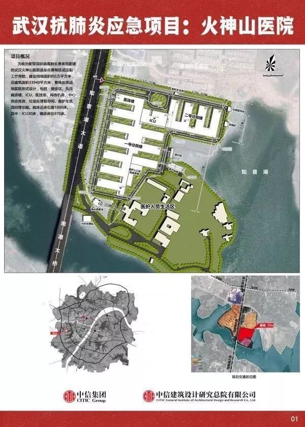
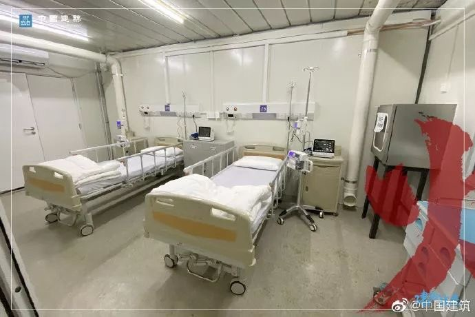
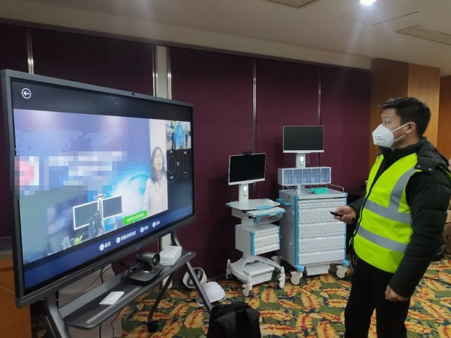
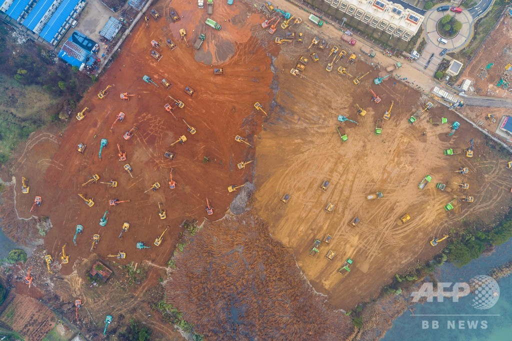

10日間で1000ベッド規模の病院を更地から立ち上げる事は、世界は啞然しているでしょう。多くの日本人の反応としては、耐震大丈夫とかの疑問から、日本製のダメな所を見えるかと思います。

日本製を完全に否定する事ではありません。日本の製造業は世界どこでも代替できない所は沢山あります。  
但し、全体的に見ると、衰退しているわけです。中国製が安いからといい訳をつける人は多いでしょうが、本質、品質良いとはいえ、日本製は顧客の必要としないものを提供しようとするからです。  
要すると、顧客は100円の物が欲しいと発注して、エンジニアの都合で、500円でできた。いくら品質といっても、顧客は必要としないから、選択肢の中国ができたら、元々のニーズ、100円を提供してくれる業者に移ったのです。表は価格かもしれませんが、本質は価格と関係ありません。

例の10日間で出来た火雷山病院は顧客(武漢医療環境を改善しようとする政府)の需要に合わせて、沢山の新型肺炎の患者を治療できる大型病院を素早く建築した。拡張性を備えて、５G基地局などのハイテックな施設も一通りそろえています。中国のインフラ建設の実力を示しています。

- 
    
- 
    
- 
    

これを見て、

<figure>

<figcaption>

建設時の写真

</figcaption>

</figure>

建設現場の作業員などをみて、人海戦術だ、耐震は大丈夫とか、文句する人の本音は、日本がスマート、耐震技術世界一などを言いたいではないかと思います。

勿論、それらは間違っていませんが、今回の病院では、必要としないものです。とにかく納期と大量な感染病の患者を収容できる大型病院が最低限のニーズであるはずです。  
顧客のニーズを無視して、品質ばっかり言うのが、エンジニア的な考え方で、成功に繋がり難いものです。抑々、納期が迫っているのに、地震の少ない武漢で、東京と同じ耐震基準を求める事自体は愚かです。  
これは一般の人の考え方しかすぎないと言えるかもしれませんが、プロたちもよく犯しそうな所です。

これと似たような現象はスマホ時代から非常に目立ちます。世界TOPのスマホメーカーは米中韓の三国状態で、曽て、世界一の電子工業を持つ日本は一つのメーカーも入りません。  
勿論、どこのスマホも、日本製のパーツがなければ成り立たないが、エンドユーザ向けの製品にしようとしたら、負けているところから、日本メーカーは顧客の本当に欲しがるものを理解していないかと思います。

価格、ブランド、撮影、 米中韓のメーカーはそれぞれのやり方で、世界中、ユーザのスマホに対してのニーズを製品と業績で解釈しています。  
エンジニア都合でできあがった日本のスマホだけは寂しく苦戦して、安くて良い、元々日本製はアメリカ製を勝った原点が失っているのではないかと思います。

元アリババのCEO、馬雲曰く、顧客ニーズは第一、顧客の課題を解決してあげるのだ。これが中国製の原点だと思います。日本製造業はもうちょっと頑張って欲しい所です。

https://twitter.com/peopledailyJP/status/1224183666189844480?s=20
