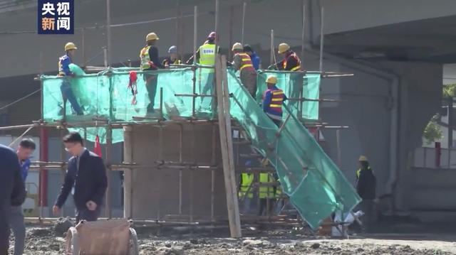

北京時間12月1日9:28、広州地下鉄十一号線砂河駅の建設現場には、路面の崩壊が発生し、通過中の清掃車が転落し、一両の電動スクーターは巻き込まれ、3人の行方不明になりました。  
当日、清掃車の2人の乗員の身分を確認できたが、電動スクーターに乗ってた人の身分不明のままで、現在でも、救助活動を進行中です。

ただいま、救助専用通路ほぼ完成し、事故の人員と車両の位置は公開されていない。

12月2日昼、記者は現場へ行き、事故は発生した箇所が既に囲まれて、救助は行われていたことを確認しました。崩壊した箇所は既に固定され、大きな金属のパイプが崩壊した位置の中心に立てられ、救助の通路として使われています。

救助チームの専門家、林本海氏より、今回の崩壊、最大深さ、約38メートル、一回目の崩壊後すぐ、数回の崩壊など発生し、底には既に流れ砂のように不安定になっていると見られます。

事故発生後、救助するために、セメント等を使って、崩壊した箇所の周りを固定し、事態の拡大を防ぎました。同時、直径2.5メートルの丸鋼パイプで救助の通路にして、周りの崩壊を防ぎぐ機能もあります。  
パイプの位置は、当時、車両の落ちた位置で、今は救助の最中です。

同氏は、1日の崩壊した深度は、8～10メートルと推測した、現在、パイプの深度は8メートルだが、その後、2、3回の崩壊もあったため、埋まれた車両の位置が移動した可能性もあると強調しました。

現在、救助チームは探知設備を使って、転落した車両と人員を探しています。救助担当の責任者より、少しでも可能性があれば、我々は諦めずに救助活動を最後まで継続します。

原文：[广州地铁施工区域塌陷，人未救土先填？救援专家这样解释](https://baijiahao.baidu.com/s?id=1651868822649595394&wfr=spider&for=pc)  
翻訳：[中国を読み解く](https://blog.loveapple.cn/)
