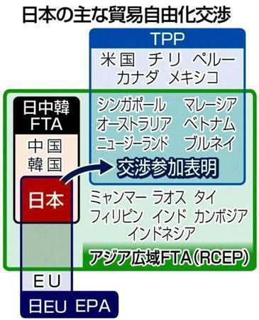

日中韓ビジネスサミットの続き、日中韓の貿易自由化で。これは安倍政権の主導するRCEP、FTAの目標の一つです。勿論、中国の一帯一路戦略と共通しているので、日中韓のどれも積極的に動いています。これは、2020、習近平主席の国賓来日の主旨でしょう。  
日中韓の貿易自由化は実現できれば、日本経済の長期な不況は、これで終了して、新たな飛躍になるかもしれません。

<figure>

<figcaption>

[**「メガＦＴＡ」に乗り遅れるな**](https://www.sankeibiz.jp/express/news/130624/exb1306241101000-n1.htm)

</figcaption>

</figure>

日中韓の貿易自由化は実現できれば、東南アジアも巻き込んで、人類史上最大の貿易圏になります。これこそ、安倍総理は日本の歴史に名前が残るぐらい、偉大なるでしょう。  
日本の生存に関わる重大なことだから、いくら反対の声が大きいでも、揺るがすことなく、推進している。

残念ですが、このアジアの偉業は、欧米に非常に都合が悪いです。絶妙なタイミングで、新型肺炎は、工業都市の武漢で爆発して、中国政府の危機管理は試されています。

但し、今は夜明け直前の一番暗い時で、辛いときを乗り越えれば、東亜、そして日本の新たな時代の黎明を迎えるかと信じています。

