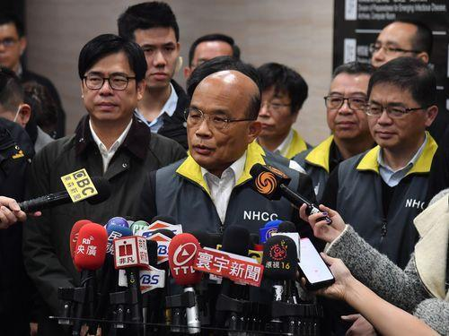

1月23日、台湾行政院長蘇貞昌（スー・ジェンチャン）はマスク輸出禁止を発表した。  
ビジネス貿易の輸出だけではなく、特に中国大陸向けの個人の郵便物にもマスクを検出したら、没収するらしい。

<figure>

<figcaption>

真ん中は 台湾行政院長蘇貞昌（スー・ジェンチャン）

</figcaption>

</figure>

但し、一つの隠された真実は、台湾経済部(経産省)の統計情報から分かった。  
・台湾が、毎月、中国大陸から、約1000万個のマスクを輸入している  
・そのうち、医療用のマスクは100%中国大陸からのもの

今の中国は新型肺炎で、操業停止の工場は多いため、あらゆる製品の生産に追いづかない状態です。  
特に、マスクの主要な原材料、不織布の世界最大規模の生産地の中国として、回らないことで、世界中のマスクは足りないでしょう。

台湾行政院長蘇貞昌は台湾のマスクは足りると正々堂々と宣言したにも関わらず、現在、台湾では一人3枚まで買い取り制限している中、多くの人は朝3、4時で、スーパーなどで行列に並んでも、マスクは手に入らない状態だそうです。しかも、マスクをつけないと、病院にも入れないということで、マスクのない人は病気にかかったら本当に大変でしょう。

普通の人は1枚のマスクを手にしても必死にしているのに、政府の偉い人達はいっぱい持っているという、台湾の政治評論番組から暴きました。
