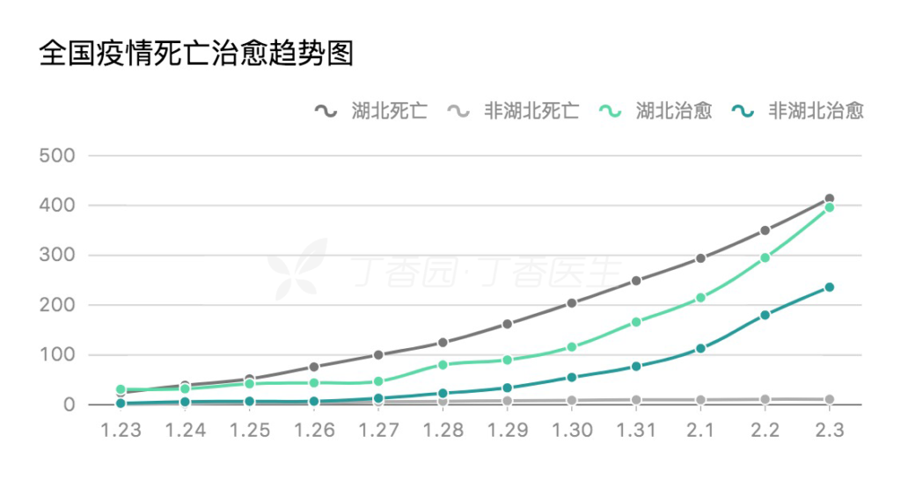

<figure>

<figcaption>

湖北死亡者数、湖北以外死亡者数、湖北治癒人数、湖北以外治癒人数推移

</figcaption>

</figure>

中国全土の死亡者数を見れば、増加中の状況が変わりませんが、湖北地方とそれ以外で絞れば、湖北以外の死亡者数がほぼ増加しない事を分かります。一方、治癒人数は右肩上がります。

2/5 10時までの時点で、公開された数字によると、  
全体の致死率、2%  
湖北内の致死率、2.8%  
湖北以外の致死率、0.1%

湖北以外、[日本の季節性インフルエンザの致死率0.1%](http://www.tmd.ac.jp/mri/koushimi/shimin/shiryou012.pdf)とほぼ変わらない。アメリカの季節性インフルエンザより、致死率が低い数字がでています。([日本でインフルエンザが流行。米国では？](https://www.jmedical.com/influenzafeb2018/))

湖北以外の人の特徴は、春節の帰省ラッシュで帰省する青年と中年がメインです。富裕層ではなくても、比較的に余裕を持った生活を送る人がメインでしょう。自身はそれほどの免疫力があるのと、ちゃんとした治療を受ければ、普通に治る病気であることを分かるのではないかと思います。

湖北の武漢と、武漢周辺の新設病院の投入や、治療薬、治療方法の進歩により、近いうちに、治癒人数の急増、湖北内でも、致死率が低くなる見込んでも良いかと思います。

遅くても、2月いっぱいで収束する見方は変わりません。

**補足：**

過去数十年、世界中、恐怖を興した感染病の致死率は以下となります。  
・SARS(サーズ)：9.6%  
・鳥インフルエンザ(H7N9)：27%  
・MERS：36%  
・鳥インフルエンザ(H5N1)：53%

**関連：[インストール新型コロナウイルス(新型肺炎)、持病と高齢者に別の見方で](https://blog.loveapple.cn/news/202002052825.html)**
